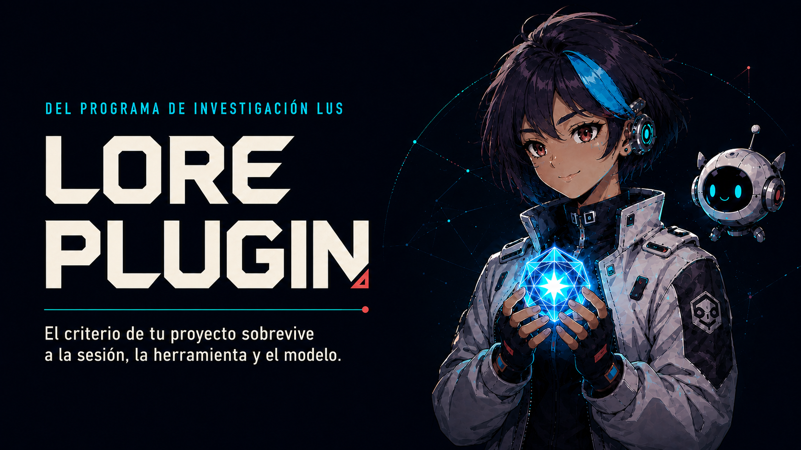

<p align="center">
  
</p>

<h1 align="center">Lore</h1>

<p align="center">
  <a href="#installation"></a>
  <a href="#installation"></a>
  <a href="#the-seven-skills"></a>
  <a href="./docs/SPEC_KIT_en.md"></a>
  <a href="#what-is-lore"></a>
  <a href="#origin"></a>
</p>

<p align="center">
  <b>Stop explaining your project to the AI every morning.</b><br>
  Lore keeps the criteria behind your decisions and loads it into the next session.
</p>

---

<details>
<summary><b>Read in English</b></summary>

<a id="english"></a>

## The problem

Every session starts blank: everything you taught the agent yesterday — every correction, every back-and-forth — gets erased, and you open the next one explaining the project again. Your Lore is where that stays.

In *Groundhog Day* (Harold Ramis, 1993), Phil Connors wakes up to the same radio every February 2nd and nobody in town remembers a thing about yesterday — only him. Your agent is the town, not Phil: every session opens on that same morning, and the one who walks in carrying the memory is you.

It is a loop of re-explanations and mediocre solutions you had already rejected. Lore calls this **ephemeral experience**: the facts may survive, but the learning never became a reusable structure.

---

<h3 align="center"><strong>+9.4 points of cross-domain first-pass compliance</strong>.</h3>

<p align="center">
  <i>An SDD kit that gives you local fine-tuning for your own tasks — and the one doing the training is you.</i>
</p>

---

<table>
<tr>
<td width="33%" valign="top">

**Start**

[The problem](#the-problem) ·
[What is Lore](#what-is-lore) ·
[Who can use it](#who-can-use-lore-plugin) ·
[Start building](#start-building-your-lore) ·
[Benchmark](#benchmark) ·
[Installation](#installation)

</td>
<td width="33%" valign="top">

**Use it**

[Architecture](#architecture) ·
[The seven skills](#the-seven-skills) ·
[Loose notes](#loose-notes) ·
[Documentation](#documentation)

</td>
<td width="33%" valign="top">

**Understand it**

[Shared invariants](#shared-invariants) ·
[Case studies](./docs/CASES_en.md) ·
[Reach](#reach) · [The deck](#the-deck) · [Origin](#origin)

</td>
</tr>
</table>

---

## What is Lore?

A lightweight, provider-neutral **Spec-Driven Development** kit for AI agents. Or, in one line: **local fine-tuning for your own tasks, and the one doing the training is you.**

#### The same destination as a fine-tune, by the other road

A fine-tune conditions a model on thousands of examples until it stops answering like a generalist. Lore gets to the same place from the other side: one written constraint per thing that went wrong. No training happens and no weights move, so your criteria stays as plain text you can read, correct in one line, and carry to a different model tomorrow.

A fine-tune stops asking things of you the day it ships. Lore never stops: one distillation, every time something breaks. That is the cost, and it is worth knowing before you install anything.

#### What it provides

Three things:

- a simple convention for organizing a project's criteria;
- seven skills that operate that convention;
- and a continuous loop for distilling experience into reusable criteria.

Spec-driven is not a label here: one contract per project (`CLAUDE.md` or `AGENTS.md`, whichever your host reads), `FASES.md` for where the work stands, `lore/` for what constrains how it gets built.

#### You can start from what you already have

You do not have to begin from an empty folder. Lore Plugin can learn from what is already there — your project folders, documents, exported chat summaries, the notes you have been keeping — and from what you tell it as you work. `transmute-lore` reads through all of it and helps you put words to the criteria, canon and routing that were already shaping the project, just never written down. Your files stay exactly as they are: nothing becomes Lore until you have read the distillation and approved it.

When that criterion needs to travel, **CRYSTALLIZE** creates a traceable single-Markdown “memory card”: portable across models, usable wherever Markdown instructions are accepted, shareable on your terms and extractable back into a working folder. It omits sensitive filenames and aborts when routed text contains recognized secret markers. It is a snapshot, never a replacement for the live Lore.

#### What it does not promise

That the work will come out right. Accumulated criteria does not end uncertainty: it only shrinks the space of ways to be wrong. Albert Camus, in *The Myth of Sisyphus* (1942), argued that the absurd is not solved but inhabited, and the line this kit takes from him is its own: **a system of criteria does not reduce the absurd; it knows what to do when the absurd shows up.** Lore does not promise the deploy holds. It promises there is a next step for the morning it does not, and that you chose that step back when you still had time to think.

And there is a cost on the other side, worth saying out loud because this kit sells accumulation. Karl Weick, studying a crew that died in the 1949 Mann Gulch fire still carrying the tools that defined their competence, made the general point in “Drop Your Tools” (1996): **a body of criteria makes reframing more expensive, and that cost peaks exactly when reframing is what would save you.** More accumulated criteria is not always more capacity. `PRUNE` and the connectivity sweep exist for that — and both assume you have time to think. Neither knows how to drop everything at once.

#### The only filter

Lore does not try to describe everything — that is what documentation is for. It preserves what changes future behavior. A README answers *"what is this?"*; Lore answers something else: **What did we learn that we should never have to learn again?**

> **If a sentence does not constrain a future decision, it is not Lore.** That rule is the whole filter, and it is what keeps the system from becoming another graveyard of documents.

Gregory Bateson, in *Steps to an Ecology of Mind* (1972), defined information as **"a difference that makes a difference"**: a difference that changes nothing downstream is not information, it is noise. Lore applies that test to experience. What happened yesterday only becomes criteria if it would change what you do tomorrow — everything else is a log.

---

## Who can use Lore Plugin?

- **Professionals early in working with AI** — if you want what you learn to compound instead of evaporating, start here: a professional memory card that outlasts any project or model, where your **professional criterion** refines how real work gets done.
- **People who read the benchmark before anything else**, willing to try something that is not mainstream yet if the numbers hold up.
- **Researchers curious about LUS itself** — less the kit than the question behind it: what changes when a person and an AI accumulate criteria together over time. Lore is where that question gets answered one decision at a time.
- **Teams already running spec-kit, SDD pipelines or another automation framework.** Those manage *process* — constitution, plan, tasks, quality gates — and none asks whether the knowledge behind those gates is still alive. That gap is what `MYCELIUM` and `PRUNE` close, and Lore runs alongside spec-kit rather than replacing it (see [`SPEC_KIT_en.md`](./docs/SPEC_KIT_en.md)).

Lore Plugin operationalizes a narrow part of the questions LUS studies. Its benchmark tests product behavior under a frozen protocol; it does not test the richness or stability of a human–AI **Between**. [Read the current research boundary →](./docs/LUS_en.md)

> Martin Buber, in *I and Thou* (1923): what matters does not live inside either party but in the relation between them. This kit takes the structure, not the theology — what accumulates here is neither yours nor the model's: it is the criteria the two of you built.

---

## Start building your Lore

Every solved problem contains two things: the solution, and the reason that solution exists. Documentation keeps the first. **Lore keeps the second.**

Instead of recording what happened, it distills it into an **Invariant Clue**: a small constraint that stays useful long after the original context is gone.

| Instead of remembering | Lore keeps |
|---|---|
| "The AI wrote a report that was too technical for the reader" | "Before drafting, identify who will read it and explain every unfamiliar term in plain language" |
| "A meeting summary omitted who was responsible for each task" | "Every meeting summary ends with each task, its owner and its deadline" |

The event is forgotten. The criteria keeps working.

### The loop

<p align="center">
  
</p>

Every step of the loop moves the same way: it is proposed, you approve, and only then is it written. **That gate is the threshold**, and it is the reason nothing reaches your Lore that you did not read first.

The shape behind that gate has a name. Andy Clark and David Chalmers called it the **extended mind** ("The Extended Mind", 1998): an external store stops being a filing cabinet and starts participating in the thinking when the system reaches for it by default and trusts what it finds. Documentation sits beside the work; Lore is loaded before the work starts — reaching for it is not a step you remember to take, it is how the work begins.

And the process has a name too. Gilbert Simondon called it **transduction**: an operation that advances through a domain step by step, each phase founded on the structuration of the one before. One distillation is exactly that — friction crystallizes into a constraint that changes the next interaction, and then the next, until the accumulated structure becomes a body of criteria no one ever designed in advance: your Lore.

So that is the mechanism: not documentation, not a memory dump — a threshold between what happened and what gets to constrain tomorrow. The next section takes you from zero to a running install.

---

## Installation

Pick the route that matches your setup — just don't mix hosts. Claude Code and Codex install through each host's plugin manager, which verifies the package. OpenCode, Cursor and Antigravity below are manual copies — the install is only as good as the copy, confirmed by hand.

### Claude Code

Run these commands inside Claude Code:

```bash
/plugin marketplace add andresanemic/lore-plugin
/plugin install lore@lore-plugin
```

Or run their CLI equivalents from a terminal:

```bash
claude plugin marketplace add andresanemic/lore-plugin
claude plugin install lore@lore-plugin
```

### Codex CLI

Run these commands in your terminal:

```bash
codex plugin marketplace add andresanemic/lore-plugin
codex plugin add lore@lore-plugin
```

<details>
<summary><b>Other hosts — manual copy, unverified</b> (OpenCode, Cursor, Antigravity, direct install)</summary>

<br>

### OpenCode

From a local clone, copy Lore's seven skill folders into OpenCode's global directory:

```bash
mkdir -p ~/.config/opencode/skills
cp -R skills/* ~/.config/opencode/skills/
```

Restart OpenCode. For one project, use `.opencode/skills/` instead.

### Cursor

Cursor already discovers skills installed under `~/.codex/skills/` or `~/.agents/skills/`. To keep
a separate Cursor copy, use its global directory and restart Cursor:

```bash
mkdir -p ~/.cursor/skills
cp -R skills/* ~/.cursor/skills/
```

### Google Antigravity

Antigravity loads global skills from `~/.gemini/config/skills/` and workspace skills from
`.agents/skills/`. From a local clone:

```bash
mkdir -p ~/.gemini/config/skills
cp -R skills/* ~/.gemini/config/skills/
```

Restart Antigravity after copying them.

### Direct install from the repository

Use this provider-neutral route when you prefer a local clone or want to prepare both CLIs. It requires Git and Node.js:

```bash
git clone https://github.com/andresanemic/lore-plugin.git
cd lore-plugin
node scripts/lore-plugin.mjs install --target all
codex plugin add lore@personal
```

Replace `all` with `claude` or `codex` to target only one CLI. The installer configures Claude directly; for Codex it prepares the local `personal` marketplace and prints the final `codex plugin add` command.

</details>

Then open a new CLI session. **If this is your first time, you do not need to know a single command** — write *«I want to start using Lore Plugin, help me»* and the kit opens a **brainstorming, not a menu**: it looks at your tree first, asks one question at a time, and ends with your **first artifact created**, never with a recommendation. If you already know what you want, `use-lore` routes you.

One question at a time is not a courtesy, and a form would be faster. The questions are what keep you and the model two things instead of one — no fusion, and no sparing each other the friction — long enough for an answer neither of you had alone.

## What it looks like in practice

You just shipped a landing page and the feedback is: "I didn't know what to do on the page." The CTA was below the fold and the headline talked about the product, not the outcome. You fixed it. Instead of closing the tab:

```text
› save to lore
```

```text
  Distilled this:

  [cta] CTA not visible — headline without outcome

  Context ······· landing page had the CTA below the fold
  Root cause ···· headline described the product, not the
                  result for the reader
  Clue ·········· place the main CTA above the fold and
                  write the headline around the outcome,
                  not the feature
  Confidence ···· confirmed — fixed on live page

  → projects/client-a/lore/cta.md
  → this clue is generic and confirmed: promote it to the Area
    so the other 3 projects see it?

  Write it?
```

Three months later, another project in the same Area ships a landing page. The criteria is already loaded, so that mistake does not happen again.

> None of it was written without a human saying yes. The same gate governs all seven skills.

---

## Architecture

### The six pieces

Every project organizes its criteria and state into six structural pieces. They are not necessarily six files: thematic modules are one piece, implemented across as many focused files as the work requires.

| Piece | What it holds | Where |
|---|---|---|
| `identidad.md` | What the project is, its purpose and its **quality floor** | `lore/` |
| `principios.md` | Invariant laws, technical and business: prohibitions and imperatives | `lore/` |
| Thematic modules | Technical scars by domain (animation, layout, scroll…) | `lore/` |
| `index.md` | Navigation map: one line per pattern | `lore/` |
| `FASES.md` | State and roadmap: current phase, focus | root |
| `CLAUDE.md` **or** `AGENTS.md` | One collaboration contract, selected by primary host and slimmed to **pointers** | root |

Each has one responsibility. None duplicates another.

> **Lore is criteria (it persists); `FASES.md` is state (it advances).** They never mix, and `FASES.md` never lives inside `lore/`.

They are kept apart because they age at different speeds: who you are and how you work stay true next month; which phase the project is in does not. Mixing them means re-reading a document where half the sentences expired and nothing says which half.

The canonical names are Spanish; in your language they are localized.

#### The always-on block

The contract is the only artifact **both** hosts load without being asked, which is why Lore stamps
a delimited pointer section into it — the kit's always-on channel to the session.

<details>
<summary><b>The exact mechanics</b> (ceiling, variants, how it gets stamped)</summary>

<br>

```markdown
<!-- lore:always-on -->
…what Lore governs here · where it lives · where the state lives · when to invoke instead of writing by hand…
<!-- /lore:always-on -->
```

Four items and no more, under a hard ceiling of **25 lines**. It points to `lore/` and to `FASES.md` — criteria and state live apart, but the session that receives them can only read once. An agent that gets the criteria without the phase will propose the right thing at the wrong time. The block never reproduces a clue. If a variant does not fit, move content into `lore/`; do not raise the ceiling.

Three variants: an **area** points to its own `lore/`; a **project** points to its own layer and to its mother area's; a **bot** points to `canon/` and to its **routing table** — never to the federated Lores one by one. That is why a bot that reaches twenty bodies of criteria still fits.

The owning skills stamp it idempotently inside their existing threshold; UPGRADE adds it to older
contracts. Hand-edited divergence is reported, never overwritten.

</details>

### Area → Project inheritance

Lore scales through **Areas**. An Area is a mother folder with its own Lore, and projects inherit it instead of copying it:

```text
web-development/
│
├── lore/                      ← general criteria lives ONCE
│     identity · principles · index · animation · scroll · layout
│
├── PHASES.md                  ← the Area's project registry
├── CLAUDE.md or AGENTS.md     ← the Area's one host-selected contract
│
└── projects/
    ├── client-a/
    │   └── lore/              ← only its own; the index points at the Area
    ├── client-b/
    │   └── lore/
    └── client-c/
        └── lore/
```

Fix a generic clue once in the Area and every project sees it. Each project keeps only what is truly its own — the system stays DRY without losing accumulated experience.

### The third shape: a bot

| | Area | Project | **Bot** |
|---|---|---|---|
| Holds | projects | one piece of work | **a work session** |
| Its Lore governs | the domain's method | that work | **how the agent behaves** |
| Opened to | see the registry | advance that work | **work on any of several projects** |

Areas and projects are places; **a bot is a lens you carry into them.** An Area that collects criteria it never earned starts receiving promotions that belong somewhere else.

---

## The seven skills

**This kit moves with Superpowers' `writing-skills` discipline, not past it.** Every changed skill is checked against it before it ships; the latest record is [`bench/writing-skills-2.4.1/README.md`](./bench/writing-skills-2.4.1/README.md), alongside the 2.4.0 loose-note and 2.3.3 audit records.

> **The skills are written in English; the Lore they produce is not** — content and filenames included, in your language. The English in a `SKILL.md` is the portable substrate that lets the kit run on other hosts, not the language of the kit. Do not open one to explain a mode to someone (we learned this in Case 12, live) — that is what the table and the two docs below are for.

| Skill | What for | When |
|---|---|---|
| `use-lore` | Entry point: explains the model and routes you to the right skill | first, always |
| `brainstorming-lore` | Designs Lore artifacts, or deliverables governed by routed process modules, without taking over generic ideation; preserves recognizable continuity and fertile effort | before a material Lore change or governed design |
| `create-area` | Creates an Area with its shared Lore | opening a new domain |
| `create-project` | Creates a project that inherits from the Area | starting a piece of work |
| `save-to-lore` | Distills a lesson, or mines a loose-notes inbox, and decides whether it rises to the Area | every day |
| `transmute-lore` | Migrates, cleans, translates, upgrades, prunes or exports a safe snapshot of Lore | inheriting, maintaining, updating or sharing Lore |
| `create-bot` | One place to open a session and work across several Areas at once | from zero, or once there is Lore to federate |

**Day one needs two of these:** `use-lore` routes you to whatever comes next, and `save-to-lore` is the one you will actually type — *"save to lore"*, after solving something that cost you. **Getting started, day-to-day use and the full mechanism for every skill and mode** live in one place: [`REFERENCE_en.md`](./docs/REFERENCE_en.md).

Optional Lore encryption remains experimental and off by default; see [`ENCRYPTION.md`](./docs/ENCRYPTION.md).

---

## Loose notes

Add a `notes/`, `notas/` or `apuntes/` folder inside any project, Area or bot. It can be written with any editor; Obsidian is optional. When you want the AI to read what you left there, run:

> "review my notes and see what belongs in my lore"

`save-to-lore` conditionally loads its loose-note procedure, scans the whole inbox, separates criteria from tasks and noise, proposes the owning Lore and waits for your approval. It marks each mined note with date and destination and never deletes it. A bot routes notes more reliably because it already knows each project's purpose. **A note is source, never criteria** — nothing crosses without explicit distillation and an approved diff.

---

## Shared invariants

All seven skills follow the same rules:

- Lore is written **in your language**.
- **Criteria is never invented.** Everything comes from real experience.
- **A note is source, never criteria.**
- **Discarded noise is reported**, never silently deleted.
- Every change passes a **threshold** before being written.
- **Nothing commits automatically.** You review the final diff.

Those last two are the whole bet. Agent frameworks increasingly keep a memory of their own successes and failures and generate reusable skills from the patterns they find — a real capability, and the opposite choice: there, the agent gets better; here, **the person does**. Lore's criteria live in files you own, in your language, and nothing enters them without your approval with the content in view. If you want a system that learns behind your back, this is not it, and it never will be.

---

## Benchmark

<p align="center">
  
</p>

**Lore improved convergence across different kinds of practical work.** With the same task, factual dossier and execution model, the complete system — Lore Plugin 2.3.2 plus routed project Lore — reached **59/64 criteria (92.2%)** on the first pass, against **53/64 (82.8%)** without Lore. It doubled complete first-pass deliverables (**4/8 vs 2/8**) and brought **8/8 goals** within two attempts; the cold arm reached **6/8**. Lore runs took longer, so “faster to goal” here means fewer review cycles and no residual failures, not fewer wall-clock seconds.

The benchmark was designed and preregistered with **GPT-5.6 Sol medium**, then executed in isolated sessions with **GPT-5.6 Terra medium**: 16 first passes and 10 controlled repairs across landing direction, news writing, community management and founder CRM work. The [frozen instrument, blind adjudication, raw outputs and derived summary](./bench/effect-2.3.2/) are auditable. The product ledger records this as **Lore Plugin Case 19**; the independent scientific ledger records the same event as **LUS Case 18**. These are situated Codex results, not a universal model claim.

---

## Documentation

This README covers motivation and architecture. Everything else lives in its own document:

| Document | What it's for |
|---|---|
| [`90_SECONDS_en.md`](./docs/90_SECONDS_en.md) | **Start here.** The whole mechanism, short enough to read before deciding whether to install anything. |
| [`REFERENCE_en.md`](./docs/REFERENCE_en.md) | **The technical document.** Getting started, day-to-day use, core concepts, the exact spec for each skill, mode and artifact, and how to migrate an existing project. |
| [`ENCRYPTION.md`](./docs/ENCRYPTION.md) | The optional, experimental encryption for a bot's criteria: what it protects and what it does not. |
| [`CASES_en.md`](./docs/CASES_en.md) | The nineteen case studies, each with its declared boundary. |
| [`SPEC_KIT_en.md`](./docs/SPEC_KIT_en.md) | Lore alongside GitHub's spec-kit: who governs what. Optional — Lore never depends on it. |
| [`LUS_en.md`](./docs/LUS_en.md) | The research program behind Lore, its current hypotheses and evidence boundaries. |
| [`GENEALOGY_en.md`](./docs/GENEALOGY_en.md) | Affective genealogy: cultural provenance kept separate from theory and product rules. |
| [`BIBLIOGRAPHY_en.md`](./docs/BIBLIOGRAPHY_en.md) | Conceptual sources: the entry rule, and where each one loses. |
| [`OBSERVER_en.md`](./docs/OBSERVER_en.md) | Observer provenance: the third registry — its method is published, its content does not travel. |
| [`CONTRIBUTING_en.md`](./docs/CONTRIBUTING_en.md) | How to contribute product changes, cases, refutations and research questions. |
| [`CODE_OF_CONDUCT.md`](./docs/CODE_OF_CONDUCT.md) | Participation standards and reporting route. |
| [`LICENSE`](./LICENSE) | MIT license. |
| [`bench/`](./bench/) | The benchmark: Web, Editorial and UPGRADE harnesses; frozen tasks; method; declared limits; and raw results. |

---

## Case studies

Lore was not designed ahead of time: every decision came from applying it to real projects and watching what broke — documented as **nineteen case studies**, each with its declared boundary, several turning the kit on itself. **Case 12 is the first install run by someone who is not the author.**

> **Status:** cases, not proofs — small n, and **seventeen of the eighteen come from the same researcher** (Case 12 is the exception). They constrain how we use the kit; they do not pretend to be law. The measured claim belongs to [Case 08 and its benchmark](#benchmark); the rest are qualitative evidence.

**[Read the nineteen case studies →](./docs/CASES_en.md)**

---

## Reach

<p align="center">
  
</p>

<p align="center">
  <a href="./data/traffic/clones.json"></a>
  <a href="./data/traffic/clones.json"></a>
  <a href="./data/traffic/clones.json"></a>
  <a href="./data/traffic/clones.json"></a>
</p>

GitHub traffic windows preserved in [`data/traffic/clones.json`](./data/traffic/clones.json).

Lore Plugin is the technical arm of LUS, not a productivity system with philosophy attached. The benchmark tests a narrow product claim; it does not validate LUS as a whole. [The research boundary is explicit here.](./docs/LUS_en.md)

Morin gives this work its ethical north: in UNESCO's [*Seven Complex Lessons in Education for the Future*](https://unesdoc.unesco.org/ark:/48223/pf0000378091) he writes that “the notion of wager should be generalized to every faith” (our translation) — giving up the best of all worlds is not giving up a better world. Lore makes that wager actionable through projects and bots; evidence stays bounded to what was measured.

> **A reach signal, not a demonstration.** Nobody knows what anyone did with their copy — installed, distilled, opened once? It is no case, and answers none of the questions the [case studies](./docs/CASES_en.md) do. And the API's "unique cloners" are unique **per day**, not people: they cannot be summed into a headcount.

---

## The deck

<p align="center">
  
</p>

The full **LUS + Lore Plugin** talk: what Lore Plugin is, the LUS research behind it, and how a project goes from zero to its first useful Lore.

**[Open the deck →](https://docs.google.com/presentation/d/1p1JoHTVL_A1EW3hG82E6rZpyysznmJbb/edit?usp=sharing)**

---


## Origin

Lore was born from **LUS (Lore User System)**, a research program about relations that accumulate criteria capable of participating in later decisions. Lore is one operational architecture produced by that work, not a demonstration of the program. One idea links them:

> **Experience only creates value when it can participate in a future decision.**

That makes us **gardeners of the Between**: we preserve the experiences that deserve to orient another decision and prune those that no longer constrain anything. Research and software remain separate: a product observation is not automatically a scientific result, and a hypothesis does not become a skill rule without evidence and review.

Read the full [LUS research overview](./docs/LUS_en.md), its [conceptual bibliography](./docs/BIBLIOGRAPHY_en.md), and the separate [affective genealogy](./docs/GENEALOGY_en.md). The public [LUS NotebookLM](https://notebooklm.google.com/notebook/6191db3f-3f9b-4412-b792-86a081b79450) is an accessible introduction, not the source of record.

### Why "Lore"?

In video games, *lore* is the accumulated story and rules that keep a universe coherent — what can and cannot happen next. We borrow the image and shift the weight: specific events fade, and **what remains is the criteria** that keeps the next work coherent. The visual debt is explicit too: the anime palette comes from ***Tales of Berseria*** (Bandai Namco, 2016), the author's favorite game — naming that provenance separates a design decision from inherited taste.

## Author

**Andrés Peña Mellado** — principal researcher of LUS.

Web3 founder of two blockchain projects and community manager at ChatterPay; formerly on the
editorial teams of **Polkadot Español** and **BeInCrypto**.

He helped establish UTEM's **Design Thinking** course and taught it from 2023 to 2025. **Speaker at
[KCD El Salvador 2023](https://www.credly.com/badges/ad17002a-16be-474b-ada4-d7ba0df3a0fd)**.

<p>
  <a href="https://github.com/andresanemic"></a>
  <a href="https://x.com/andresanemic"></a>
  <a href="https://www.linkedin.com/in/andresanemic/"></a>
  <a href="https://t.me/andresanemic"></a>
  
  <a href="mailto:andres@healthproof.cl"></a>
</p>

</details>

---

<details>
<summary><b>Leer en español</b></summary>

<a id="español"></a>

<p align="center">
  
</p>

<h1 align="center">Lore</h1>

<p align="center">
  <a href="#instalación"></a>
  <a href="#instalación"></a>
  <a href="#las-siete-skills"></a>
  <a href="./docs/SPEC_KIT_es.md"></a>
  <a href="#qué-es-lore"></a>
  <a href="#origen"></a>
</p>

<p align="center">
  <b>Deja de explicarle tu proyecto a la IA todas las mañanas.</b><br>
  Lore guarda el criterio detrás de tus decisiones y lo carga en la siguiente sesión.
</p>

---

## El problema

Cada sesión arranca en blanco: todo lo que le enseñaste al agente ayer —cada corrección, cada ida y vuelta— se borra, y abres la siguiente explicando otra vez el proyecto. Tu Lore es donde eso sí permanece.

En *El día de la marmota* (Harold Ramis, 1993), Phil Connors despierta con la misma radio cada 2 de febrero y nadie en el pueblo recuerda nada de lo de ayer — solo él. Tu agente es el pueblo, no Phil: cada sesión abre en esa misma mañana, y el único que entra con memoria eres tú.

Es un bucle de reexplicaciones y soluciones mediocres que ya habías descartado. Lore llama a esto **experiencia efímera**: los datos pueden sobrevivir, pero el aprendizaje nunca se convirtió en una estructura reutilizable.

---

<h3 align="center"><strong>+9,4 puntos de cumplimiento multidominio al primer intento</strong>.</h3>

<p align="center">
  <i>Un kit SDD que te permite hacer fine-tuning local de tus tareas — y el que entrena eres tú.</i>
</p>

---

<table>
<tr>
<td width="33%" valign="top">

**Empezar**

[El problema](#el-problema) ·
[Qué es Lore](#qué-es-lore) ·
[Quién puede usarlo](#quién-puede-usar-lore-plugin) ·
[Comienza a construir](#comienza-a-construir-tu-lore) ·
[Benchmark](#el-benchmark) ·
[Instalación](#instalación)

</td>
<td width="33%" valign="top">

**Usarlo**

[Arquitectura](#arquitectura) ·
[Las siete skills](#las-siete-skills) ·
[Notas sueltas](#notas-sueltas) ·
[Documentación](#documentación)

</td>
<td width="33%" valign="top">

**Entenderlo**

[Invariantes](#invariantes-compartidas) ·
[Casos de estudio](./docs/CASES_es.md) ·
[Alcance](#alcance) · [El deck](#el-deck) · [Origen](#origen)

</td>
</tr>
</table>

---

## ¿Qué es Lore?

Un kit ligero y neutral al proveedor de **Spec-Driven Development** para agentes de IA. O, en una línea: **fine-tuning local de tus tareas, y el que entrena eres tú.**

#### El mismo destino que un fine-tune, por el otro camino

Un fine-tune condiciona un modelo con miles de ejemplos hasta que deja de responder como generalista. Lore llega al mismo lugar por el otro lado: una restricción escrita por cada cosa que salió mal. No se entrena nada y ningún peso se mueve, así que tu criterio se queda en texto plano que puedes leer, corregir en una línea y llevarte mañana a otro modelo.

Un fine-tune deja de pedirte cosas el día que está listo. Lore no para nunca: una destilación, cada vez que algo se rompe. Ese es el costo, y conviene saberlo antes de instalar nada.

#### Qué aporta

Tres cosas:

- una convención sencilla para organizar el criterio de un proyecto;
- siete *skills* que operan esa convención;
- y un ciclo continuo para destilar experiencia en criterio reutilizable.

Lo de *spec-driven* no es una etiqueta: un contrato por proyecto (`CLAUDE.md` o `AGENTS.md`, el que lea tu host), `FASES.md` para dónde está el trabajo, `lore/` para lo que restringe cómo se construye.

#### Puedes empezar desde lo que ya tienes

No tienes que empezar con una carpeta vacía. Lore Plugin puede aprender de lo que ya está ahí —las carpetas del proyecto, documentos, resúmenes de chats exportados, las notas que has ido guardando— y de lo que le dices mientras trabajas. `transmute-lore` lee todo eso y te ayuda a poner en palabras el criterio, el canon y el enrutamiento que ya le daban forma al proyecto, solo que nunca se escribieron. Tus archivos se quedan tal como están: nada se vuelve Lore hasta que has leído la destilación y la has aprobado.

Cuando ese criterio necesita viajar, **CRYSTALLIZE** crea una «memory card» trazable en un solo Markdown: portable entre modelos, utilizable donde se acepten instrucciones Markdown, compartible en tus términos y extraíble de vuelta a una carpeta de trabajo. Omite nombres de archivo sensibles y aborta cuando el texto enrutado contiene marcadores de secreto reconocidos. Es una fotografía, nunca un reemplazo del Lore vivo.

#### Qué no promete

Que el trabajo salga bien. El criterio acumulado no termina con la incertidumbre: apenas achica el espacio de maneras de equivocarse. Albert Camus, en *El mito de Sísifo* (1942), sostuvo que el absurdo no se resuelve sino que se habita, y la línea que este kit toma de ahí es suya propia: **un sistema de criterio no reduce el absurdo; sabe qué hacer cuando el absurdo aparece.** Lore no promete que el despliegue aguante. Promete que hay un paso siguiente para la mañana en que no aguante, y que ese paso lo elegiste cuando todavía tenías tiempo de pensarlo.

Y hay un costo del otro lado, que conviene decir en voz alta porque este kit vende acumular. Karl Weick, estudiando a una brigada que murió en el incendio de Mann Gulch en 1949 todavía cargando las herramientas que definían su oficio, lo generalizó en «Drop Your Tools» (1996): **un cuerpo de criterio encarece re-encuadrar, y ese costo es máximo justo cuando re-encuadrar es lo que te salvaría.** Más criterio acumulado no siempre es más capacidad. `PRUNE` y el barrido de conectividad existen para eso — y los dos suponen que tienes tiempo de pensar. Ninguno sabe soltarlo todo de golpe.

#### El único filtro

Lore no intenta describirlo todo — para eso está la documentación. Conserva aquello que modifica el comportamiento futuro. Un README responde *«¿qué es esto?»*; Lore responde otra cosa: **¿Qué aprendimos que nunca deberíamos tener que volver a aprender?**

> **Si una frase no restringe una decisión futura, no es Lore.** Esa regla es todo el filtro, y es lo que impide que el sistema se convierta en otro cementerio de documentos.

Gregory Bateson, en *Pasos hacia una ecología de la mente* (1972), definió la información como **«una diferencia que hace una diferencia»**: una diferencia que no cambia nada más adelante no es información, es ruido. Lore le aplica esa prueba a la experiencia. Lo que pasó ayer se vuelve criterio solo si cambiaría lo que haces mañana — todo lo demás es un registro.

---

## ¿Quién puede usar Lore Plugin?

- Si recién empiezas a trabajar con IA y quieres que lo aprendido se acumule en vez de evaporarse, empieza por acá: una memory card profesional que sobrevive a cualquier proyecto o modelo, donde tu **criterio profesional** afina el uso real con cada decisión.
- **Quienes leen el benchmark antes que cualquier otra cosa**, dispuestos a probar algo que todavía no es mainstream si los números se sostienen.
- **Investigadores curiosos por LUS en sí** — menos por el kit que por la pregunta detrás: qué cambia cuando una persona y una IA acumulan criterio juntas a lo largo del tiempo. Lore es donde esa pregunta se responde una decisión a la vez.
- **Equipos que ya corren spec-kit, pipelines SDD u otro framework de automatización.** Esos gestionan *proceso* — constitución, plan, tareas, puertas de calidad — y ninguno pregunta si el conocimiento detrás de esas puertas sigue vivo. Ese hueco es el que cierran `MYCELIUM` y `PRUNE`, y Lore corre junto a spec-kit en vez de reemplazarlo (ver [`SPEC_KIT_es.md`](./docs/SPEC_KIT_es.md)).

Lore Plugin vuelve operable una parte acotada de las preguntas que estudia LUS. Su benchmark prueba comportamiento de producto bajo un protocolo congelado; no prueba la riqueza ni la estabilidad de un **Entre** humano–IA. [Lee la frontera vigente de la investigación →](./docs/LUS_es.md)

> Martin Buber, en *Yo y Tú* (1923): lo que importa no vive dentro de ninguna de las dos partes sino en la relación entre ellas. Este kit toma la estructura, no la teología — lo que se acumula acá no es tuyo ni del modelo: es el criterio que construyeron los dos.

---

## Comienza a construir tu Lore

Todo problema resuelto contiene dos cosas: la solución, y la razón por la que esa solución existe. La documentación conserva la primera. **Lore conserva la segunda.**

En lugar de registrar lo que pasó, lo destila en una **Pista Invariante**: una restricción pequeña que sigue sirviendo mucho después de que el contexto original desapareció.

| En vez de recordar | Lore guarda |
|---|---|
| «La IA escribió un informe demasiado técnico para quien debía leerlo» | «Antes de redactar, identifica quién lo leerá y explica en lenguaje simple cada término poco familiar» |
| «El resumen de una reunión omitió quién era responsable de cada tarea» | «Todo resumen de reunión termina con cada tarea, su responsable y su fecha límite» |

El acontecimiento se olvida. El criterio sigue trabajando.

### El ciclo

<p align="center">
  
</p>

Cada paso del ciclo avanza igual: se propone, apruebas, y recién entonces se escribe. **Esa puerta es el umbral**, y es la razón de que nada llegue a tu Lore sin que lo hayas leído antes.

La forma detrás de esa puerta tiene nombre. Andy Clark y David Chalmers la llamaron **mente extendida** («The Extended Mind», 1998): un almacén externo deja de ser un archivador y empieza a participar del pensamiento cuando el sistema lo consulta por defecto y confía en lo que encuentra. La documentación queda al lado del trabajo; el Lore se carga antes de empezarlo — alcanzarlo no es un paso que recuerdas dar, es la forma en que el trabajo empieza.

Y el proceso también tiene nombre. Gilbert Simondon lo llamó **transducción**: una operación que avanza por un dominio paso a paso, cada fase fundada en la estructuración de la anterior. Una destilación es exactamente eso — la fricción cristaliza en una restricción que modifica la siguiente interacción, y luego la siguiente, hasta que la estructura acumulada se vuelve un cuerpo de criterio que nadie diseñó de antemano: tu Lore.

Ese es el mecanismo: no es documentación ni un volcado de memoria, es un umbral entre lo que pasó y lo que puede condicionar mañana. La sección siguiente te lleva de cero a tenerlo corriendo.

---

## Instalación

Elige la ruta que coincida con tu equipo — solo no mezcles hosts. Claude Code y Codex instalan a través del gestor de plugins de cada host, que verifica el paquete. OpenCode, Cursor y Antigravity, más abajo, son copias manuales — la instalación vale lo que valga la copia, confirmada a mano.

### Claude Code

Ejecuta estos comandos dentro de Claude Code:

```bash
/plugin marketplace add andresanemic/lore-plugin
/plugin install lore@lore-plugin
```

O ejecuta sus equivalentes desde una terminal:

```bash
claude plugin marketplace add andresanemic/lore-plugin
claude plugin install lore@lore-plugin
```

### Codex CLI

Ejecuta estos comandos en tu terminal:

```bash
codex plugin marketplace add andresanemic/lore-plugin
codex plugin add lore@lore-plugin
```

<details>
<summary><b>Otros hosts — copia manual, sin verificación</b> (OpenCode, Cursor, Antigravity, instalación directa)</summary>

<br>

### OpenCode

Desde un clon local, copia las siete carpetas de Lore en el directorio global de OpenCode:

```bash
mkdir -p ~/.config/opencode/skills
cp -R skills/* ~/.config/opencode/skills/
```

Reinicia OpenCode. Para un solo proyecto usa `.opencode/skills/`.

### Cursor

Cursor ya descubre las skills instaladas en `~/.codex/skills/` o `~/.agents/skills/`. Si prefieres
una copia separada para Cursor, usa su directorio global y reinícialo:

```bash
mkdir -p ~/.cursor/skills
cp -R skills/* ~/.cursor/skills/
```

### Google Antigravity

Antigravity carga skills globales desde `~/.gemini/config/skills/` y skills del proyecto desde
`.agents/skills/`. Desde un clon local:

```bash
mkdir -p ~/.gemini/config/skills
cp -R skills/* ~/.gemini/config/skills/
```

Reinicia Antigravity después de copiarlas.

### Instalación directa desde el repositorio

Usa esta ruta neutral al proveedor si prefieres un clon local o quieres preparar ambas CLI. Requiere Git y Node.js:

```bash
git clone https://github.com/andresanemic/lore-plugin.git
cd lore-plugin
node scripts/lore-plugin.mjs install --target all
codex plugin add lore@personal
```

Reemplaza `all` por `claude` o `codex` para preparar solo una CLI. El instalador configura Claude directamente; para Codex prepara el marketplace local `personal` e imprime el comando final `codex plugin add`.

</details>

Después abre una sesión nueva en la CLI. **Si es tu primera vez, no necesitas saber ningún comando** — escribe *«quiero comenzar a usar Lore Plugin, ayúdame»* y el kit abre un **brainstorming, no un menú**: primero mira tu árbol, después pregunta de a una cosa por vez, y termina con **tu primer artefacto creado**, nunca con una recomendación. Si ya sabes qué quieres, `use-lore` te enruta.

Preguntar de a una cosa por vez no es cortesía, y un formulario sería más rápido. Las preguntas son lo que te mantiene a ti y al modelo siendo dos cosas y no una —sin fusión y sin ahorrarse la fricción—, el rato suficiente para que aparezca una respuesta que ninguno tenía por separado.

## Así se ve en la práctica

Acabas de publicar una landing y el feedback es: "No sabía qué hacer en la página". El CTA quedaba abajo y el titular hablaba del producto, no del resultado. Lo corregiste. En vez de cerrar la pestaña:

```text
› guarda en lore
```

```text
  Destilé esto:

  [cta] CTA poco visible — titular sin resultado

  Contexto ······ la landing tenía el CTA debajo del pliegue
  Causa raíz ···· el titular describía el producto, no el
                  resultado para quien lee
  Pista ········· poner el CTA principal arriba del pliegue y
                  escribir el titular alrededor del resultado,
                  no de la funcionalidad
  Confianza ····· confirmada — corregido en la página publicada

  → proyectos/cliente-a/lore/cta.md
  → esta pista es genérica y confirmada: ¿la promuevo al Área
    para que la vean los otros 3 proyectos?

  ¿Escribo?
```

Tres meses después, otro proyecto del Área publica una landing. El criterio ya está cargado y ese error no se repite.

---

## Arquitectura

### Las seis piezas

Cada proyecto organiza su criterio y su estado en seis piezas estructurales. No son necesariamente seis archivos: los módulos temáticos son una sola pieza, repartida en tantos archivos enfocados como el trabajo requiera.

| Pieza | Qué guarda | Dónde |
|---|---|---|
| `identidad.md` | Qué es el proyecto, su propósito y su **piso de calidad** | `lore/` |
| `principios.md` | Leyes invariantes, técnicas y de negocio | `lore/` |
| Módulos temáticos | Cicatrices técnicas por dominio | `lore/` |
| `index.md` | Mapa de navegación: una línea por patrón | `lore/` |
| `FASES.md` | Estado y hoja de ruta | raíz |
| `CLAUDE.md` **o** `AGENTS.md` | Un contrato de colaboración, elegido por host principal y reducido a **punteros** | raíz |

Cada uno tiene una responsabilidad. Ninguno duplica a otro.

> **El Lore es criterio (persiste); `FASES.md` es estado (avanza).** Nunca se mezclan, y `FASES.md` nunca vive dentro de `lore/`.

Se mantienen aparte porque envejecen a velocidades distintas: quién eres y cómo trabajas sigue siendo cierto el mes que viene; en qué fase está el proyecto, no. Mezclarlos significa releer un documento donde la mitad de las frases venció y nada dice cuál mitad.

#### El bloque siempre-activo

El contrato es el único artefacto que **los dos** hosts cargan sin que nadie se lo pida, y por eso
Lore le estampa una sección de punteros delimitada — el canal siempre activo del kit hacia la sesión.

<details>
<summary><b>La mecánica exacta</b> (techo, variantes, cómo se estampa)</summary>

<br>

```markdown
<!-- lore:always-on -->
…qué Lore gobierna acá · dónde vive · dónde vive el estado · cuándo invocar en vez de escribir a mano…
<!-- /lore:always-on -->
```

Cuatro elementos y no más, con un techo duro de **25 líneas**. Apunta a `lore/` y a `FASES.md`: el criterio y el estado viven separados, pero la sesión que los recibe solo puede leer una vez. Un agente que recibe el criterio sin la fase propone lo correcto en el momento equivocado. El bloque nunca reproduce una pista. Si una variante no entra, mueve contenido a `lore/`; no subas el techo.

Tres variantes: un **área** apunta a su propio `lore/`; un **proyecto** apunta al suyo y al del área madre; un **bot** apunta a `canon/` y a su **tabla de enrutamiento** — nunca a los Lore federados uno por uno. Por eso un bot que alcanza veinte cuerpos de criterio sigue entrando.

Las skills dueñas lo estampan de forma idempotente dentro de su umbral; UPGRADE lo agrega a
contratos antiguos. Una divergencia editada a mano se reporta y nunca se sobrescribe.

</details>

### Herencia Área → Proyecto

```text
desarrollo-web/
│
├── lore/                      ← el criterio general vive UNA sola vez
│     identidad · principios · index · animacion · scroll · layout
│
├── FASES.md                   ← registro de proyectos del Área
├── CLAUDE.md o AGENTS.md      ← contrato único del Área, elegido por host
│
└── proyectos/
    ├── cliente-a/
    │   └── lore/              ← solo lo propio; el index apunta al Área
    ├── cliente-b/
    │   └── lore/
    └── cliente-c/
        └── lore/
```

Arreglas una Pista genérica una vez, en el Área, y todos los proyectos la ven.

### La tercera forma: un bot

| | Área | Proyecto | **Bot** |
|---|---|---|---|
| Contiene | proyectos | un trabajo | **una sesión de trabajo** |
| Su Lore gobierna | el método del dominio | ese trabajo | **cómo se comporta el agente** |
| Se abre para | ver el registro | avanzar eso | **trabajar en varios proyectos** |

Las Áreas y los proyectos son lugares; **un bot es una lente que llevas a ellos.**

---

## Las siete skills

**Este kit avanza junto a la disciplina `writing-skills` de Superpowers, no por delante de ella.** Cada skill modificada se revisa antes de publicarse; el registro más reciente vive en [`bench/writing-skills-2.4.1/README.md`](./bench/writing-skills-2.4.1/README.md), junto a los de notas sueltas 2.4.0 y la auditoría 2.3.3.

> **Las skills están escritas en inglés y el Lore que producen, no** — contenido y nombres de archivo incluidos, en tu idioma. El inglés del `SKILL.md` es el sustrato portable con el que el kit funciona en otros hosts, no el idioma del kit. No abras uno para explicarle a alguien qué hace un modo (lo aprendimos en el Caso 12, en vivo) — para eso está la tabla y los dos docs de abajo.

| Skill | Para qué | Cuándo |
|---|---|---|
| `use-lore` | Punto de entrada: explica el modelo y te manda a la skill correcta | primero, siempre |
| `brainstorming-lore` | Diseña artefactos Lore, o entregables gobernados por módulos de proceso enrutados, sin apropiarse de la ideación genérica; preserva la continuidad reconocible y el esfuerzo fértil | antes de un cambio Lore material o un diseño gobernado |
| `create-area` | Crea un Área con su Lore compartido | al abrir un dominio nuevo |
| `create-project` | Crea un proyecto que hereda del Área | al empezar un trabajo |
| `save-to-lore` | Destila una lección, o mina una bandeja de notas sueltas, y decide si sube al Área | todos los días |
| `transmute-lore` | Migra, limpia, traduce, actualiza, poda o exporta una fotografía segura del Lore | al heredar, mantener, actualizar o compartir Lore |
| `create-bot` | Un lugar donde abrir sesión y trabajar sobre varias Áreas a la vez | desde cero, o cuando ya hay Lore que federar |

**El primer día necesitas dos de estas:** `use-lore` te enruta hacia lo que sigue, y `save-to-lore` es la que vas a escribir de verdad — *"guarda en lore"*, después de resolver algo que te costó. **Cómo empezar, el uso cotidiano y el mecanismo completo de cada skill y modo** viven en un solo lugar: [`REFERENCE_es.md`](./docs/REFERENCE_es.md).

El cifrado del Lore sigue experimental y apagado por defecto; consulta [`ENCRYPTION.md`](./docs/ENCRYPTION.md).

---

## Notas sueltas

Agrega una carpeta `notas/`, `notes/` o `apuntes/` dentro del proyecto, Área o bot donde estés trabajando. Puedes escribirla con cualquier editor; Obsidian es opcional. Cuando quieras que la IA la lea, pide:

> «revisa mis notas y checa si algo se puede guardar en mi lore»

`save-to-lore` carga condicionalmente su procedimiento de notas, hace el barrido completo, separa criterio de tareas y ruido, propone el Lore dueño y espera tu aprobación. Marca cada nota minada con fecha y destino y nunca la borra. Un bot enruta mejor porque ya conoce la finalidad de cada proyecto. **Una nota es fuente, nunca criterio**: nada cruza sin destilación explícita y un diff aprobado.

---

## Invariantes compartidas

- El Lore se escribe **en tu idioma**.
- **El criterio nunca se inventa.** Todo proviene de experiencia real.
- **Una nota es fuente, nunca criterio.**
- **El ruido descartado se informa**, nunca se elimina en silencio.
- Todo cambio pasa por un **umbral** antes de escribirse.
- **Nada hace *commit* automáticamente.** Tú revisas el *diff* final.

Esas dos últimas son la apuesta entera. Hay una clase creciente de frameworks de agentes que guarda memoria de sus propios éxitos y fracasos y genera skills a partir de sus patrones — una capacidad real, y la elección contraria: ahí mejora el agente; acá **mejoras tú**. El criterio vive en archivos tuyos, en tu idioma, y nada entra sin tu aprobación con el contenido a la vista. Si quieres un sistema que aprenda a tus espaldas, este no es, y no va a serlo.

---

## El benchmark

<p align="center">
  
</p>

**Lore mejoró la convergencia entre distintos tipos de trabajo práctico.** Con la misma tarea, dossier factual y modelo de ejecución, el sistema completo —Lore Plugin 2.3.2 más Lore de proyecto enrutado— alcanzó **59/64 criterios (92,2%)** al primer intento, frente a **53/64 (82,8%)** sin Lore. Duplicó los entregables completos de primera pasada (**4/8 frente a 2/8**) y llevó **8/8 metas** a objetivo en un máximo de dos intentos; el brazo frío alcanzó **6/8**. Las corridas con Lore tardaron más: «más rápido a la meta» significa menos ciclos de revisión y ninguna falla residual, no menos segundos de reloj.

El benchmark fue diseñado y prerregistrado con **GPT-5.6 Sol medium**, y después ejecutado en sesiones aisladas con **GPT-5.6 Terra medium**: 16 primeras pasadas y 10 reparaciones controladas sobre dirección de landing, redacción de noticias, community management y CRM founder. El [instrumento congelado, la adjudicación ciega, las salidas crudas y el resumen derivado](./bench/effect-2.3.2/) son auditables. El registro de producto lo documenta como **Caso 19 de Lore Plugin**; el registro científico independiente documenta el mismo evento como **Caso 18 de LUS**. Son resultados situados de Codex, no una afirmación universal sobre modelos.

---

## Documentación

| Documento | Para qué sirve |
|---|---|
| [`90_SECONDS_es.md`](./docs/90_SECONDS_es.md) | **Empieza acá.** El mecanismo completo, corto como para leerlo antes de decidir si instalas algo. |
| [`REFERENCE_es.md`](./docs/REFERENCE_es.md) | **El documento técnico.** Cómo empezar, uso cotidiano, conceptos, la especificación exacta de cada *skill*, modo y artefacto, y cómo migrar un proyecto existente. |
| [`ENCRYPTION.md`](./docs/ENCRYPTION.md) | El cifrado opcional y experimental del criterio de un bot: qué protege y qué no. |
| [`CASES_es.md`](./docs/CASES_es.md) | Los diecinueve casos de estudio, cada uno con su frontera declarada. |
| [`SPEC_KIT_es.md`](./docs/SPEC_KIT_es.md) | Lore junto a spec-kit de GitHub: quién gobierna qué. Opcional — Lore no depende de él. |
| [`LUS_es.md`](./docs/LUS_es.md) | El programa de investigación detrás de Lore, sus hipótesis vigentes y fronteras de evidencia. |
| [`GENEALOGY_es.md`](./docs/GENEALOGY_es.md) | Genealogía afectiva: procedencia cultural separada de la teoría y las reglas de producto. |
| [`BIBLIOGRAPHY_es.md`](./docs/BIBLIOGRAPHY_es.md) | Fuentes conceptuales: la regla de entrada, y dónde pierde cada una. |
| [`OBSERVER_es.md`](./docs/OBSERVER_es.md) | Procedencia del observador: el tercer registro — se publica su método, su contenido no viaja. |
| [`CONTRIBUTING_es.md`](./docs/CONTRIBUTING_es.md) | Cómo contribuir cambios de producto, casos, refutaciones y preguntas de investigación. |
| [`CODE_OF_CONDUCT.md`](./docs/CODE_OF_CONDUCT.md) | Normas de participación y vía de reporte. |
| [`LICENSE`](./LICENSE) | Licencia MIT. |
| [`bench/`](./bench/) | El benchmark: harnesses Web, Editorial y UPGRADE; tareas congeladas; método; fronteras declaradas; y resultados crudos. |

---

## Casos de estudio

Lore no se diseñó de antemano: cada decisión salió de aplicarlo a proyectos reales y mirar qué se rompía — documentado como **diecinueve casos de estudio**, cada uno con su frontera declarada, varios vuelven el kit contra sí mismo. El **Caso 12 es la primera instalación hecha por alguien que no es el autor**.

> **Estatus:** casos, no demostraciones — n pequeño, y **diecisiete de los dieciocho vienen del mismo investigador** (la excepción es el Caso 12). Restringen cómo usamos el kit; no pretenden ser ley. La afirmación medida pertenece al [Caso 08 y su benchmark](#el-benchmark); los demás aportan evidencia cualitativa.

**[Leer los diecinueve casos de estudio →](./docs/CASES_es.md)**

---

## Alcance

<p align="center">
  
</p>

<p align="center">
  <a href="./data/traffic/clones.json"></a>
  <a href="./data/traffic/clones.json"></a>
  <a href="./data/traffic/clones.json"></a>
  <a href="./data/traffic/clones.json"></a>
</p>

Ventanas GitHub preservadas en [`data/traffic/clones.json`](./data/traffic/clones.json).

Lore Plugin es el brazo técnico de LUS, no un sistema de productividad con filosofía agregada. El benchmark prueba una afirmación acotada de producto; no valida LUS como conjunto. [La frontera de investigación está explícita acá.](./docs/LUS_es.md)

Morin le da a este trabajo su norte ético: en la edición de UNESCO de [*Los siete saberes necesarios para la educación del futuro*](https://unesdoc.unesco.org/ark:/48223/pf0000378091) escribe que «la noción de apuesta se debe generalizar para cualquier fe» — renunciar al mejor de los mundos no es renunciar a un mundo mejor. Lore vuelve esa apuesta operable mediante proyectos y bots; la evidencia se limita a lo realmente medido.

> **Una señal de alcance, no una demostración.** Nadie sabe qué hizo cada quien con su copia — ¿instalada, destilada, abierta una vez? No es un caso y no responde lo que responden los [casos de estudio](./docs/CASES_es.md). Y los «clonadores únicos» de la API son únicos **por día**, no personas: no se pueden sumar para contar cabezas.

---

## El deck

<p align="center">
  
</p>

La charla completa de **LUS + Lore Plugin**: qué es Lore Plugin, la investigación LUS que hay detrás y cómo un proyecto va de cero a su primer Lore útil.

**[Abrir el deck →](https://docs.google.com/presentation/d/1eg0OBUwm86yMp3OYFBX_z9pyLrXPCKZV/edit?usp=sharing)**

---


## Origen

Lore nació de **LUS (Lore User System)**, un programa de investigación sobre relaciones que acumulan criterio capaz de participar en decisiones posteriores. Lore es una arquitectura operativa producida por ese trabajo, no una demostración del programa. Una idea los conecta:

> **La experiencia solo crea valor cuando puede volver a participar en una decisión futura.**

Eso nos vuelve **jardineros del Entre**: conservamos las experiencias que merecen orientar otra decisión y podamos las que ya no restringen nada. Investigación y software siguen separados: una observación de producto no se vuelve automáticamente resultado científico, y una hipótesis no se vuelve regla de una skill sin evidencia y revisión.

Lee la [presentación completa de LUS](./docs/LUS_es.md), su [bibliografía conceptual](./docs/BIBLIOGRAPHY_es.md) y la [genealogía afectiva](./docs/GENEALOGY_es.md), mantenida aparte. El [NotebookLM público de LUS](https://notebooklm.google.com/notebook/6191db3f-3f9b-4412-b792-86a081b79450) es una introducción accesible, no la fuente de registro.

### ¿Por qué «Lore»?

En los videojuegos, el *lore* es la historia y las reglas acumuladas que mantienen coherente un universo —qué puede y qué no puede pasar después. Tomamos esa imagen y cambiamos el peso: los hechos puntuales se desvanecen, y **lo que permanece es el criterio** que mantiene coherente el próximo trabajo. La deuda visual también es explícita: la paleta anime viene de ***Tales of Berseria*** (Bandai Namco, 2016), el juego favorito del autor — nombrar esa procedencia separa una decisión de diseño de un gusto heredado.

## Autor

**Andrés Peña Mellado** — investigador principal de LUS.

Construyendo en Web3: dos proyectos blockchain como founder, y community management en ChatterPay.
Antes, parte del equipo editorial de **Polkadot Español** y editor en **BeInCrypto**.

Docencia e investigación: integró el equipo que estableció las bases bibliográficas y metodológicas
de la asignatura **Design Thinking** de la Escuela de Ingeniería en Informática de la UTEM (2023), y
la dictó desde 2023 hasta 2025. **Speaker en [KCD El Salvador
2023](https://www.credly.com/badges/ad17002a-16be-474b-ada4-d7ba0df3a0fd)**.

<p>
  <a href="https://github.com/andresanemic"></a>
  <a href="https://x.com/andresanemic"></a>
  <a href="https://www.linkedin.com/in/andresanemic/"></a>
  <a href="https://t.me/andresanemic"></a>
  
  <a href="mailto:andres@healthproof.cl"></a>
</p>

</details>
