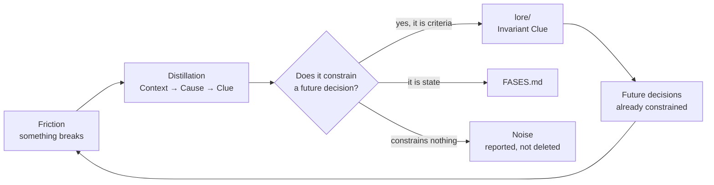
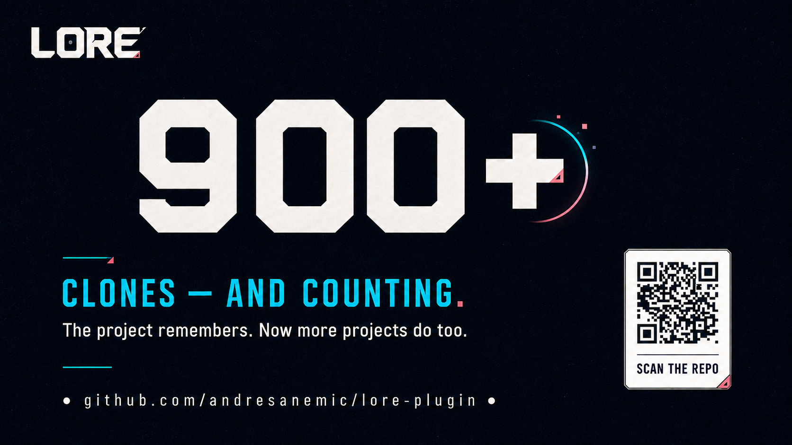
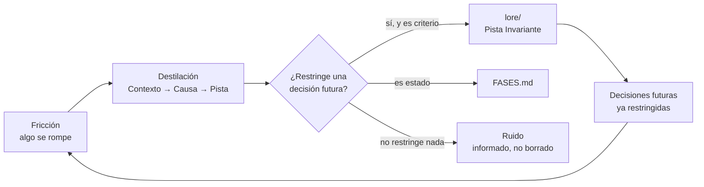
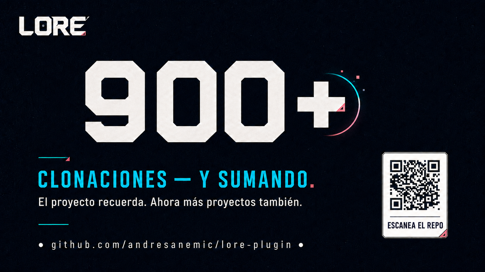

<a id="english"></a>

<p align="center">
  
</p>

<!-- Language selector (top of README.md) -->

<p align="right">
  <strong>Language / Idioma:</strong>
  <a href="#english">English</a> |
  <a href="#español">Español</a>
</p>

<h1 align="center">Lore</h1>

<p align="center">
  <a href="#installation"></a>
  <a href="#installation"></a>
  <a href="#what-is-lore"></a>
  <a href="#obsidian--the-way-in"></a>
  <a href="#origin"></a>
  <a href="#reach"></a>
</p>

<p align="center">
  <b>Stop explaining your project to the AI every morning.</b><br>
  Lore keeps the criteria behind your decisions and loads it into the next session.
</p>

<p align="center">
  no re-explaining the stack &nbsp;·&nbsp; no re-proposing what you ruled out last week &nbsp;·&nbsp; criteria that outlives the session
</p>

<p align="center">
  <code>7 skills · 6 case studies</code>
</p>

---

<table>
<tr>
<td width="33%" valign="top">

**Start**

[The problem](#the-problem)
[What is Lore](#what-is-lore)
[How it works](#how-it-works)
[Installation](#installation)

</td>
<td width="33%" valign="top">

**Use it**

[Architecture](#architecture)
[The seven skills](#the-seven-skills)
[Obsidian](#obsidian--the-way-in)
[Lore language](#lore-language)

</td>
<td width="33%" valign="top">

**Understand it**

[Reach](#reach)
[Shared invariants](#shared-invariants)
[Encryption](#encryption-experimental)
[Case studies](#case-studies) · [Origin](#origin)

</td>
</tr>
</table>

---

## The problem

You open a session. You explain, again, what the project does. That the initial state cannot live in JS, because you spent an afternoon on that flash last month. That the library it is about to suggest broke the build in April.

You explained all of it yesterday. You will explain it again tomorrow.

Meanwhile the project keeps accumulating what actually cost you — architectural decisions, production incidents, failed experiments, dozens of *"let's never do that again"* moments — and **none of it survives the session**.

It is a loop of re-explanations and mediocre solutions you had already rejected. LUS calls it **ephemeral experience**, and it does not happen because facts get forgotten: it happens because the learning never became a reusable structure.

> Traditional documentation solved part of the problem, but it only preserves **information**. Manuals describe procedures, READMEs explain installs, databases store facts. They rarely capture what actually changes a future decision.

---

## What is Lore

A lightweight **Spec-Driven Development** kit for Claude Code. It provides three things:

- a simple convention for organizing a project's criteria;
- seven skills that operate that convention;
- and a continuous loop for distilling experience into reusable criteria.

Unlike documentation, Lore does not try to describe everything. It only preserves what changes future behavior.

A README answers *"what is this?"*. Lore answers something else:

> **What did we learn that we should never have to learn again?**

> [!IMPORTANT]
> **If a sentence does not constrain a future decision, it is not Lore.** That rule is the whole filter, and it is what keeps the system from becoming another graveyard of documents.

---

## How it works

Every solved problem contains two things: the solution, and the reason that solution exists. Documentation keeps the first. **Lore keeps the second.**

Instead of recording what happened, it distills it into an **Invariant Clue**: a small constraint that stays useful long after the original context is gone.

| Instead of remembering | Lore keeps |
|---|---|
| "We had a hydration issue in Next.js" | "Never use client-side state to control initial opacity" |
| "Assets 404'd after deploying from Windows" | "Never compress with native Windows tools: use `tar.exe -a -c -f`" |

The event is forgotten. The criteria keeps working.

### The loop



Every step of the loop passes a **HARD GATE**: it is proposed, you approve, only then it is written.

---

## Installation

```bash
/plugin marketplace add andresanemic/lore-plugin
/plugin install lore@lore-plugin
```

Two lines, no dependencies or configuration. Then type `using-lore` and the kit points you at the skill you need.

> **Using another AI tool?** Each skill is a Markdown file with a YAML header: the packaging is Claude Code's, the architecture is not. Copy the skill folder anywhere, or paste its body as a system prompt. The six artifacts and the Area↔Project model are conventions, not code.

### What it looks like in practice

You just spent two hours fighting a flash of unstyled content on load. You solved it. Instead of closing the tab:

```text
› save to lore
```

```text
  Distilled this:

  [animation] Flash on load — initial state delegated to JS

  Context ······· Next.js with entrance animations under SSR
  Root cause ···· the JS hydrates after the browser painted the raw
                  HTML, so the element shows up for one frame before
                  the animation hides it
  Clue ·········· never delegate the initial state to JS. It lives
                  inline in the JSX (opacity: 0). Use fromTo to
                  transition, never to create the state
  Confidence ···· confirmed — validated in the running app

  → projects/client-a/lore/animation.md
  → this Clue is generic and confirmed: promote it to the Area,
    so the other 3 projects see it?

  Write it?
```

Three months later, in another project of the Area, someone asks for an entrance animation. The criteria is already loaded and that discussion never happens again.

> None of it was written without a human saying yes. Same gate in all seven skills.

---

## Reach

<p align="center">
  
</p>

<p align="center">
  <a href="./data/traffic/clones.json"></a>
  <a href="./data/traffic/clones.json"></a>
  <a href="./data/traffic/clones.json"></a>
  <a href="./data/traffic/clones.json"></a>
</p>

The total has not stopped growing and it keeps growing at a steady twenty-odd clones a day well past the launch spike. That steadiness is the more interesting part: it is not a launch bump, it is people still arriving. Data comes from GitHub's traffic API, stored weekly in [`data/traffic/clones.json`](./data/traffic/clones.json) because the API only keeps 14 days.

> **This is a reach signal, not a demonstration.** Nobody knows what anyone did with their copy: how many installed it, how many distilled anything, how many opened the folder once. It does not count as a case and it does not answer the question the [case studies](#case-studies) do. Note also that the "unique cloners" the API returns are unique **per day**, not people, so they cannot be summed into a headcount.

---

## Architecture

### The six artifacts

Every project organizes its criteria with exactly these six:

| Artifact | What it holds | Where |
|---|---|---|
| `identidad.md` | What the project is, its purpose and its **quality floor** | `lore/` |
| `principios.md` | Invariant laws, technical and business: prohibitions and imperatives | `lore/` |
| Thematic modules | Technical scars by domain (animation, layout, scroll…) | `lore/` |
| `index.md` | Navigation map: one line per pattern | `lore/` |
| `FASES.md` | State and roadmap: current phase, focus | root |
| `CLAUDE.md` | Collaboration contract, slimmed to **pointers** | root |

Each has one responsibility. None duplicates another.

> **Lore is criteria (it persists); `FASES.md` is state (it advances).** They never mix, and `FASES.md` never lives inside `lore/`.

The names shown are the Spanish canonical forms; in your language they localize. See [Lore language](#lore-language).

### Area → Project inheritance

Lore scales through **Areas**. An Area is a mother folder with its own Lore, and projects inherit it instead of copying it:

```text
web-development/
│
├── lore/                      ← general criteria lives ONCE
│     identity · principles · index · animation · scroll · layout
│
├── PHASES.md                  ← the Area's project registry
├── CLAUDE.md                  ← the Area's contract
│
└── projects/
    ├── client-a/
    │   └── lore/              ← only its own; the index points at the Area
    ├── client-b/
    │   └── lore/
    └── client-c/
        └── lore/
```

Fix a generic Clue once, in the Area, and every project sees it. Each project keeps only what belongs to it: the system stays DRY without losing accumulated experience.

### The third shape: a bot

| | Area | Project | **Bot** |
|---|---|---|---|
| Holds | projects | one piece of work | **a work session** |
| Its Lore governs | the domain's method | that work | **how the agent behaves** |
| Opened to | see the registry | advance that work | **work on any of several projects** |

Areas and projects are places; **a bot is a lens you carry into them.** It is not an Area, precisely because it owns none of the criteria it routes to: an Area that accumulates criteria it never paid for starts receiving promotions that belong somewhere else.

---

## The seven skills

| Skill | What for | When |
|---|---|---|
| [`using-lore`](#using-lore) | Entry point: explains the model and routes you to the right skill | first, always |
| [`create-area`](#create-area) | Creates an Area with its shared Lore | opening a new domain |
| [`create-project`](#create-project) | Creates a project that inherits from the Area | starting a piece of work |
| [`save-to-lore`](#save-to-lore) | Distills a lesson and decides whether it rises to the Area | every day |
| [`transmute-lore`](#transmute-lore) | Migrates old projects, cleans duplicates, or translates the Lore | inheriting something with no Lore |
| [`create-bot`](#create-bot) | One place to open a session and work across several Areas at once | once there is Lore worth gathering |
| [`obsidian-lore`](#obsidian--the-way-in) | Turns your loose notes into criteria | once the inbox gets heavy |

### `using-lore`

The entry point. Explains Lore's model, the six-artifact standard, the Area↔Project model, and routes you to the right skill. Read it before invoking any other.

### `create-area`

Creates a new Area with its own shared Lore: `identity` + `principles`, an `index.md`, a `CLAUDE.md`, a `PHASES.md` acting as project registry, and an empty `projects/` folder. It brainstorms the identity **before** touching disk.

### `create-project`

Creates a project inside an existing Area. The project inherits the Area's criteria instead of duplicating it: it keeps its own identity and principles, plus an `index.md` that **points** at the Area's modules by relative path. Folder structure and phases are derived from the project's source documents, not from a generic template.

### `save-to-lore`

The flow you will use every day. You solve something that cost you, and you type:

> "save to lore"

The skill extracts the criteria behind the solution, writes it where it belongs, and **proposes** — never executes — promoting it to the Area if it serves every project.

- Specific lessons stay inside the project.
- Generic, confirmed ones are proposed for promotion to the Area.
- Nothing is promoted automatically.

It has **two modes**, chosen by where the criteria comes from:

| Mode | Source | What it does |
|---|---|---|
| **capture** (default) | **lived friction**: a bug, a collapse, a client rejection | Distills the scar into an Invariant Clue. |
| **arbitrate** | **imported criteria**: a skill, a style guide, a third-party playbook | Judges it against **your** project's purpose. Only what survives gets in. |

> **The law of `arbitrate` mode: external criteria is not distilled, it is arbitrated.**
>
> A skill is criteria already distilled **by someone else, under someone else's purpose**, and it arrives without declaring where it stops being valid. Copying it into your Lore produces **redundant literature wearing the authority of an Invariant Clue**: criteria nobody paid for with real experience.
>
> That is why `arbitrate` has an exit HARD GATE: the resulting module **must** record **where the source contradicts your standard and loses**. No defeats section, no entry — either nothing was arbitrated (it was a copy), or the source carried no criteria at all.
>
> **What the source loses is worth more than what it offers:** the summary already exists, better written, in the source. The disagreement exists nowhere else.

Two warnings `arbitrate` mode will give you:

- **Capacity ≠ criteria.** A skill that **executes** (renders video, crawls, compiles) is **used** as a dependency: it is not Lore. Only a skill that **judges** (what is good copy, good design, good SEO) gets arbitrated.
- **No identity, no arbitration.** If your identity file is empty you have no yardstick, and facing an authoritative source all you can do is obey it. Identity first, source second.

### `transmute-lore`

Migrates existing projects into Lore's architecture. Three modes:

| Mode | What it does |
|---|---|
| **add** | Rescues criteria already scattered around (a bloated `CLAUDE.md`, a kilometric README, code comments) and crystallizes it into the six artifacts. |
| **clean** | Removes the project's redundant modules that the Area already owns. The criteria does not disappear: it changes owner. |
| **translate** | Standardizes the language of an existing Lore, translating content and renaming artifacts, without altering structure or meaning. |

### `create-bot`

Lets you **work from a single place across several Areas that belong to one project**. We call that *federating*.

Think of a blockchain lab. It has a website, it runs its social media, and it sustains lines of scientific research and technology transfer. Each of those Areas already has its own Lore. A bot routes all of them into one folder: you open the session there and can work on any of them, and make them talk to each other.

It works the other way round too: if you have an Area with several projects — several websites, say — a bot lets you work on one while reading the files of the others. Copying a footer from one site into another stops being an expedition.

**A bot does not answer questions about the projects: it works in them.**

> **Its north, and the only test that matters:** *a short instruction is enough.* If the project had to be explained to the bot to get the result, criteria were missing from the load.

**Two modes**, by where the criteria comes from:

| Mode | When | What it produces |
|---|---|---|
| **`nuevo`** | From zero. No prior Lore to gather. | Canon born from a brainstorm + source documents. |
| **`federar`** | The criteria already exists, dissolved across several Areas. | Canon **plus** a routing table over those Lore bodies. |

<details>
<summary><b>When the folders have no Lore yet</b></summary>

<br>

The usual starting point is not a tidy set of Lore bodies. It is raw material: folders of documents, a database, a Notion workspace, undistilled code. That cannot be federated yet, and the fix is a chain:

```text
raw folder (no Lore)
   └─ create-area                → the Area that will OWN that criteria
        └─ transmute-lore (add)     → rescues the criteria already scattered inside it
             └─ create-bot (federar)  → the bot routes to that Lore
```

**The law: the bot never distills into itself.** A source with no Lore gets its Lore **in the Area it belongs to**, and only then is federated. Letting the bot distill raw material makes it the owner of criteria it never paid for — the precise failure the Area/bot distinction exists to prevent, and in practice it is irreversible: once the only copy of that criteria lives in the bot, the Area can no longer be its source of truth.

`create-bot` inspects the paths you give it and tells you which already have Lore, which need transmuting first, and which need extracting to text beforehand. A free-note inbox is **never federated**: it holds no Lore, and it is `.md`, which is exactly what makes the mistake easy.

</details>

<details>
<summary><b>The three bodies that never merge</b></summary>

<br>

A bot holds three bodies of criteria with **three different owners**. Merging them is the default failure mode, and it is silent: everything still works, and the copy starts outranking its source.

| Body | What it is | Rule |
|---|---|---|
| `canon/` | criteria the bot **is** — loaded before every decision | distilled |
| `lore/` | criteria for **maintaining** the bot | the project's own |
| **borrowed** criteria | the Lore of every project the bot routes to | reached **by pointer**; **never authoritative** |

The test that keeps them apart: **would the source be discardable?** Distilling produces something smaller that can *replace* its origin; copying produces something identical that **cannot**.

**Federating is pointing, not copying.** Each row of the manifest is an **address**: the table says which Lore governs the task, and the generated access lets the session reach it where it lives. That criteria keeps one owner and one version, the same DRY rule the whole kit runs on.

And the law that makes routing work:

> **Route by type of task, not by name of project.**

One entity can own several bodies of criteria whose own principles forbid crossing them — what it does versus how it tells it is the common split. Naming it does not select a Lore.

</details>

<details>
<summary><b>Four optional extras, off by default</b></summary>

<br>

All four are asked when the bot is configured for the first time. A bot with none of them is complete: they are seals, not parts.

- **The ecosystem copy (`lore-ecosistema/`).** By default the bot **points** at each project's Lore where it lives, duplicating nothing. Turning it on only makes sense if whoever will use the bot does **not** have your folders: there the pointer resolves to nothing, and the copy is the only way that criteria exists on their machine.
- **Packaging it as a shareable plugin.** **Not created by default.** A bot is a folder with its canon and its `CLAUDE.md`: you open the session there and the criteria is already loaded, with nothing to install. Wrapping it in a skill with its own repository serves **one purpose**, handing it to a team, and if you are working alone it is scaffolding you still have to maintain.
- **Lore encryption** — *experimental*, see [Encryption](#encryption-experimental).
- **Remote operation over the Telegram MCP** — the bot depends on no channel: it runs where the repository lives, and the phone is only a terminal. Requires an explicit access list and a machine left on with a session open. This plugin neither packages nor installs it.

</details>

---

## Obsidian — the way in

If you already write notes in Obsidian, you already have the raw material. Point the vault at the **mother folder of your Areas** (*Open folder as vault*) and the same file tree is both your workspace and your vault. Nothing else gets configured.

Then, whenever you want:

> "review my Obsidian notes and see what belongs in my lore"

`obsidian-lore` sweeps the inbox, separates criteria from everything else, tells you which Lore each thing belongs to, and **waits for your approval** before writing anything.

> [!IMPORTANT]
> **Work your notes from a bot. Permanently, not as an alternative.**
>
> That is the setup this skill was designed for, and the reason is routing. A bot carries a routing table with the purpose of every Area and project it federates written down, so a note is routed **against that table** and the border cases get asked instead of guessed. From a bare folder, routing comes from one path plus a reading of the text: a guess wearing the same confidence.
>
> No bot yet, and your notes touch more than one Area? The skill will propose [`create-bot`](#create-bot). Take it up on that.

```text
<your mother folder>/           ← open it as a vault in Obsidian
  web-development/              ← your Areas and projects, with their Lore
  bots/projects/my-bot/         ← ★ open your sessions here
    notes/                      ← the inbox that matters: routed, not guessed
    canon/ · lore/ · CLAUDE.md
```

### What it does with each note

The discriminator is not the quality of the note: it is whether the note records a **transformation** or only a **fact**.

| The note records | Where it goes |
|---|---|
| A friction you **resolved** | Invariant Clue in the Lore |
| A **task** or an open problem — *"we need to add X"* | `FASES.md`. That is state, not criteria |
| Someone else's criteria you collected | Arbitration against your standard |
| A summary, a link, a meeting jotting | Noise, and it tells you so |

Most of a real inbox lands in the last row, and saying so is part of the job: a note container accumulates information above all, and criteria is the rare thing inside it.

> **Why a sweep and not a save button.** Writing the note already satisfies the urge to preserve, so the distillation never happens and the criterion stays asleep inside. Separating notes from Lore does not fix that: it was already tried, and the record stayed inert for six weeks (see [Case 05](#case-studies)). What works is sweeping, and having every sweep tell you how many notes have gone how long unmined.

### Where the inbox lives

**Where you open the session** — and **the vault root never has one**. Nobody opens a session at the root, so a note written there has no owner and no table to be routed against. Worse, a bot cannot reach the root: the sweep does not read it, does not fail, and reports a debt of zero. A note that belongs to no project means the project is missing — `create-project`, not an orphan inbox.

Every mined note gets a mark with date and destination, **including the ones that produced nothing**. That mark makes the sweep idempotent and makes the debt visible. The skill **never deletes a note**: mine before deleting, and deleting is your call.

**A note is source, never criteria.** It answers *"what happened"*; Lore answers *"what changed because of it"*. Nothing crosses without explicit distillation and a human approving the diff.

---

## Lore language

**Lore speaks your language.**

The skills are written in English, but the Lore they generate is not: both the **content** and the **artifact filenames** are written in the language you work in. `identidad.md`, `principios.md`, `FASES.md` are the Spanish canonical forms; in English they become `identity.md`, `principles.md`, `PHASES.md`.

What stays fixed in every language:

- `CLAUDE.md` (a Claude Code convention), `lore/` (the kit's own name), `index.md` and `golden-paths.md`;
- structure and relative-path depth;
- English terms of general technical use (workflow, commit, stack, scaffold…).

Inside an existing Area or project the established names win: naming schemes are never mixed. If a Lore ended up in the wrong language, or mixed, it is standardized with `transmute-lore` in **translate** mode, which translates content and renames artifacts together.

---

## Shared invariants

All seven skills follow the same rules:

- Lore is written **in your language**.
- **Criteria is never invented.** Everything comes from real experience.
- **A note is source, never criteria.**
- **Discarded noise is reported**, never silently deleted.
- Every change passes a **HARD GATE** before being written.
- **Nothing commits automatically.** You review the final diff.

---

## Encryption (experimental)

`create-bot` can seal a bot's criteria so it travels encrypted. It is **off by default** and **recommended for testing only**: a bot without encryption is complete, and for criteria that matters, a private repository is today's serious answer.

**The law: encrypt in distribution, never at consultation.** Payloads travel encrypted and are decrypted once on clone; at rest they are plain Markdown. Encrypting where the agent consults does not forbid reading, it makes reading **expensive**, and what is expensive stops being consulted.

AES-256-GCM with a scrypt-derived key, Node stdlib only. The passphrase is read from *stdin*, never pasted into the chat.

> [!CAUTION]
> It has **not been audited**, has no key rotation and no revocation. It protects the repository and the transport, **not** against someone holding the passphrase, and it does not cover what an AI tool does with the text once loaded into its context.

**Credit.** The question — *what protects a Lore that has to be shared?* — was opened by **Mantra**, by [LonelyAchemist](https://github.com/lonelyachemist-arch), which encrypted the Lore at rest. The answer here is inverted, and the code is our own.

---

## Documentation

This README covers motivation and architecture. For everything else there are three dedicated documents, in Spanish and English:

| Document | What it's for |
|---|---|
| [`USAGE_en.md`](./USAGE_en.md) · [`USAGE_es.md`](./USAGE_es.md) | Practical day-to-day usage guide: installation, core loop, and each skill with examples. |
| [`REFERENCE_en.md`](./REFERENCE_en.md) · [`REFERENCE_es.md`](./REFERENCE_es.md) | Technical reference: core concepts, the exact spec for each artifact and each skill. |
| [`MIGRATION_en.md`](./MIGRATION_en.md) · [`MIGRATION_es.md`](./MIGRATION_es.md) | How to migrate an existing project into Lore using `transmute-lore`. |

<details>
<summary><b>Repository structure</b></summary>

<br>

```text
lore-plugin/
  .claude-plugin/
    plugin.json
    marketplace.json

  skills/
    using-lore/
    create-area/
    create-project/
    create-bot/
      plantillas/        # validar.js · canon.js · sync.js · ecosistema.json
    save-to-lore/
    transmute-lore/
    obsidian-lore/

  README.md
  LICENSE
```

</details>

---

## Case studies

Lore was not designed on a whiteboard: every decision in this kit came from applying it to real projects and watching what broke. LUS documents those applications as **case studies**.

> **Status:** these are cases, not proofs. Small n, and all six documented cases come from the same researcher. What they claim constrains how we use the kit; it does not pretend to be a law.

<details>
<summary><b>Case 01 — Lore as the operational form of an entire project</b></summary>

<br>

A real project (*numerología*) built with Lore from start to finish, on top of a disciplined development practice. It showed that the six-artifact architecture **holds up across a whole project**, not just scattered notes: criteria accumulate, get consulted, and keep making decisions months later.

</details>

<details>
<summary><b>Case 02 — Criteria can be recovered and shared</b></summary>

<br>

Four projects of a real area (*web development*) migrated to the standard with `transmute-lore`. It left three things that are now law in this kit:

- **Criteria is recoverable** (`add` mode): a project born without Lore already had criteria scattered across comments, decisions, and scars. It is never invented: it is **rescued**.
- **Criteria is deduplicable** (`clean` mode): generic modules live **once, in the Area**. In one project, `clean` deleted 7 redundant modules (−866 lines) losing nothing: the criteria did not disappear, it **changed owner**.
- **Inheritance is selective:** each project references **only** the Area modules its stack actually uses.

**Declared boundary:** all four projects were in the same domain. Transferability *across* domains remains a promise, not evidence.

</details>

<details>
<summary><b>Case 03 — Imported criteria is not adopted: it is arbitrated</b></summary>

<br>

The case that produced `arbitrate` mode. Three areas distilled Lore from third-party skills, and what we observed contradicted the intuition:

- **The value was not the summary of the skill — it was the disagreement.** In two different areas, the dense block of the resulting module was *"where the skill contradicts our standard and loses"*. That part **existed neither in the skill nor in the previous Lore**: it was born from the collision.
- **The same skill, arbitrated by two opposite purposes, loses in the same place for inverse reasons.** *Copywriting* skills were defeated in a marketing area (*"boring, functional copy always wins"*) and in a journalism area (*"we don't sell, we inform"*). The outcome does not depend on the source: it depends on **your** purpose.
- **Capacity ≠ criteria.** A skill that *executes* was never distilled: it is used as a dependency.

**Declared boundary:** all three areas belong to the same user, using the same tool. The mechanism is observed, not proven at scale.

</details>

<details>
<summary><b>Case 04 — Lore without software: the structure survives outside code</b></summary>

<br>

The first case that crosses from software into another discipline. Two areas outside development — journalism and content strategy — already had real distilled Lore, not scaffolding: thematic modules derived from real work, consulted by real projects.

- **The architecture is not a software trait.** The same skeleton reproduced itself in trades with no compiler or test, just a disciplined practice with an explicit purpose.
- **Existence is not measurement.** The case shows the method *produces* criteria in another domain; it does not yet measure that criteria *reduced re-learning*.

**Declared boundary:** criteria did not *travel* across domains — each Lore was born fresh in its own discipline. What replicates is the mechanism.

</details>

<details>
<summary><b>Case 05 — Case memory does not feed distillation: it displaces it</b></summary>

<br>

The method came back, six weeks later, to the project where it had been invented in raw form. It found two preservation artifacts living side by side with opposite fates: a `lore/` of distilled Clues that kept working, and an incident log that **took part in no decision at all** — not even when the same technical territory that log documented broke again.

- **Preserving is not distilling, and the resemblance is the problem.** A case log satisfies the urge to preserve **without producing criteria**. Once the "leave a record" principle is met, nobody distills. Mining the log before deleting it surfaced two Clues that had sat there undistilled for six weeks.
- **"Indexed and mandatory" does not imply "consulted".** It was in the `CLAUDE.md` lookup table and it was law in `principios.md`, and still it never loaded. Accessibility is necessary and not sufficient.
- **The admission filter does not measure a Clue's altitude.** A Clue entered one day and the next failed to prevent the second symptom of its own root cause: it had been written about the surface that was seen, not the cause.

**This case is why `obsidian-lore` is a sweep and not a button.**

**Declared boundary:** this is software, same researcher and same interlocutor, and there is no counterfactual. Testimonial evidence, not measurement.

</details>

<details>
<summary><b>Case 06 — Inheritance between sibling Areas: freeze it or route it</b></summary>

<br>

A project needed criteria from four Areas, only one of which was its mother. **Lore's inheritance model is vertical, and sibling Areas are nobody's mother.** Two independent solutions appeared: **freezing** — copying snapshots, when the folder has to travel on its own — and **routing** — deciding per task which body governs. The second is what `create-bot` packages.

- **Consuming is not inheriting.** You inherit from the mother Area; criteria from a sibling Area is **consumed**. The distinction decides where a criterion promotes to once it generalizes: it rises to its own Area, never to the one that merely reads it.
- **What is distillable about a set of criteria is the border, not the criteria.** Two sibling Areas each had their half of the line written down. Neither had the rule for deciding which one governs a concrete task, because each body is written from inside its own purpose and the dividing line is only visible from outside both.

**Declared boundary:** the two observations are 48 hours apart, in the same ecosystem and with the same researcher. They are not two independent cases.

</details>

---

## Origin

Lore was born as a distillation of **LUS (Lore User System)**, a research program that studies how a human and an AI accumulate shared criteria over a long-term collaboration.

LUS studies the relationship. Lore is an operational implementation that emerged from that research. Its core principle fits in one idea:

> **Experience only creates value when it can participate in a future decision.**

Some of the main influences behind the program:

- **Martin Buber** — *I and Thou*
- **Claude Shannon** and **Warren Weaver** — *The Mathematical Theory of Communication*
- **Gregory Bateson** — "a difference that makes a difference"
- **Andy Clark** and **David Chalmers** — *The Extended Mind*

[Explore the research in the LUS NotebookLM](https://notebooklm.google.com/notebook/6191db3f-3f9b-4412-b792-86a081b79450)

### Why "Lore"?

In video games, *lore* is what gives a universe coherence. Not the mechanics: the accumulated story, the rules that keep influencing everything that can happen afterwards.

Lore applies that same idea to development. The original events stop mattering. The criteria remain.

---

## Author

**Andrés Peña Mellado** — principal researcher of LUS.

<p>
  <a href="https://github.com/andresanemic"></a>
  <a href="https://x.com/andresanemic"></a>
  <a href="https://www.linkedin.com/in/andresanemic/"></a>
  <a href="https://t.me/andresanemic"></a>
  
  <a href="mailto:andres@healthproof.cl"></a>
</p>

Questions, cases that contradict ours, a Lore that came out weird? The [repository discussions](https://github.com/andresanemic/lore-plugin/discussions) are the place. The cases that **refute** something are the ones that help most.

> **If Lore saved you from explaining yourself again, a ⭐ on the repo helps other people find it.**

---

<a id="español"></a>

<p align="center">
  
</p>

<p align="right">
  <strong>Language / Idioma:</strong>
  <a href="#english">English</a> |
  <a href="#español">Español</a>
</p>

<h1 align="center">Lore</h1>

<p align="center">
  <a href="#instalación"></a>
  <a href="#instalación"></a>
  <a href="#qué-es-lore"></a>
  <a href="#obsidian--la-puerta-de-entrada"></a>
  <a href="#origen"></a>
  <a href="#alcance"></a>
</p>

<p align="center">
  <b>Deja de explicarle tu proyecto a la IA todas las mañanas.</b><br>
  Lore guarda el criterio detrás de tus decisiones y lo carga en la siguiente sesión.
</p>

<p align="center">
  no volver a explicar el stack &nbsp;·&nbsp; no volver a proponer lo que descartaste la semana pasada &nbsp;·&nbsp; criterio que sobrevive al cierre de la sesión
</p>

<p align="center">
  <code>7 skills · 6 casos de estudio</code>
</p>

---

<table>
<tr>
<td width="33%" valign="top">

**Empezar**

[El problema](#el-problema)
[Qué es Lore](#qué-es-lore)
[Cómo funciona](#cómo-funciona)
[Instalación](#instalación)

</td>
<td width="33%" valign="top">

**Usarlo**

[Arquitectura](#arquitectura)
[Las siete skills](#las-siete-skills)
[Obsidian](#obsidian--la-puerta-de-entrada)
[Idioma del Lore](#idioma-del-lore)

</td>
<td width="33%" valign="top">

**Entenderlo**

[Alcance](#alcance)
[Invariantes](#invariantes-compartidas)
[Cifrado](#cifrado-experimental)
[Casos de estudio](#casos-de-estudio) · [Origen](#origen)

</td>
</tr>
</table>

---

## El problema

Abres una sesión. Explicas, otra vez, qué hace el proyecto. Que el estado inicial no puede vivir en JS, porque perdiste una tarde con ese parpadeo el mes pasado. Que la librería que está por sugerirte rompió el build en abril.

Todo eso lo explicaste ayer. Mañana lo vas a explicar de nuevo.

Mientras tanto el proyecto sigue acumulando lo que de verdad te costó —decisiones de arquitectura, incidentes en producción, experimentos fallidos, decenas de momentos de *«nunca volvamos a hacer esto»*— y **nada de eso sobrevive a la sesión**.

Es un bucle de reexplicaciones y de soluciones mediocres que ya habías rechazado. LUS lo llama **experiencia efímera**, y no ocurre porque se olviden los datos: ocurre porque el aprendizaje nunca se convirtió en una estructura reutilizable.

> La documentación tradicional resolvió parte del problema, pero solo preserva **información**. Los manuales describen procedimientos, los README explican instalaciones, las bases de datos guardan hechos. Casi nunca capturan lo que de verdad modifica una decisión futura.

---

## Qué es Lore

Un kit ligero de **Spec-Driven Development** para Claude Code. Aporta tres cosas:

- una convención sencilla para organizar el criterio de un proyecto;
- siete *skills* que operan esa convención;
- y un ciclo continuo para destilar experiencia en criterio reutilizable.

A diferencia de la documentación, Lore no intenta describirlo todo. Solo conserva aquello que modifica el comportamiento futuro.

Un README responde *«¿qué es esto?»*. Lore responde otra cosa:

> **¿Qué aprendimos que nunca deberíamos tener que volver a aprender?**

> [!IMPORTANT]
> **Si una frase no restringe una decisión futura, no es Lore.** Esa regla es todo el filtro, y es lo que impide que el sistema se convierta en otro cementerio de documentos.

---

## Cómo funciona

Todo problema resuelto contiene dos cosas: la solución, y la razón por la que esa solución existe. La documentación conserva la primera. **Lore conserva la segunda.**

En lugar de registrar lo que pasó, lo destila en una **Pista Invariante**: una restricción pequeña que sigue sirviendo mucho después de que el contexto original desapareció.

| En vez de recordar | Lore guarda |
|---|---|
| «Tuvimos un problema de hidratación en Next.js» | «Nunca uses estado del cliente para controlar la opacidad inicial» |
| «Al desplegar desde Windows los assets daban 404» | «Prohibido comprimir con herramientas nativas de Windows: usar `tar.exe -a -c -f`» |

El acontecimiento se olvida. El criterio sigue trabajando.

### El ciclo



Cada paso del ciclo pasa por un **HARD-GATE**: se propone, tú apruebas, recién entonces se escribe.

---

## Instalación

```bash
/plugin marketplace add andresanemic/lore-plugin
/plugin install lore@lore-plugin
```

Dos líneas, sin dependencias ni configuración. Después escribe `using-lore` y el kit te guía hacia la skill que necesitas.

> **¿Usas otra herramienta de IA?** Cada skill es un archivo Markdown con encabezado YAML: el empaquetado es de Claude Code, la arquitectura no. Copia la carpeta de la skill donde quieras, o pega su cuerpo como prompt de sistema.

### Así se ve en la práctica

Acabas de pasar dos horas peleando con un parpadeo al cargar la página. Lo resolviste. En vez de cerrar la pestaña:

```text
› guarda en lore
```

```text
  Destilé esto:

  [animacion] Parpadeo al cargar — el estado inicial delegado a JS

  Contexto ······ Next.js con animaciones de entrada en SSR
  Causa raíz ···· el JS se hidrata después de que el navegador pintó
                  el HTML crudo, así que el elemento aparece visible
                  un frame antes de que la animación lo oculte
  Pista ········· prohibido delegar el estado inicial a JS. Vive
                  inline en el JSX (opacity: 0). Usar fromTo para
                  transicionar, nunca para crear el estado
  Confianza ····· confirmada — validado en la app corriendo

  → proyectos/cliente-a/lore/animacion.md
  → esta Pista es genérica y confirmada: ¿la promuevo al Área,
    para que la vean los otros 3 proyectos?

  ¿Escribo?
```

Tres meses después, en otro proyecto del Área, alguien pide una animación de entrada. El criterio ya está cargado y esa discusión no vuelve a ocurrir.

---

## Alcance

<p align="center">
  
</p>

<p align="center">
  <a href="./data/traffic/clones.json"></a>
  <a href="./data/traffic/clones.json"></a>
  <a href="./data/traffic/clones.json"></a>
  <a href="./data/traffic/clones.json"></a>
</p>

El total no ha dejado de crecer y sigue creciendo a unas veinte clonaciones diarias mucho después del pico del lanzamiento. Esa constancia es lo más interesante: no es el rebote de un lanzamiento, es gente que sigue llegando. Los datos vienen de la API de tráfico de GitHub y se guardan cada semana en [`data/traffic/clones.json`](./data/traffic/clones.json), porque la API solo conserva 14 días.

> **Es una señal de alcance, no una demostración.** Nadie sabe qué hizo cada quien con su copia: cuántos la instalaron, cuántos destilaron algo, cuántos abrieron la carpeta una vez. No cuenta como caso y no responde la pregunta que sí responden los [casos de estudio](#casos-de-estudio). Y los «clonadores únicos» que devuelve la API son únicos **por día**, no personas: no se pueden sumar para contar cabezas.

---

## Arquitectura

### Los seis artefactos

| Artefacto | Qué guarda | Dónde |
|---|---|---|
| `identidad.md` | Qué es el proyecto, su propósito y su **piso de calidad** | `lore/` |
| `principios.md` | Leyes invariantes, técnicas y de negocio | `lore/` |
| Módulos temáticos | Cicatrices técnicas por dominio | `lore/` |
| `index.md` | Mapa de navegación: una línea por patrón | `lore/` |
| `FASES.md` | Estado y hoja de ruta | raíz |
| `CLAUDE.md` | Contrato de colaboración, reducido a **punteros** | raíz |

Cada uno tiene una responsabilidad. Ninguno duplica a otro.

> **El Lore es criterio (persiste); `FASES.md` es estado (avanza).** Nunca se mezclan, y `FASES.md` nunca vive dentro de `lore/`.

### Herencia Área → Proyecto

```text
desarrollo-web/
│
├── lore/                      ← el criterio general vive UNA sola vez
│     identidad · principios · index · animacion · scroll · layout
│
├── FASES.md                   ← registro de proyectos del Área
├── CLAUDE.md                  ← contrato del Área
│
└── proyectos/
    ├── cliente-a/
    │   └── lore/              ← solo lo propio; el index apunta al Área
    ├── cliente-b/
    │   └── lore/
    └── cliente-c/
        └── lore/
```

Arreglas una Pista genérica una vez, en el Área, y todos los proyectos la ven.

### La tercera forma: un bot

| | Área | Proyecto | **Bot** |
|---|---|---|---|
| Contiene | proyectos | un trabajo | **una sesión de trabajo** |
| Su Lore gobierna | el método del dominio | ese trabajo | **cómo se comporta el agente** |
| Se abre para | ver el registro | avanzar eso | **trabajar en varios proyectos** |

Las Áreas y los proyectos son lugares; **un bot es una lente que llevas a ellos.**

---

## Las siete skills

| Skill | Para qué | Cuándo |
|---|---|---|
| [`using-lore`](#using-lore) | Punto de entrada: explica el modelo y te manda a la skill correcta | primero, siempre |
| [`create-area`](#create-area) | Crea un Área con su Lore compartido | al abrir un dominio nuevo |
| [`create-project`](#create-project) | Crea un proyecto que hereda del Área | al empezar un trabajo |
| [`save-to-lore`](#save-to-lore) | Destila una lección y decide si sube al Área | todos los días |
| [`transmute-lore`](#transmute-lore) | Migra proyectos viejos, limpia duplicados o traduce el Lore | al heredar algo sin Lore |
| [`create-bot`](#create-bot) | Un lugar donde abrir sesión y trabajar sobre varias Áreas a la vez | cuando ya hay Lore que reunir |
| [`obsidian-lore`](#obsidian--la-puerta-de-entrada) | Convierte tus notas sueltas en criterio | cuando la bandeja pesa |

### `using-lore`

El punto de entrada. Explica el modelo de Lore, el estándar de seis artefactos, el modelo Área↔Proyecto, y te guía hacia la skill adecuada. Léelo antes de invocar cualquier otro.

### `create-area`

Crea un Área nueva con su propio Lore compartido: `identidad.md` + `principios.md`, un `index.md`, un `CLAUDE.md`, un `FASES.md` que hace de registro de proyectos, y una carpeta `proyectos/` vacía. Hace un brainstorm de la identidad **antes** de tocar el disco.

### `create-project`

Crea un proyecto dentro de un Área existente. El proyecto hereda el criterio del Área en vez de duplicarlo: conserva su `identidad.md` y `principios.md` propios, y un `index.md` que **apunta** a los módulos del Área por ruta relativa. La estructura de carpetas y las fases se derivan de los documentos fuente del proyecto, no de una plantilla genérica.

### `save-to-lore`

El flujo que usarás todos los días. Resuelves algo que costó y escribes «guarda en lore». La skill extrae el criterio detrás de la solución, lo escribe donde corresponde y **propone** —nunca ejecuta— subirlo al Área si sirve para todos los proyectos.

- Las lecciones específicas se quedan en el proyecto.
- Las genéricas y confirmadas se proponen para promoción al Área.
- Nada se promueve automáticamente.

| Modo | Fuente | Qué hace |
|---|---|---|
| **capture** (por defecto) | **fricción vivida**: un bug, un cliente que rechaza | Destila la cicatriz en una Pista Invariante. |
| **arbitrate** | **criterio importado**: una skill, una guía ajena | Lo juzga contra la finalidad de **tu** proyecto. |

> **Un criterio ajeno no se destila, se arbitra.** Una skill es criterio destilado por otro, bajo otra finalidad, y llega sin declarar dónde deja de valer. Por eso `arbitrate` exige registrar **dónde la fuente contradice tu estándar y pierde**: sin esa sección no entra. Lo que la fuente pierde vale más que lo que aporta — el resumen ya existe, mejor escrito, en la fuente.

Dos avisos que te dará:

- **Capacidad ≠ criterio.** Una skill que **ejecuta** se **usa** como dependencia: no es Lore. Solo se arbitra la que **juzga**.
- **Sin identidad no hay arbitraje.** Si tu `identidad.md` está vacío, frente a una fuente con autoridad lo único que puedes hacer es obedecerla.

### `transmute-lore`

| Modo | Qué hace |
|---|---|
| **add** | Rescata el criterio ya disperso y lo cristaliza en los seis artefactos. |
| **clean** | Elimina los módulos del proyecto que el Área ya posee. El criterio cambia de dueño. |
| **translate** | Estandariza el idioma de un Lore existente, sin alterar estructura ni significado. |

### `create-bot`

Te permite **trabajar desde un solo lugar sobre varias Áreas que forman parte de un mismo proyecto**. A eso lo llamamos *federar*.

Piensa en un laboratorio de blockchain: tiene su sitio web, lleva sus redes sociales, y sostiene líneas de investigación y de transferencia tecnológica. Cada una es un Área con su propio Lore. Un bot las enruta a todas hacia una misma carpeta: abres la sesión ahí y trabajas en cualquiera de ellas.

**Un bot no responde preguntas sobre los proyectos: trabaja en ellos.**

> **Su norte, y el único test que importa:** *una instrucción corta basta.* Si hubo que explicarle el proyecto al bot para obtener el resultado, faltaba criterio cargado.

**Dos modos**, según de dónde sale el criterio:

| Modo | Cuándo | Qué produce |
|---|---|---|
| **`nuevo`** | Desde 0. No hay Lore previo que reunir. | Canon nacido de un brainstorm + documentos fuente. |
| **`federar`** | El criterio ya existe, disuelto en varias Áreas. | Canon **más** una tabla de enrutamiento sobre esos Lore. |

<details>
<summary><b>Cuando las carpetas todavía no tienen Lore</b></summary>

<br>

El punto de partida habitual no es un conjunto ordenado de Lore. Es material en bruto: carpetas de documentos, una base de datos, un espacio de Notion, código sin destilar. Eso no se puede federar todavía, y el arreglo es una cadena:

```text
carpeta en bruto (sin Lore)
   └─ create-area                → el Área que va a ser DUEÑA de ese criterio
        └─ transmute-lore (add)     → rescata el criterio que ya estaba disperso adentro
             └─ create-bot (federar)   → el bot enruta hacia ese Lore
```

**La ley: el bot nunca destila hacia sí mismo.** Una fuente sin Lore recibe su Lore **en el Área que le corresponde**, y recién después se federa. Dejar que el bot destile material en bruto lo convierte en dueño de criterio que no pagó — la falla exacta que la distinción Área/bot existe para evitar, y en la práctica es irreversible: cuando la única copia de ese criterio vive en el bot, el Área ya no puede ser su fuente de verdad.

`create-bot` inspecciona las rutas que le des y te dice cuáles ya tienen Lore, cuáles hay que transmutar primero y cuáles hay que extraer a texto antes. Una bandeja de notas libres **nunca se federa**: no tiene Lore, y es `.md`, que es justo lo que vuelve fácil el error.

</details>

<details>
<summary><b>Los tres cuerpos que nunca se mezclan</b></summary>

<br>

Un bot sostiene tres cuerpos de criterio con **tres dueños distintos**. Fundirlos es el modo de falla por defecto, y es silencioso: todo sigue funcionando, y la copia empieza a ganarle a su fuente.

| Cuerpo | Qué es | Regla |
|---|---|---|
| `canon/` | criterio que el bot **es** — cargado antes de cada decisión | destilado |
| `lore/` | criterio para **mantener** el bot | propio del proyecto |
| criterio **prestado** | el Lore de cada proyecto que el bot enruta | se alcanza **por puntero**; **nunca es autoritativo** |

El test que los separa: **¿sería descartable la fuente?** Destilar produce algo más chico que puede *reemplazar* a su origen; copiar produce algo idéntico que **no puede**.

**Federar es apuntar, no copiar.** Cada fila del manifiesto es una **dirección**: la tabla dice qué Lore gobierna la tarea, y el acceso generado deja que la sesión lo alcance donde vive. Ese criterio conserva un solo dueño y una sola versión, la misma regla DRY con la que funciona todo el kit.

Y la ley que hace funcionar el enrutamiento:

> **Se enruta por tipo de tarea, no por nombre de proyecto.**

Una entidad puede tener varios cuerpos de criterio cuyos propios principios prohíben cruzarlos —lo que hace contra cómo lo cuenta es el corte habitual—. Decir su nombre no alcanza para elegir.

</details>

<details>
<summary><b>Cuatro extras opcionales, apagados por defecto</b></summary>

<br>

Los cuatro se preguntan al configurar el bot la primera vez. Un bot sin ninguno está completo: son sellos, no piezas.

- **La copia del ecosistema (`lore-ecosistema/`).** Por defecto el bot **apunta** al Lore de cada proyecto donde vive, sin duplicar nada. Encenderla solo tiene sentido si quien va a usar el bot **no** tiene tus carpetas: ahí el puntero no apunta a nada y la copia es lo único que hace existir ese criterio en su máquina.
- **Empaquetarlo como *plugin* compartible.** Por defecto **no se crea**. Un bot es una carpeta con su canon y su `CLAUDE.md`: abres la sesión ahí y el criterio ya está cargado, sin instalar nada. Envolverlo en una skill con su repositorio propio sirve para **una sola cosa**, repartirlo a un equipo, y si vas a trabajar tú solo es andamiaje que igual hay que mantener.
- **Cifrado del Lore** — *experimental*, ver la sección de cifrado.
- **Operación remota por el MCP de Telegram** — el bot no depende de ningún canal: corre donde vive el repositorio y el teléfono es solo la terminal. Requiere lista de acceso explícita y dejar una máquina encendida con una sesión abierta. Este plugin no lo empaqueta ni lo instala.

</details>

---

## Obsidian — la puerta de entrada

Si ya escribes notas en Obsidian, ya tienes la materia prima. Apunta la vault a la **carpeta madre de tus Áreas** (*Open folder as vault*) y el mismo árbol de archivos es a la vez tu espacio de trabajo y tu vault.

Después, cuando quieras:

> «revisa mis notas de Obsidian y checa si algo se puede guardar en mi lore»

`obsidian-lore` barre la bandeja, separa lo que es criterio de lo que no, te dice a qué Lore va cada cosa y **espera tu aprobación** antes de escribir nada.

> [!IMPORTANT]
> **Ten tus notas en un bot. De forma permanente, no como una opción entre varias.**
>
> Es la configuración para la que esta skill fue diseñada, y la razón es el enrutamiento. Un bot lleva una tabla con la finalidad de cada Área y proyecto que federa escrita ahí, así que una nota se enruta **contra esa tabla** y los casos frontera se preguntan en vez de adivinarse. Desde una carpeta suelta, el enrutamiento sale de una sola ruta y de la lectura del texto: una conjetura con la misma cara de certeza.
>
> ¿Todavía sin bot, y tus notas tocan más de un Área? La skill te va a proponer `create-bot`. Hazle caso.

```text
<tu carpeta madre>/             ← ábrela como vault en Obsidian
  desarrollo-web/               ← tus Áreas y proyectos, con su Lore
  bots/proyectos/mi-bot/        ← ★ abre tus sesiones acá
    notas/                      ← la bandeja que importa: enrutada, no adivinada
    canon/ · lore/ · CLAUDE.md
```

### Qué hace con cada nota

El discriminador no es la calidad de la nota: es si registra una **transformación** o solo un **hecho**.

| La nota registra | Adónde va |
|---|---|
| Una fricción que **resolviste** | Pista Invariante en el Lore |
| Una **tarea** o un problema abierto — *«hay que añadir X»* | `FASES.md`. Es estado, no criterio |
| Criterio ajeno que recogiste | Arbitraje contra tu estándar |
| Un resumen, un link, un apunte de reunión | Ruido, y te lo informa |

La mayoría de una bandeja real cae en la última fila, y decirlo es parte del trabajo.

> **Por qué un barrido y no un botón de guardar.** Escribir la nota ya satisface las ganas de preservar, así que la destilación nunca ocurre y el criterio se queda dormido adentro. Separar las notas del Lore no lo arregla: eso ya se probó, y el registro siguió inerte seis semanas (Caso 05). Lo que sí funciona es barrer, y que cada barrido te diga cuántas notas llevan cuánto tiempo sin minar.

### Dónde vive la bandeja

**Donde abres la sesión** — y **la raíz de la vault nunca tiene una**. Nadie abre una sesión en la raíz, así que una nota escrita ahí no tiene dueño ni tabla contra la cual enrutarse. Peor: un bot no alcanza la raíz, de modo que el barrido no la lee, no falla y reporta deuda cero. Una nota que no pertenece a ningún proyecto significa que falta el proyecto — `create-project`, no una bandeja huérfana.

Cada nota minada recibe una marca con fecha y destino, **incluidas las que no produjeron nada**. La skill **nunca borra una nota**: se mina antes de borrar, y borrar lo decides tú.

**Una nota es fuente, nunca criterio.** Responde *«qué pasó»*; el Lore responde *«qué cambió por eso»*.

---

## Idioma del Lore

**El Lore habla tu idioma.** Las *skills* están escritas en inglés, pero el Lore que generan no: tanto el **contenido** como los **nombres de los artefactos** se escriben en el idioma en el que trabajas. `identidad.md`, `principios.md`, `FASES.md` son las formas canónicas en español; en inglés serían `identity.md`, `principles.md`, `PHASES.md`.

Permanecen fijos en todos los idiomas `CLAUDE.md`, `lore/`, `index.md` y `golden-paths.md`, la estructura de rutas relativas y los términos técnicos de uso general en inglés.

Dentro de un Área existente mandan los nombres ya establecidos. Si un Lore quedó mezclado, se estandariza con `transmute-lore` en modo **translate**.

---

## Invariantes compartidas

- El Lore se escribe **en tu idioma**.
- **El criterio nunca se inventa.** Todo proviene de experiencia real.
- **Una nota es fuente, nunca criterio.**
- **El ruido descartado se informa**, nunca se elimina en silencio.
- Todo cambio pasa por un **HARD-GATE** antes de escribirse.
- **Nada hace *commit* automáticamente.** Tú revisas el *diff* final.

---

## Cifrado (experimental)

`create-bot` puede sellar el criterio de un bot para que viaje cifrado. Está **apagado por defecto** y **se recomienda solo para pruebas**: para criterio que importa, un repositorio privado es hoy la respuesta seria.

**La ley: se cifra en distribución, nunca en consulta.** Las cargas viajan cifradas y se descifran una vez al clonar; en reposo son Markdown plano. Cifrar donde el agente consulta no prohíbe leer, **encarece** leer, y lo caro deja de consultarse.

AES-256-GCM con clave derivada por scrypt, solo con la stdlib de Node. La passphrase se pide por *stdin*, nunca pegada en el chat.

> [!CAUTION]
> **No ha sido auditado**, no tiene rotación de claves ni revocación. Protege el repositorio y el tránsito, **no** contra quien tiene la passphrase, y no cubre lo que una herramienta de IA hace con el texto una vez cargado en su contexto.

**Crédito.** La pregunta —*¿qué protege a un Lore que tiene que compartirse?*— la abrió **Mantra**, de [LonelyAchemist](https://github.com/lonelyachemist-arch), que cifraba el Lore en reposo. La respuesta acá está invertida, y el código es propio.

---

## Documentación

| Documento | Para qué sirve |
|---|---|
| [`USAGE_es.md`](./USAGE_es.md) · [`USAGE_en.md`](./USAGE_en.md) | Guía práctica de uso día a día, con ejemplos. |
| [`REFERENCE_es.md`](./REFERENCE_es.md) · [`REFERENCE_en.md`](./REFERENCE_en.md) | Referencia técnica de cada artefacto y cada *skill*. |
| [`MIGRATION_es.md`](./MIGRATION_es.md) · [`MIGRATION_en.md`](./MIGRATION_en.md) | Cómo migrar un proyecto existente con `transmute-lore`. |

<details>
<summary><b>Estructura del repositorio</b></summary>

<br>

```text
lore-plugin/
  .claude-plugin/
    plugin.json
    marketplace.json

  skills/
    using-lore/
    create-area/
    create-project/
    create-bot/
      plantillas/        # validar.js · canon.js · sync.js · ecosistema.json
    save-to-lore/
    transmute-lore/
    obsidian-lore/

  README.md
  LICENSE
```

</details>

---

## Casos de estudio

Lore no se diseñó en una pizarra: cada decisión salió de aplicarlo a proyectos reales y mirar qué se rompía.

> **Estatus:** son casos, no demostraciones. n pequeño, y las seis evidencias vienen del mismo investigador. Restringen cómo usamos el kit; no pretenden ser una ley.

<details>
<summary><b>Caso 01 — El Lore como forma operativa de un proyecto entero</b></summary>

<br>

Un proyecto real (*numerología*) construido con Lore de principio a fin, sobre una práctica de desarrollo disciplinado. Mostró que la arquitectura de seis artefactos **aguanta un proyecto completo**, no solo notas sueltas: el criterio se acumula, se consulta y sigue decidiendo meses después.

</details>

<details>
<summary><b>Caso 02 — El criterio se recupera y se comparte</b></summary>

<br>

Cuatro proyectos de un área real (*desarrollo web*) llevados al estándar con `transmute-lore`. Dejó tres cosas que hoy son ley del kit:

- **El criterio es recuperable** (modo `add`): un proyecto que nació sin Lore ya tenía criterio disperso en comentarios, decisiones y cicatrices. No se inventa: **se rescata**.
- **El criterio es deduplicable** (modo `clean`): los módulos genéricos viven **una sola vez, en el Área**. En un proyecto, el `clean` borró 7 módulos redundantes (−866 líneas) sin perder nada: el criterio no desapareció, **cambió de dueño**.
- **La herencia es selectiva:** cada proyecto referencia **solo** los módulos del Área que su stack realmente usa.

**Frontera declarada:** los cuatro proyectos eran del mismo dominio. La transferibilidad *entre dominios* sigue siendo promesa, no evidencia.

</details>

<details>
<summary><b>Caso 03 — El criterio importado no se adopta: se arbitra</b></summary>

<br>

El caso que originó el modo `arbitrate`. Tres áreas destilaron Lore a partir de *skills* de terceros, y lo observado contradijo la intuición:

- **Lo valioso no fue el resumen de la skill, fue el desacuerdo.** En dos áreas distintas, el bloque denso del módulo resultante era *«dónde la skill contradice nuestro estándar y pierde»*. Esa parte **no existía ni en la skill ni en el Lore previo**: nació de la colisión.
- **La misma skill, arbitrada por dos finalidades opuestas, pierde en el mismo sitio por razones inversas.** Las skills de *copywriting* fueron derrotadas en un área de marketing (*«copy aburrido y funcional le gana siempre»*) y en una de periodismo (*«no vendemos, informamos»*). El resultado no depende de la fuente: depende de **tu** finalidad.
- **Capacidad ≠ criterio.** Una skill que *ejecuta* no se destiló: se usa como dependencia.

**Frontera declarada:** las tres áreas son del mismo usuario, con la misma herramienta. El mecanismo está observado, no probado a escala.

</details>

<details>
<summary><b>Caso 04 — El Lore no-software: la estructura sobrevive fuera del código</b></summary>

<br>

El primer caso que cruza de software a otra disciplina. Dos áreas ajenas al desarrollo —periodismo y estrategia de contenido— ya tenían Lore destilado real, no andamiaje: módulos temáticos derivados de trabajo real, consultados por proyectos reales.

- **La arquitectura no es un rasgo del software.** El mismo esqueleto se reprodujo en oficios sin compilador ni test, solo con una práctica disciplinada y una finalidad explícita.
- **Existencia no es medición.** El caso muestra que el método *produce* criterio en otro dominio; no mide todavía que ese criterio *redujo el reaprendizaje*.

**Frontera declarada:** el criterio no *viajó* entre dominios — cada Lore nació fresco en su disciplina. Lo que se replica es el mecanismo.

</details>

<details>
<summary><b>Caso 05 — La memoria del caso no alimenta la destilación: la desplaza</b></summary>

<br>

El método volvió, seis semanas después, al proyecto donde había nacido en bruto. Encontró dos artefactos de preservación conviviendo con suertes opuestas: un `lore/` de Pistas destiladas, que seguía trabajando, y un registro de incidentes que **no participó de una sola decisión** — ni siquiera cuando volvió a romperse el mismo territorio técnico que ese registro documentaba.

- **Preservar no es destilar, y el parecido es el problema.** Un registro de casos satisface el impulso de preservar **sin producir criterio**. Cumplido el principio de «dejar registro», nadie destila. Al minar el registro antes de borrarlo aparecieron dos Pistas que llevaban seis semanas ahí sin destilarse.
- **«Indexado y obligatorio» no implica «consultado».** Estaba en la tabla de consulta del `CLAUDE.md` y era ley en `principios.md`, y aun así no se cargó. La accesibilidad es necesaria y no suficiente.
- **El filtro de admisión no mide la altitud de la Pista.** Una Pista entró un día y al siguiente no impidió el segundo síntoma de su misma causa: estaba escrita sobre la superficie que se vio, no sobre la causa.

**Este caso es la razón de que `obsidian-lore` sea un barrido y no un botón.**

**Frontera declarada:** es software, mismo investigador y mismo interlocutor, y no hay contrafactual. Evidencia testimonial, no medida.

</details>

<details>
<summary><b>Caso 06 — La herencia entre Áreas hermanas: congelarla o enrutarla</b></summary>

<br>

Un proyecto necesitó criterio de cuatro Áreas, de las cuales solo una era su madre. **El modelo de herencia de Lore es vertical, y las Áreas hermanas no son madres de nadie.** Aparecieron dos soluciones independientes: **congelar** —copiar snapshots, cuando la carpeta tiene que viajar sola— y **enrutar** —decidir por tarea cuál cuerpo gobierna—. Este segundo camino es el que `create-bot` empaqueta.

- **Consumir no es heredar.** Se hereda del Área madre; el criterio de un Área hermana se **consume**. La distinción decide hacia dónde promueve un criterio que se generaliza: sube a su propia Área, nunca a la que solo lo lee.
- **Lo destilable de un conjunto de criterios es la frontera, no los criterios.** Dos Áreas hermanas tenían escrita, cada una, su mitad de la línea. Ninguna tenía la regla para decidir cuál gobierna una tarea concreta, porque cada cuerpo se escribe desde adentro de su propia finalidad y la divisoria solo se ve desde afuera de los dos.

**Frontera declarada:** las dos observaciones distan 48 horas, en el mismo ecosistema y con el mismo investigador. No son dos casos independientes.

</details>

---

## Origen

Lore nació como una destilación de **LUS (Lore User System)**, un programa de investigación que estudia cómo un ser humano y una IA acumulan criterio compartido a lo largo de una colaboración prolongada.

LUS estudia la relación. Lore es su implementación operativa. Un principio lo resume:

> **La experiencia solo crea valor cuando puede volver a participar en una decisión futura.**

Influencias: **Martin Buber** (*Yo y Tú*), **Shannon** y **Weaver** (*The Mathematical Theory of Communication*), **Gregory Bateson** («una diferencia que produce una diferencia»), **Clark** y **Chalmers** (*The Extended Mind*).

[Explora la investigación en el NotebookLM de LUS](https://notebooklm.google.com/notebook/6191db3f-3f9b-4412-b792-86a081b79450)

### ¿Por qué «Lore»?

En los videojuegos, el *lore* es aquello que da coherencia a un universo. No son las mecánicas: es la historia acumulada, las reglas que siguen influyendo en todo lo que puede ocurrir después. Los acontecimientos dejan de importar. El criterio permanece.

---

## Autor

**Andrés Peña Mellado** — investigador principal de LUS.

<p>
  <a href="https://github.com/andresanemic"></a>
  <a href="https://x.com/andresanemic"></a>
  <a href="https://www.linkedin.com/in/andresanemic/"></a>
  <a href="https://t.me/andresanemic"></a>
  
  <a href="mailto:andres@healthproof.cl"></a>
</p>

¿Preguntas, casos que contradigan los nuestros, un Lore que quedó raro? La [discusión del repositorio](https://github.com/andresanemic/lore-plugin/discussions) es el lugar. Los casos que **refutan** algo son los que más sirven.

> **Si Lore te ahorró volver a explicarte, una ⭐ en el repositorio ayuda a que otras personas lo encuentren.**
