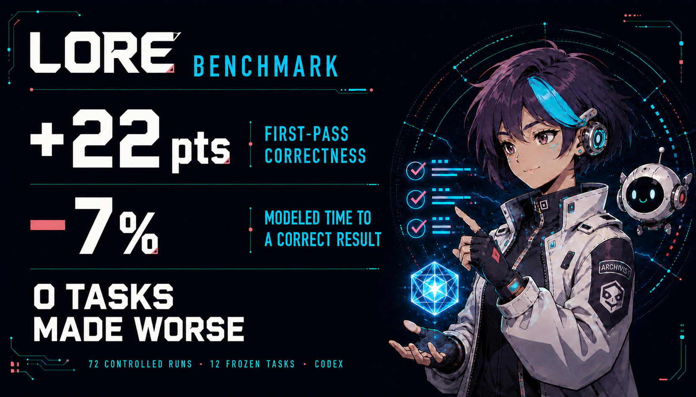
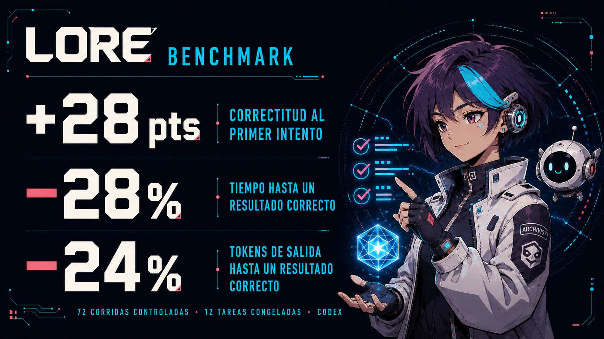

<a id="english"></a>

<p align="center">
  
</p>

<!-- Language selector (top of README.md) -->

<p align="right">
  <strong>Language / Idioma:</strong>
  <a href="#english">English</a> |
  <a href="#español">Español</a>
</p>

<h1 align="center">Lore</h1>

<p align="center">
  <a href="#installation"></a>
  <a href="#installation"></a>
  <a href="#what-is-lore"></a>
  <a href="#what-is-lore"></a>
  <a href="#obsidian--the-way-in"></a>
  <a href="#origin"></a>
  <a href="#shared-invariants"></a>
</p>

<p align="center">
  <b>Stop explaining your project to the AI every morning.</b><br>
  Lore keeps the criteria behind your decisions and loads it into the next session.
</p>

<h3 align="center"><strong>+44.5 points of cross-domain first-pass compliance</strong>.</h3>

<div align="center">
<table>
  <thead>
    <tr>
      <th>Metric</th>
      <th align="right">Cold Codex</th>
      <th align="right">Codex + Lore</th>
    </tr>
  </thead>
  <tbody>
    <tr>
      <td>First-pass compliance (Web–Editorial macro-average)</td>
      <td align="right">51.3%</td>
      <td align="right"><strong>95.8% (+44.5 pp)</strong></td>
    </tr>
    <tr>
      <td>Goals reached (≤1 correction; 52 units)</td>
      <td align="right">39/52 (75.0%)</td>
      <td align="right"><strong>52/52 (100%; +25.0 pp)</strong></td>
    </tr>
    <tr>
      <td>Observed attempts to goal completion</td>
      <td align="right">1.44</td>
      <td align="right"><strong>1.08 (−25.3%)</strong></td>
    </tr>
    <tr>
      <td>Observed time to goal completion</td>
      <td align="right">68.7 s</td>
      <td align="right"><strong>58.2 s (−15.2%)</strong></td>
    </tr>
  </tbody>
</table>
</div>

<p align="center">
  <i>An SDD kit that gives you local fine-tuning for your own tasks — and the one doing the training is you.</i>
</p>

---

<table>
<tr>
<td width="33%" valign="top">

**Start**

[The problem](#the-problem) ·
[What is Lore](#what-is-lore) ·
[How it works](#how-it-works) ·
[Benchmark](#benchmark) ·
[Installation](#installation)

</td>
<td width="33%" valign="top">

**Use it**

[Architecture](#architecture) ·
[The eight skills](#the-eight-skills) ·
[Obsidian](#obsidian--the-way-in) ·
[Documentation](#documentation)

</td>
<td width="33%" valign="top">

**Understand it**

[Shared invariants](#shared-invariants) ·
[Case studies](./docs/CASES_en.md) ·
[Reach](#reach) · [Origin](#origin)

</td>
</tr>
</table>

---

## The problem

You open a session. You explain, again, what the project is for. Which approach you already tried and why you dropped it. Which shortcut cost you an afternoon last month, and which decision you are not reopening.

You explained all of it yesterday. You will explain it again tomorrow.

Meanwhile you keep paying to learn: architectural decisions, production incidents, failed experiments, dozens of *"let's never do that again"* moments. That is what actually cost you, and **none of it survives the session**.

It is a loop of re-explanations and mediocre solutions you had already rejected. Lore calls this **ephemeral experience**: the facts may survive, but the learning never became a reusable structure.

> Traditional documentation solved part of the problem, but it only preserves **information**. Manuals describe procedures, READMEs explain installs, databases store facts. They rarely capture what actually changes a future decision.

---

## What is Lore

A lightweight, provider-neutral **Spec-Driven Development** kit for AI agents. Or, in one line: **local fine-tuning for your own tasks, and the one doing the training is you.**

A fine-tune conditions a model on thousands of examples until it stops answering like a generalist. Lore gets to the same place from the other side: one written constraint per thing that went wrong. No training happens and no weights move, so your criteria stays as plain text you can read, correct in one line, and carry to a different model tomorrow.

A fine-tune stops asking things of you the day it ships. Lore never stops: one distillation, every time something breaks. That is the cost, and it is worth knowing before you install anything.

It provides three things:

- a simple convention for organizing a project's criteria;
- eight skills that operate that convention;
- and a continuous loop for distilling experience into reusable criteria.

Spec-driven is not a label here. The project has one host-selected contract—`CLAUDE.md` for Claude Code or `AGENTS.md` for Codex—`FASES.md` is the state, the roadmap and the task list, and `lore/` is the criteria that constrains how any of it gets built. If you use both hosts, Codex can fall back to `CLAUDE.md`; you still do not need two contracts.

> **Which contract should you keep?** Use `CLAUDE.md` when Claude Code is your regular host and
> `AGENTS.md` when Codex is. For a Claude-first project that occasionally opens in Codex, add
> `project_doc_fallback_filenames = ["CLAUDE.md"]` to your Codex `config.toml`
> ([official reference](https://developers.openai.com/codex/config-reference/)). Only create a
> pointer adapter when the other host cannot be configured and you explicitly choose that tradeoff;
> never keep two copies of the rules.

Unlike documentation, Lore does not try to describe everything. It only preserves what changes future behavior.

A README answers *"what is this?"*. Lore answers something else: **What did we learn that we should never have to learn again?**

> [!IMPORTANT]
> **If a sentence does not constrain a future decision, it is not Lore.** That rule is the whole filter, and it is what keeps the system from becoming another graveyard of documents.

---

## How it works

Every solved problem contains two things: the solution, and the reason that solution exists. Documentation keeps the first. **Lore keeps the second.**

Instead of recording what happened, it distills it into an **Invariant Clue**: a small constraint that stays useful long after the original context is gone.

| Instead of remembering | Lore keeps |
|---|---|
| "The AI wrote a report that was too technical for the reader" | "Before drafting, identify who will read it and explain every unfamiliar term in plain language" |
| "A meeting summary omitted who was responsible for each task" | "Every meeting summary ends with each task, its owner and its deadline" |

The event is forgotten. The criteria keeps working.

### The loop

<p align="center">
  
</p>

Every step of the loop passes a **HARD GATE**: it is proposed, you approve, only then it is written.

---

## Installation

Choose **one** of the following routes. Claude Code and Codex use different commands; do not mix them.

### Claude Code

Run these commands inside Claude Code:

```bash
/plugin marketplace add andresanemic/lore-plugin
/plugin install lore@lore-plugin
```

Or run their CLI equivalents from a terminal:

```bash
claude plugin marketplace add andresanemic/lore-plugin
claude plugin install lore@lore-plugin
```

### Codex CLI

Run these commands in your terminal:

```bash
codex plugin marketplace add andresanemic/lore-plugin
codex plugin add lore@lore-plugin
```

### Direct install from the repository

Use this provider-neutral route when you prefer a local clone or want to prepare both CLIs. It requires Git and Node.js:

```bash
git clone https://github.com/andresanemic/lore-plugin.git
cd lore-plugin
node scripts/lore-plugin.mjs install --target all
codex plugin add lore@personal
```

Replace `all` with `claude` or `codex` to target only one CLI. The installer configures Claude directly; for Codex it prepares the local `personal` marketplace and prints the final `codex plugin add` command.

Then start a new CLI session and type `use-lore`; the kit points you at the skill you need.

> **Using another AI tool?** Each skill is a Markdown file with a YAML header. Copy the skill folder into that tool's supported skills directory, or use its body as agent instructions. The six-piece architecture and the Area↔Project model are provider-neutral conventions, not code.

## What it looks like in practice

You just spent two hours chasing a bug: some dates showed up one day off, but only for some people. You found it. Instead of closing the tab:

```text
› save to lore
```

```text
  Distilled this:

  [dates] Off-by-one day — dates stored with a local timezone

  Context ······· the server runs in UTC, the users do not
  Root cause ···· each date was saved with the timezone of whoever
                  created it, so the same record read differently
                  depending on who opened it
  Clue ·········· always store dates in UTC. Convert only when
                  displaying, never when saving
  Confidence ···· confirmed — verified in production

  → projects/client-a/lore/dates.md
  → this Clue is generic and confirmed: promote it to the Area,
    so the other 3 projects see it?

  Write it?
```

Three months later, in another project of the Area, someone adds a calendar. The criteria is already loaded and that bug never happens again.

> None of it was written without a human saying yes. The same gate governs all eight skills.

---

## Architecture

### The six pieces

Every project organizes its criteria and state through six structural pieces. They are not
necessarily six files: thematic modules are one piece implemented by as many focused files as the
work earns.

| Piece | What it holds | Where |
|---|---|---|
| `identidad.md` | What the project is, its purpose and its **quality floor** | `lore/` |
| `principios.md` | Invariant laws, technical and business: prohibitions and imperatives | `lore/` |
| Thematic modules | Technical scars by domain (animation, layout, scroll…) | `lore/` |
| `index.md` | Navigation map: one line per pattern | `lore/` |
| `FASES.md` | State and roadmap: current phase, focus | root |
| `CLAUDE.md` **or** `AGENTS.md` | One collaboration contract, selected by primary host and slimmed to **pointers** | root |

Each has one responsibility. None duplicates another.

> **Lore is criteria (it persists); `FASES.md` is state (it advances).** They never mix, and `FASES.md` never lives inside `lore/`.

The names shown are the Spanish canonical forms; in your language they localize.

#### The always-on block

The contract is the only artifact **both** hosts load without being asked, which makes it the kit's always-on channel. Its pointer section is delimited so it can be found and re-stamped without touching anything else:

```markdown
<!-- lore:always-on -->
…what Lore governs here · where it lives · when to invoke instead of writing by hand…
<!-- /lore:always-on -->
```

Three things and no more, under a hard ceiling of **25 lines**. It points at `lore/`; it never reproduces a clue. If a variant does not fit, the answer is to move content into `lore/`, not to raise the ceiling.

Three variants: an **area** points at its own `lore/`; a **project** at its own layer and its mother area's; a **bot** at `canon/` and its **routing table** — never at the federated Lores one by one, which is why a bot that reaches twenty bodies of criteria still fits.

Stamping is idempotent and belongs to the skills that already write the contract, inside the HARD-GATE they already have. `transmute-lore` UPGRADE adds it to contracts that predate it. Identical content is a **no-op that writes nothing**; a block edited by hand is a **divergence that gets reported, never overwritten**. The marker pair is literal and never localizes.

### Area → Project inheritance

Lore scales through **Areas**. An Area is a mother folder with its own Lore, and projects inherit it instead of copying it:

```text
web-development/
│
├── lore/                      ← general criteria lives ONCE
│     identity · principles · index · animation · scroll · layout
│
├── PHASES.md                  ← the Area's project registry
├── CLAUDE.md or AGENTS.md     ← the Area's one host-selected contract
│
└── projects/
    ├── client-a/
    │   └── lore/              ← only its own; the index points at the Area
    ├── client-b/
    │   └── lore/
    └── client-c/
        └── lore/
```

Fix a generic Clue once, in the Area, and every project sees it. Each project keeps only what belongs to it: the system stays DRY without losing accumulated experience.

### The third shape: a bot

| | Area | Project | **Bot** |
|---|---|---|---|
| Holds | projects | one piece of work | **a work session** |
| Its Lore governs | the domain's method | that work | **how the agent behaves** |
| Opened to | see the registry | advance that work | **work on any of several projects** |

Areas and projects are places; **a bot is a lens you carry into them.** It is not an Area, because it owns none of the criteria it routes to. An Area that collects criteria it never earned starts receiving promotions that belong somewhere else.

---

## The eight skills

| Skill | What for | When |
|---|---|---|
| [`use-lore`](#use-lore) | Entry point: explains the model and routes you to the right skill | first, always |
| [`brainstorming-lore`](#brainstorming-lore) | Designs changes to Lore artifacts without colliding with general-purpose brainstorming skills | before creating or materially restructuring Lore |
| [`create-area`](#create-area) | Creates an Area with its shared Lore | opening a new domain |
| [`create-project`](#create-project) | Creates a project that inherits from the Area | starting a piece of work |
| [`save-to-lore`](#save-to-lore) | Distills a lesson and decides whether it rises to the Area | every day |
| [`transmute-lore`](#transmute-lore) | Migrates, cleans, translates, upgrades or exports a safe snapshot of Lore | inheriting, maintaining, updating or sharing Lore |
| [`create-bot`](#create-bot) | One place to open a session and work across several Areas at once | once there is Lore worth gathering |
| [`obsidian-lore`](#obsidian--the-way-in) | Mines loose notes and routes what survives | once the inbox gets heavy |

### `use-lore`

> **2.0 rename:** `using-lore` is now `use-lore`. Remove the old skill when updating; do not keep
> both names installed, because duplicate entry-point triggers make routing ambiguous.

The entry point. Explains Lore's model, the six-piece standard, the Area↔Project model, and routes you to the right skill. Read it before invoking any other.

### `brainstorming-lore`

The kit's own design conversation. It is deliberately narrow: it activates for Lore, bots, Areas, projects and phases—not for general ideation—and hands the approved result to the skill that owns the artifact and its HARD-GATE.

### `create-area`

Creates a new Area with its own shared Lore: `identity` + `principles`, an `index.md`, one host-selected contract, a `PHASES.md` acting as project registry, and an empty `projects/` folder. It brainstorms the identity **before** touching disk.

### `create-project`

Creates a project inside an existing Area. The project inherits the Area's criteria instead of duplicating it: it keeps its own identity and principles, plus an `index.md` that **points** at the Area's modules by relative path. Folder structure and phases are derived from the project's source documents, not from a generic template.

### `save-to-lore`

The flow you will use every day. You solve something that cost you, and you type:

> "save to lore"

The skill extracts the criteria behind the solution, writes it where it belongs, and **proposes** — never executes — promoting it to the Area if it serves every project.

- Specific lessons stay inside the project.
- Generic, confirmed ones are proposed for promotion to the Area.
- Nothing is promoted automatically.

It has **two modes**, chosen by where the criteria comes from:

| Mode | Source | What it does |
|---|---|---|
| **capture** (default) | **lived friction**: a bug, a collapse, a client rejection | Distills the scar into an Invariant Clue. |
| **arbitrate** | **imported criteria**: a skill, a style guide, a third-party playbook | Judges it against **your** project's purpose. Only what survives gets in. |

> **The law of `arbitrate` mode: external criteria is not distilled, it is arbitrated.**
>
> A skill is criteria already distilled **by someone else, under someone else's purpose**, and it arrives without declaring where it stops being valid. Copying it into your Lore produces **redundant literature wearing the authority of an Invariant Clue**: criteria nobody paid for with real experience.
>
> That is why `arbitrate` has an exit HARD GATE: the resulting module **must** record **where the source contradicts your standard and loses**. No defeats section, no entry — either nothing was arbitrated (it was a copy), or the source carried no criteria at all.
>
> **What the source loses is worth more than what it offers:** the summary already exists, better written, in the source. The disagreement exists nowhere else.

Two warnings `arbitrate` mode will give you:

- **Capacity ≠ criteria.** A skill that **executes** (renders video, crawls, compiles) is **used** as a dependency: it is not Lore. Only a skill that **judges** (what is good copy, good design, good SEO) gets arbitrated.
- **No identity, no arbitration.** If your identity file is empty you have no yardstick, and facing an authoritative source all you can do is obey it. Identity first, source second.

### `transmute-lore`

Operates existing Lore in five modes:

| Mode | What it does |
|---|---|
| **add** | Rescues criteria already scattered around (a bloated `CLAUDE.md`, a kilometric README, code comments) and crystallizes it into the six-piece architecture. |
| **clean** | Removes the project's redundant modules that the Area already owns. The criteria does not disappear: it changes owner. |
| **translate** | Standardizes the language of an existing Lore, translating content and renaming artifacts, without altering structure or meaning. |
| **upgrade** | Raises a healthy Lore written against an older version of these skills. Sorts every finding into Missing, Superseded or **Earned** — and what the project paid for with real friction is left alone. |
| **crystallize** | Exports a safe, traceable single-Markdown snapshot for a chat or notebook without replacing the live Lore or exposing private material. |

### `create-bot`

Lets you **work from a single place across several Areas that belong to one project**. We call that *federating*.

Think of a blockchain lab. It has a website, it runs its social media, and it sustains lines of scientific research and technology transfer. Each of those Areas already has its own Lore. A bot routes all of them into one folder: you open the session there and can work on any of them, and make them talk to each other.

It works the other way round too: if you have an Area with several projects — several websites, say — a bot lets you work on one while reading the files of the others. Copying a footer from one site into another stops being an expedition.

**A bot does not answer questions about the projects: it works in them.**

> **Its north, and the only test that matters:** *a short instruction is enough.* If the project had to be explained to the bot to get the result, criteria were missing from the load.

**Two modes**, by where the criteria comes from:

| Mode | When | What it produces |
|---|---|---|
| **`nuevo`** | From zero. No prior Lore to gather. | Canon born from a brainstorm + source documents. |
| **`federar`** | The criteria already exists, dissolved across several Areas. | Canon **plus** a routing table over those Lore bodies. |

<details>
<summary><b>When the folders have no Lore yet</b></summary>

<br>

The usual starting point is not a tidy set of Lore bodies. It is raw material: folders of documents, a database, a Notion workspace, undistilled code. That cannot be federated yet, and the fix is a chain:

```text
raw folder (no Lore)
   └─ create-area                → creates the Area that will OWN that criteria — clean
        └─ adopt by registration   → the existing folder is listed in FASES.md, by path,
        │                              and stays where it is. Nothing moves.
        └─ transmute-lore (add)    → rescues the criteria already scattered inside it
             └─ create-bot (federar) → the bot routes to that Lore
```

**`create-area` does not swallow the folder.** It creates the Area clean, which is why the second
step exists: an already-existing folder is **adopted by registration — by path, without moving it**.
Skipping that link is what makes the chain look like the Area consumes what it is supposed to govern.

**The law: the bot never distills into itself.** A source with no Lore first gets its Lore **in the Area it belongs to**. Only then can the bot federate it. Otherwise the bot becomes the sole owner of criteria earned elsewhere, and the Area can no longer act as their source of truth.

`create-bot` inspects the paths you give it and tells you which already have Lore, which need transmuting first, and which need extracting to text beforehand. A free-note inbox is **never federated**: it holds no Lore, and it is `.md`, which is exactly what makes the mistake easy.

</details>

<details>
<summary><b>The three bodies that never merge</b></summary>

<br>

A bot holds three bodies of criteria with **three different owners**. Merging them is the default failure mode, and it is silent: everything still works, and the copy starts outranking its source.

| Body | What it is | Rule |
|---|---|---|
| `canon/` | criteria the bot **is** — loaded before every decision | distilled |
| `lore/` | criteria for **maintaining** the bot | the project's own |
| **borrowed** criteria | the Lore of every project the bot routes to | reached **by pointer**; **never authoritative** |

The test that keeps them apart: **would the source be discardable?** Distilling produces something smaller that can *replace* its origin; copying produces something identical that **cannot**.

**Federating is pointing, not copying.** Each row of the manifest is an **address**: the table says which Lore governs the task, and the generated access lets the session reach it where it lives. That criteria keeps one owner and one version, the same DRY rule the whole kit runs on.

And the law that makes routing work:

> **Route by type of task, not by name of project.**

One entity can own several bodies of criteria that should not mix. The usual split is what it does versus how it talks about it. Naming the entity does not tell the bot which body governs the task.

</details>

<details>
<summary><b>The first use is a brainstorm, not a form</b></summary>

<br>

This kit brainstorms to build every artifact it makes, so the artifact it produces does not greet its first user with four fields to fill. **If you have a brainstorming skill installed, the bot runs the first use through it**; if not, it runs a minimal one itself.

- **It shows what it reaches before asking anything**: every federated body, whether its pointer resolves *on this machine*, what its canon contains, and what remains out of scope. A broken pointer appears there, before it can produce an answer that silently omits part of the criteria.
- **It asks only what changes its behaviour**, one question at a time. It infers tone and a nickname from how you write; either can be corrected in one sentence.
- **No closed options for anything that picks a branch.** A closed list cannot handle an answer that names two items without discarding one. The bot asks about the condition instead: *"does your work fall into more than one of these?"* If the answer names two bodies of criteria, it opens both.
- **It closes by separating configuration from criteria.** What is configuration is stored. What turned out to be true about *the project* is proposed to the Lore of whoever paid for it with experience — never kept inside the bot.

> **Configuring the first use is not the first use.** That setup is answered the same way whether the canon is full or empty and whether the paths resolve or not, so passing it proves nothing about the bot. A bot counts as launched when **an instruction that does not name the criteria produces a deliverable**, and that instruction is recorded verbatim.

</details>

<details>
<summary><b>Five optional extras, off by default</b></summary>

<br>

All five are asked when the bot is configured for the first time. A bot with none of them is complete: they are seals, not parts.

- **The ecosystem copy (`lore-ecosistema/`).** By default the bot **points** at each project's Lore where it lives, duplicating nothing. Turning it on only makes sense if whoever will use the bot does **not** have your folders: there the pointer resolves to nothing, and the copy is the only way that criteria exists on their machine.
- **Packaging it as a shareable plugin.** **Not created by default.** A bot is a folder with its canon and one contract selected by its Area: you open the session there and the criteria is already loaded, with nothing to install. Wrapping it in a skill with its own repository serves **one purpose**, handing it to a team, and if you are working alone it is scaffolding you still have to maintain.
- **Lore encryption** — *experimental*, see [`ENCRYPTION.md`](./docs/ENCRYPTION.md).
- **Telegram access.** Adds a phone channel through a separate Telegram MCP, with an explicit access list. It needs a reachable machine and an open session; it is never implied by creating the bot.
- **A local multi-provider launcher.** Uses [Lore in the Shell](https://github.com/andresanemic/lore-in-the-shell) when installed, or builds the smallest local launcher otherwise. It chooses the CLI and model; the criteria still lives in the bot.

</details>

---

## Obsidian — the way in

If you already write notes in Obsidian, you already have the raw material. Point the vault at the **mother folder of your Areas** (*Open folder as vault*) and the same file tree is both your workspace and your vault. Nothing else gets configured.

Add a `notes/` folder inside whatever you are working on — a project, an Area or a bot — and write your notes there. When you want them read:

> "review my Obsidian notes and see what belongs in my lore"

`obsidian-lore` sweeps that inbox, separates criteria from tasks and from noise, tells you which Lore each thing belongs to, and **waits for your approval** before writing anything. Every mined note gets a mark with date and destination, so the next sweep skips it and the pending debt stays visible. The skill never deletes a note.

> **Work your notes from a bot when you can.** A bot carries a routing table with the purpose of every Area and project it federates written down, so a note gets routed against that table instead of guessed. The root of the vault never gets an inbox: a note there has no owner and no table to route it against.

**A note is source, never criteria.** It answers *"what happened"*; Lore answers *"what changed because of it"*. Nothing crosses without explicit distillation and a human approving the diff.

---

## Shared invariants

All eight skills follow the same rules:

- Lore is written **in your language**.
- **Criteria is never invented.** Everything comes from real experience.
- **A note is source, never criteria.**
- **Discarded noise is reported**, never silently deleted.
- Every change passes a **HARD GATE** before being written.
- **Nothing commits automatically.** You review the final diff.

---

## Benchmark

<p align="center">
  
</p>

**Lore acts as stability infrastructure when the domain changes.** The public first-pass result now reports an equal-weight macro-average across two domain families: Web and Editorial (community management plus news writing). This prevents the larger Web cut from hiding the editorial drop. Every run used **`gpt-5.6-sol` with medium reasoning effort**; model, prompt and tools were identical between arms.

<table width="100%">
  <thead><tr><th width="50%">Multidomain result</th><th align="right">Cold Codex</th><th align="right">Codex + Lore</th><th align="right">Effect</th></tr></thead>
  <tbody>
    <tr><td>First-pass compliance</td><td align="right">51.3%</td><td align="right"><strong>95.8%</strong></td><td align="right"><strong>+44.5 pp</strong></td></tr>
    <tr><td>Goals reached with at most one correction</td><td align="right">39/52 (75.0%)</td><td align="right"><strong>52/52 (100%)</strong></td><td align="right"><strong>+25.0 pp</strong></td></tr>
    <tr><td>Observed attempts to goal completion</td><td align="right">1.44</td><td align="right"><strong>1.08</strong></td><td align="right"><strong>−25.3%</strong></td></tr>
    <tr><td>Observed time to goal completion</td><td align="right">68.7 s</td><td align="right"><strong>58.2 s</strong></td><td align="right"><strong>−15.2%</strong></td></tr>
  </tbody>
</table>

**Lore reached every measured goal within the repair limit, with fewer attempts and less observed time.**

The harness, frozen tasks, graders, raw outputs and declared limits are in [`bench/`](./bench/). These are Codex results, not a universal model claim.

---

## Documentation

This README covers motivation and architecture. Everything else lives in its own document:

| Document | What it's for |
|---|---|
| [`90_SECONDS_en.md`](./docs/90_SECONDS_en.md) | **Start here.** The whole mechanism, short enough to read before deciding whether to install anything. |
| [`USAGE_en.md`](./docs/USAGE_en.md) | Practical day-to-day usage guide: installation, core loop, and each skill with examples. |
| [`REFERENCE_en.md`](./docs/REFERENCE_en.md) | Technical reference: core concepts, the exact spec for each artifact and each skill. |
| [`MIGRATION_en.md`](./docs/MIGRATION_en.md) | How to migrate an existing project into Lore using `transmute-lore`. |
| [`ENCRYPTION.md`](./docs/ENCRYPTION.md) | The optional, experimental encryption for a bot's criteria: what it protects and what it does not. |
| [`CASES_en.md`](./docs/CASES_en.md) | The nine case studies, each with its declared boundary. |
| [`SPEC_KIT_en.md`](./docs/SPEC_KIT_en.md) | Using Lore alongside GitHub's spec-kit: **which levels should have it at all** — an area no, a project the whole cycle, a bot only up to `tasks` — who governs what, and the constitution that draws the border. Optional — Lore never depends on it. |
| [`bench/`](./bench/) | The benchmark: Web, Editorial and UPGRADE harnesses; frozen tasks; method; declared limits; and raw results. |

<details>
<summary><b>Repository structure</b></summary>

<br>

```text
lore-plugin/
  .claude-plugin/
    plugin.json
    marketplace.json

  .codex-plugin/
    plugin.json

  skills/
    use-lore/
    brainstorming-lore/
    create-area/
    create-project/
    create-bot/
      plantillas/        # validar.js · canon.js · sync.js · ecosistema.json
    save-to-lore/
    transmute-lore/
    obsidian-lore/

  README.md
  LICENSE
```

</details>

---

## Case studies

Lore was not designed on a whiteboard: every decision in this kit came from applying it to real projects and watching what broke. Those applications are documented as **nine case studies**, each with its own declared boundary. Seven are qualitative, Case 08 is the controlled benchmark summarized above, and Case 09 is the one that turned the kit on itself.

> **Status:** these are cases, not proofs. Small n, and all nine come from the same researcher. What they claim constrains how we use the kit; it does not pretend to be a law. The measured claim belongs to [Case 08 and its benchmark](#benchmark); the other seven are qualitative evidence.

**[Read the nine case studies →](./docs/CASES_en.md)**

---

## Reach

<p align="center">
  
</p>

<p align="center">
  <a href="./data/traffic/clones.json"></a>
  <a href="./data/traffic/clones.json"></a>
  <a href="./data/traffic/clones.json"></a>
  <a href="./data/traffic/clones.json"></a>
</p>

For thirty-four days the number held at a steady twenty-odd clones a day, well past the launch spike. That steadiness was the interesting part: not a launch bump, just people still arriving. Then August 8th brought 221 clones in a single day — a second peak, larger than the launch itself. I left it in the data exactly as it arrived.

The daily rate quoted above is the steady one, not the average with that day folded in. Data comes from GitHub's traffic API, stored in [`data/traffic/clones.json`](./data/traffic/clones.json) because the API only keeps 14 days.

> **This is a reach signal, not a demonstration.** Nobody knows what anyone did with their copy: how many installed it, how many distilled anything, how many opened the folder once. It does not count as a case and it does not answer the question the [case studies](./docs/CASES_en.md) do. Note also that the "unique cloners" the API returns are unique **per day**, not people, so they cannot be summed into a headcount.

---


## Origin

Lore was born as a distillation of **LUS (Lore User System)**, a research program that studies how a human and an AI accumulate shared criteria over a long-term collaboration.

LUS studies the relationship. Lore is an operational implementation that emerged from that research. Its core principle fits in one idea:

> **Experience only creates value when it can participate in a future decision.**

That makes us **gardeners of the Between**: the shared space where a human and an AI change what
the other can do next. We do not preserve every experience. We cultivate the ones that deserve to
orient another decision, prune what no longer constrains anything, and keep the trace of what was
discarded. Lore is not the garden; it is the practice that keeps this shared ground alive.

The program began with a foundational bibliography whose concepts map directly onto the practice:

- **Martin Buber, _Ich und Du_ (1923):** the *Between*—knowledge emerges in the relation, not in
  the prompt or model alone.
- **Louis Althusser, “Ideology and Ideological State Apparatuses” (1970):** interpellation—the AI
  does not merely answer; it calls the human into a position of judgment and responsibility.
- **Gilbert Simondon, _Individuation in Light of Notions of Form and Information_ (1958):**
  transduction—friction crystallizes into a structure that changes the next interaction.
- **Claude Shannon and Warren Weaver, _The Mathematical Theory of Communication_ (1949):** signal,
  entropy and noise—the reason raw logs are filtered into Context, Root cause and Invariant Clue.
- **Gregory Bateson, _Steps to an Ecology of Mind_ (1972):** “a difference that makes a
  difference”—the test for whether an experience can constrain future action.
- **Norbert Wiener, _Cybernetics_ (1948):** feedback—the error from real work returns to stabilize
  the human–AI system.
- **Edgar Morin, _Introduction to Complex Thought_ (1990):** dialogic and organizational recursion—the
  parts and the whole keep reshaping one another.
- **Andy Clark and David Chalmers, “The Extended Mind” (1998):** coupled external memory—Lore can
  participate in cognition instead of sitting beside it as passive documentation.
- **Hubert Dreyfus, _What Computers Still Can't Do_ (1992):** situated, tacit knowledge—the human
  friction that Lore translates into usable constraints for a general model.

The **extended bibliography and current dialogue** includes Edwin Hutchins on distributed cognition; Daniel
  Wegner on transactive memory; Karl Weick on sensemaking; **Francisco Varela on enaction**; and
  Heinz von Foerster on second-order cybernetics.

These are interlocutors, not borrowed authority: LUS uses them to expose convergences, differences
and tensions in claims about the Between, accumulated criterion and Lore.

[Explore the research in the LUS NotebookLM](https://notebooklm.google.com/notebook/6191db3f-3f9b-4412-b792-86a081b79450)

### Why "Lore"?

In video games, *lore* is what gives a universe coherence. Not the mechanics: the accumulated story, the rules that keep influencing everything that can happen afterwards.

Lore applies that same idea to development. The original events stop mattering. The criteria remain.

### Ecosystem

- **[research-lus](https://github.com/andresanemic/research-lus)** opens a critical research session with LUS's public corpus, bibliography, cases, hypotheses and scientific-research Lore. Each researcher keeps their own private conversation with Logos. It works independently; add Lore Plugin when you also need to create, preserve or upgrade Lore in your own projects.
- **[Lore in the Shell](https://github.com/andresanemic/lore-in-the-shell)** is the maintained launcher for opening a Lore-governed folder with the Claude Code or Codex CLI and model you choose. Lore Plugin's `create-bot` can build a minimal launcher without it; the standalone plugin adds the maintained provider/model workflow, optional theme and future updates.

---

## Author

**Andrés Peña Mellado** — principal researcher of LUS.

Builder in Web3: two blockchain projects as a founder, and community management at ChatterPay.
Previously on the editorial team at **Polkadot Español** and an editor at **BeInCrypto**.

Teaching and research: part of the team that established the bibliographic and methodological
foundations of the **Design Thinking** course at UTEM's School of Informatics Engineering (2023), and
its lecturer from 2023 to 2025. **Speaker at [KCD El Salvador
2023](https://www.credly.com/badges/ad17002a-16be-474b-ada4-d7ba0df3a0fd)** — Kubernetes Community
Days, the CNCF's community event program.

*Why this is here and not on a personal page:* the criteria this kit distills came out of that
work — the reason a `lore/` is a **decentralized** body of criteria, owned where it was paid for and
never pooled into one authority, is that it was built by someone who works in systems designed that
way. That is genealogy of the form, not an argument for it.

<p>
  <a href="https://github.com/andresanemic"></a>
  <a href="https://x.com/andresanemic"></a>
  <a href="https://www.linkedin.com/in/andresanemic/"></a>
  <a href="https://t.me/andresanemic"></a>
  
  <a href="mailto:andres@healthproof.cl"></a>
</p>

Questions, cases that contradict ours, a Lore that came out weird? The [repository discussions](https://github.com/andresanemic/lore-plugin/discussions) are the place. The cases that **refute** something are the ones that help most.

> **If Lore saved you from explaining yourself again, a ⭐ on the repo helps other people find it.**

---

<a id="español"></a>

<p align="center">
  
</p>

<p align="right">
  <strong>Language / Idioma:</strong>
  <a href="#english">English</a> |
  <a href="#español">Español</a>
</p>

<h1 align="center">Lore</h1>

<p align="center">
  <a href="#instalación"></a>
  <a href="#instalación"></a>
  <a href="#qué-es-lore"></a>
  <a href="#qué-es-lore"></a>
  <a href="#obsidian--la-puerta-de-entrada"></a>
  <a href="#origen"></a>
  <a href="#invariantes-compartidas"></a>
</p>

<p align="center">
  <b>Deja de explicarle tu proyecto a la IA todas las mañanas.</b><br>
  Lore guarda el criterio detrás de tus decisiones y lo carga en la siguiente sesión.
</p>

<h3 align="center"><strong>+44,5 puntos de cumplimiento multidominio al primer intento</strong>.</h3>

<div align="center">
<table>
  <thead>
    <tr>
      <th>Métrica</th>
      <th align="right">Codex frío</th>
      <th align="right">Codex + Lore</th>
    </tr>
  </thead>
  <tbody>
    <tr>
      <td>Cumplimiento al primer intento (macromedia Web–Editorial)</td>
      <td align="right">51,3%</td>
      <td align="right"><strong>95,8% (+44,5 pp)</strong></td>
    </tr>
    <tr>
      <td>Metas alcanzadas (≤1 corrección; 52 unidades)</td>
      <td align="right">39/52 (75,0%)</td>
      <td align="right"><strong>52/52 (100%; +25,0 pp)</strong></td>
    </tr>
    <tr>
      <td>Intentos observados hasta completar la meta</td>
      <td align="right">1,44</td>
      <td align="right"><strong>1,08 (−25,3%)</strong></td>
    </tr>
    <tr>
      <td>Tiempo observado hasta completar la meta</td>
      <td align="right">68,7 s</td>
      <td align="right"><strong>58,2 s (−15,2%)</strong></td>
    </tr>
  </tbody>
</table>
</div>

<p align="center">
  <i>Un kit SDD que te permite hacer fine-tuning local de tus tareas — y el que entrena eres tú.</i>
</p>

---

<table>
<tr>
<td width="33%" valign="top">

**Empezar**

[El problema](#el-problema) ·
[Qué es Lore](#qué-es-lore) ·
[Cómo funciona](#cómo-funciona) ·
[Benchmark](#el-benchmark) ·
[Instalación](#instalación)

</td>
<td width="33%" valign="top">

**Usarlo**

[Arquitectura](#arquitectura) ·
[Las ocho skills](#las-ocho-skills) ·
[Obsidian](#obsidian--la-puerta-de-entrada) ·
[Documentación](#documentación)

</td>
<td width="33%" valign="top">

**Entenderlo**

[Invariantes](#invariantes-compartidas) ·
[Casos de estudio](./docs/CASES_es.md) ·
[Alcance](#alcance) · [Origen](#origen)

</td>
</tr>
</table>

---

## El problema

Abres una sesión. Explicas, otra vez, para qué es el proyecto. Qué camino ya probaste y por qué lo descartaste. Qué atajo te costó una tarde el mes pasado, y qué decisión no vas a volver a abrir.

Todo eso lo explicaste ayer. Mañana lo vas a explicar de nuevo.

Mientras tanto sigues pagando por aprender: decisiones de arquitectura, incidentes en producción, experimentos fallidos, decenas de momentos de *«nunca volvamos a hacer esto»*. Eso es lo que de verdad te costó, y **nada de eso sobrevive a la sesión**.

Es un bucle de reexplicaciones y de soluciones mediocres que ya habías rechazado. Lore llama a esto **experiencia efímera**: los datos pueden sobrevivir, pero el aprendizaje nunca se convirtió en una estructura reutilizable.

> La documentación tradicional resolvió parte del problema, pero solo preserva **información**. Los manuales describen procedimientos, los README explican instalaciones, las bases de datos guardan hechos. Casi nunca capturan lo que de verdad modifica una decisión futura.

---

## Qué es Lore

Un kit ligero y neutral al proveedor de **Spec-Driven Development** para agentes de IA. O, en una línea: **fine-tuning local de tus tareas, y el que entrena eres tú.**

Un fine-tune condiciona un modelo con miles de ejemplos hasta que deja de responder como generalista. Lore llega al mismo lugar por el otro lado: una restricción escrita por cada cosa que salió mal. No se entrena nada y ningún peso se mueve, así que tu criterio se queda en texto plano que puedes leer, corregir en una línea y llevarte mañana a otro modelo.

Un fine-tune deja de pedirte cosas el día que está listo. Lore no para nunca: una destilación, cada vez que algo se rompe. Ese es el costo, y conviene saberlo antes de instalar nada.

Aporta tres cosas:

- una convención sencilla para organizar el criterio de un proyecto;
- ocho *skills* que operan esa convención;
- y un ciclo continuo para destilar experiencia en criterio reutilizable.

Lo de *spec-driven* no es una etiqueta. El proyecto tiene un solo contrato elegido según su host principal —`CLAUDE.md` para Claude Code o `AGENTS.md` para Codex—, `FASES.md` es el estado, la hoja de ruta y el listado de tareas, y `lore/` es el criterio que restringe cómo se construye todo lo anterior. Si usas ambos hosts, Codex puede tomar `CLAUDE.md` como fallback; sigues sin necesitar dos contratos.

> **¿Qué contrato conservas?** Usa `CLAUDE.md` si tu host habitual es Claude Code y `AGENTS.md` si
> es Codex. Si el proyecto usa principalmente Claude pero a veces se abre en Codex, añade
> `project_doc_fallback_filenames = ["CLAUDE.md"]` al `config.toml` de Codex
> ([referencia oficial](https://developers.openai.com/codex/config-reference/)). Crea un adaptador
> de puntero solo cuando el otro host no se pueda configurar y apruebes ese costo de forma
> explícita; nunca mantengas dos copias de las reglas.

A diferencia de la documentación, Lore no intenta describirlo todo. Solo conserva aquello que modifica el comportamiento futuro.

Un README responde *«¿qué es esto?»*. Lore responde otra cosa: **¿Qué aprendimos que nunca deberíamos tener que volver a aprender?**

> [!IMPORTANT]
> **Si una frase no restringe una decisión futura, no es Lore.** Esa regla es todo el filtro, y es lo que impide que el sistema se convierta en otro cementerio de documentos.

---

## Cómo funciona

Todo problema resuelto contiene dos cosas: la solución, y la razón por la que esa solución existe. La documentación conserva la primera. **Lore conserva la segunda.**

En lugar de registrar lo que pasó, lo destila en una **Pista Invariante**: una restricción pequeña que sigue sirviendo mucho después de que el contexto original desapareció.

| En vez de recordar | Lore guarda |
|---|---|
| «La IA escribió un informe demasiado técnico para quien debía leerlo» | «Antes de redactar, identifica quién lo leerá y explica en lenguaje simple cada término poco familiar» |
| «El resumen de una reunión omitió quién era responsable de cada tarea» | «Todo resumen de reunión termina con cada tarea, su responsable y su fecha límite» |

El acontecimiento se olvida. El criterio sigue trabajando.

### El ciclo

<p align="center">
  
</p>

Cada paso del ciclo pasa por un **HARD-GATE**: se propone, tú apruebas, recién entonces se escribe.

---

## Instalación

Elige **una** de las siguientes rutas. Claude Code y Codex usan comandos distintos; no los mezcles.

### Claude Code

Ejecuta estos comandos dentro de Claude Code:

```bash
/plugin marketplace add andresanemic/lore-plugin
/plugin install lore@lore-plugin
```

O ejecuta sus equivalentes desde una terminal:

```bash
claude plugin marketplace add andresanemic/lore-plugin
claude plugin install lore@lore-plugin
```

### Codex CLI

Ejecuta estos comandos en tu terminal:

```bash
codex plugin marketplace add andresanemic/lore-plugin
codex plugin add lore@lore-plugin
```

### Instalación directa desde el repositorio

Usa esta ruta neutral al proveedor si prefieres un clon local o quieres preparar ambas CLI. Requiere Git y Node.js:

```bash
git clone https://github.com/andresanemic/lore-plugin.git
cd lore-plugin
node scripts/lore-plugin.mjs install --target all
codex plugin add lore@personal
```

Reemplaza `all` por `claude` o `codex` para preparar solo una CLI. El instalador configura Claude directamente; para Codex prepara el marketplace local `personal` e imprime el comando final `codex plugin add`.

Después abre una sesión nueva en la CLI y escribe `use-lore`; el kit te guía hacia la skill que necesitas.

> **¿Usas otra herramienta de IA?** Cada skill es un archivo Markdown con encabezado YAML. Copia la carpeta de la skill en el directorio compatible de esa herramienta, o usa su contenido como instrucciones del agente. La arquitectura de seis piezas y el modelo Área↔Proyecto son convenciones neutrales al proveedor, no código.

## Así se ve en la práctica

Acabas de pasar dos horas persiguiendo un error: algunas fechas aparecían corridas un día, pero solo para algunas personas. Lo encontraste. En vez de cerrar la pestaña:

```text
› guarda en lore
```

```text
  Destilé esto:

  [fechas] Corrimiento de un día — fechas guardadas con zona local

  Contexto ······ el servidor corre en UTC, los usuarios no
  Causa raíz ···· cada fecha se guardaba con la zona horaria de quien
                  la creó, así que el mismo registro se leía distinto
                  según quién lo abriera
  Pista ········· guardar siempre las fechas en UTC. Convertir solo
                  al mostrarlas, nunca al guardarlas
  Confianza ····· confirmada — verificado en producción

  → proyectos/cliente-a/lore/fechas.md
  → esta Pista es genérica y confirmada: ¿la promuevo al Área,
    para que la vean los otros 3 proyectos?

  ¿Escribo?
```

Tres meses después, en otro proyecto del Área, alguien agrega un calendario. El criterio ya está cargado y ese error no vuelve a ocurrir.

---

## Arquitectura

### Las seis piezas

Cada proyecto organiza su criterio y su estado mediante seis piezas estructurales. No son
necesariamente seis archivos: los módulos temáticos son una pieza implementada por tantos archivos
enfocados como el trabajo haya ganado.

| Pieza | Qué guarda | Dónde |
|---|---|---|
| `identidad.md` | Qué es el proyecto, su propósito y su **piso de calidad** | `lore/` |
| `principios.md` | Leyes invariantes, técnicas y de negocio | `lore/` |
| Módulos temáticos | Cicatrices técnicas por dominio | `lore/` |
| `index.md` | Mapa de navegación: una línea por patrón | `lore/` |
| `FASES.md` | Estado y hoja de ruta | raíz |
| `CLAUDE.md` **o** `AGENTS.md` | Un contrato de colaboración, elegido por host principal y reducido a **punteros** | raíz |

Cada uno tiene una responsabilidad. Ninguno duplica a otro.

> **El Lore es criterio (persiste); `FASES.md` es estado (avanza).** Nunca se mezclan, y `FASES.md` nunca vive dentro de `lore/`.

#### El bloque siempre-activo

El contrato es el único artefacto que **los dos** hosts cargan sin que nadie se lo pida, y eso lo convierte en el canal siempre-activo del kit. Su sección de punteros va delimitada para poder encontrarla y re-estamparla sin tocar nada más:

```markdown
<!-- lore:always-on -->
…qué Lore gobierna acá · dónde vive · cuándo invocar en vez de escribir a mano…
<!-- /lore:always-on -->
```

Tres cosas y ninguna más, con un techo duro de **25 líneas**. Apunta al `lore/`; nunca reproduce una Pista. Si una variante no cabe, la respuesta es mover contenido al `lore/`, no subir el techo.

Tres variantes: un **área** apunta a su propio `lore/`; un **proyecto** a su capa y a la del área madre; un **bot** a `canon/` y a su **tabla de enrutamiento** — nunca a los Lore federados uno por uno, que es por lo que un bot que alcanza veinte cuerpos de criterio sigue cabiendo.

El estampado es idempotente y lo hacen las skills que ya escriben el contrato, dentro del HARD-GATE que ya tienen. `transmute-lore` UPGRADE lo agrega a los contratos anteriores a él. Contenido idéntico es un **no-op que no escribe nada**; un bloque editado a mano es una **divergencia que se reporta, nunca se sobrescribe**. El par de marcadores es literal y no se localiza.

### Herencia Área → Proyecto

```text
desarrollo-web/
│
├── lore/                      ← el criterio general vive UNA sola vez
│     identidad · principios · index · animacion · scroll · layout
│
├── FASES.md                   ← registro de proyectos del Área
├── CLAUDE.md o AGENTS.md      ← contrato único del Área, elegido por host
│
└── proyectos/
    ├── cliente-a/
    │   └── lore/              ← solo lo propio; el index apunta al Área
    ├── cliente-b/
    │   └── lore/
    └── cliente-c/
        └── lore/
```

Arreglas una Pista genérica una vez, en el Área, y todos los proyectos la ven.

### La tercera forma: un bot

| | Área | Proyecto | **Bot** |
|---|---|---|---|
| Contiene | proyectos | un trabajo | **una sesión de trabajo** |
| Su Lore gobierna | el método del dominio | ese trabajo | **cómo se comporta el agente** |
| Se abre para | ver el registro | avanzar eso | **trabajar en varios proyectos** |

Las Áreas y los proyectos son lugares; **un bot es una lente que llevas a ellos.**

---

## Las ocho skills

| Skill | Para qué | Cuándo |
|---|---|---|
| [`use-lore`](#use-lore) | Punto de entrada: explica el modelo y te manda a la skill correcta | primero, siempre |
| [`brainstorming-lore`](#brainstorming-lore-1) | Diseña cambios en los artefactos Lore sin chocar con skills generales de brainstorming | antes de crear o reestructurar Lore de forma material |
| [`create-area`](#create-area) | Crea un Área con su Lore compartido | al abrir un dominio nuevo |
| [`create-project`](#create-project) | Crea un proyecto que hereda del Área | al empezar un trabajo |
| [`save-to-lore`](#save-to-lore) | Destila una lección y decide si sube al Área | todos los días |
| [`transmute-lore`](#transmute-lore) | Migra, limpia, traduce, actualiza o exporta una fotografía segura del Lore | al heredar, mantener, actualizar o compartir Lore |
| [`create-bot`](#create-bot) | Un lugar donde abrir sesión y trabajar sobre varias Áreas a la vez | cuando ya hay Lore que reunir |
| [`obsidian-lore`](#obsidian--la-puerta-de-entrada) | Mina tus notas sueltas y enruta lo que sobrevive | cuando la bandeja pesa |

### `use-lore`

El punto de entrada. Explica el modelo de Lore, el estándar de seis piezas, el modelo Área↔Proyecto, y te guía hacia la skill adecuada. Léelo antes de invocar cualquier otro.

> **Cambio de nombre en 2.0:** `using-lore` ahora es `use-lore`. Al actualizar, elimina la skill
> anterior; no conserves ambos nombres instalados porque duplican el trigger de entrada.

### `brainstorming-lore`

La conversación de diseño propia del kit. Es deliberadamente específica: se activa para Lore, bots, Áreas, proyectos y fases —no para ideación general— y entrega el resultado aprobado a la skill dueña del artefacto y de su HARD-GATE.

### `create-area`

Crea un Área nueva con su propio Lore compartido: `identidad.md` + `principios.md`, un `index.md`, un contrato elegido por host, un `FASES.md` que hace de registro de proyectos, y una carpeta `proyectos/` vacía. Hace un brainstorm de la identidad **antes** de tocar el disco.

### `create-project`

Crea un proyecto dentro de un Área existente. El proyecto hereda el criterio del Área en vez de duplicarlo: conserva su `identidad.md` y `principios.md` propios, y un `index.md` que **apunta** a los módulos del Área por ruta relativa. La estructura de carpetas y las fases se derivan de los documentos fuente del proyecto, no de una plantilla genérica.

### `save-to-lore`

El flujo que usarás todos los días. Resuelves algo que costó y escribes «guarda en lore». La skill extrae el criterio detrás de la solución, lo escribe donde corresponde y **propone** —nunca ejecuta— subirlo al Área si sirve para todos los proyectos.

- Las lecciones específicas se quedan en el proyecto.
- Las genéricas y confirmadas se proponen para promoción al Área.
- Nada se promueve automáticamente.

| Modo | Fuente | Qué hace |
|---|---|---|
| **capture** (por defecto) | **fricción vivida**: un bug, un cliente que rechaza | Destila la cicatriz en una Pista Invariante. |
| **arbitrate** | **criterio importado**: una skill, una guía ajena | Lo juzga contra la finalidad de **tu** proyecto. |

> **Un criterio ajeno no se destila, se arbitra.** Una skill es criterio destilado por otro, bajo otra finalidad, y llega sin declarar dónde deja de valer. Por eso `arbitrate` exige registrar **dónde la fuente contradice tu estándar y pierde**: sin esa sección no entra. Lo que la fuente pierde vale más que lo que aporta — el resumen ya existe, mejor escrito, en la fuente.

Dos avisos que te dará:

- **Capacidad ≠ criterio.** Una skill que **ejecuta** se **usa** como dependencia: no es Lore. Solo se arbitra la que **juzga**.
- **Sin identidad no hay arbitraje.** Si tu `identidad.md` está vacío, frente a una fuente con autoridad lo único que puedes hacer es obedecerla.

### `transmute-lore`

Opera un Lore existente en cinco modos:

| Modo | Qué hace |
|---|---|
| **add** | Rescata el criterio ya disperso y lo cristaliza en la arquitectura de seis piezas. |
| **clean** | Elimina los módulos del proyecto que el Área ya posee. El criterio cambia de dueño. |
| **translate** | Estandariza el idioma de un Lore existente, sin alterar estructura ni significado. |
| **upgrade** | Pone al día un Lore sano escrito contra una versión anterior de estos skills. Clasifica cada hallazgo en Missing, Superseded o **Earned**, y lo que el proyecto pagó con fricción real se deja intacto. |
| **crystallize** | Exporta una fotografía trazable en un solo Markdown para un chat o notebook, sin reemplazar el Lore vivo ni exponer material privado. |

### `create-bot`

Te permite **trabajar desde un solo lugar sobre varias Áreas que forman parte de un mismo proyecto**. A eso lo llamamos *federar*.

Piensa en un laboratorio de blockchain: tiene su sitio web, lleva sus redes sociales, y sostiene líneas de investigación y de transferencia tecnológica. Cada una es un Área con su propio Lore. Un bot las enruta a todas hacia una misma carpeta: abres la sesión ahí y trabajas en cualquiera de ellas.

**Un bot no responde preguntas sobre los proyectos: trabaja en ellos.**

> **Su norte, y el único test que importa:** *una instrucción corta basta.* Si hubo que explicarle el proyecto al bot para obtener el resultado, faltaba criterio cargado.

**Dos modos**, según de dónde sale el criterio:

| Modo | Cuándo | Qué produce |
|---|---|---|
| **`nuevo`** | Desde 0. No hay Lore previo que reunir. | Canon nacido de un brainstorm + documentos fuente. |
| **`federar`** | El criterio ya existe, disuelto en varias Áreas. | Canon **más** una tabla de enrutamiento sobre esos Lore. |

<details>
<summary><b>Cuando las carpetas todavía no tienen Lore</b></summary>

<br>

El punto de partida habitual no es un conjunto ordenado de Lore. Es material en bruto: carpetas de documentos, una base de datos, un espacio de Notion, código sin destilar. Eso no se puede federar todavía, y el arreglo es una cadena:

```text
carpeta en bruto (sin Lore)
   └─ create-area                → crea el Área que va a ser DUEÑA de ese criterio — limpia
        └─ adopción por registro   → la carpeta que ya existe se registra en FASES.md,
        │                              por ruta, y se queda donde está. No se mueve nada.
        └─ transmute-lore (add)    → rescata el criterio que ya estaba disperso adentro
             └─ create-bot (federar) → el bot enruta hacia ese Lore
```

**`create-area` no se traga la carpeta.** Crea el Área limpia, y por eso existe el segundo paso: una
carpeta que ya existe se **adopta por registro — por ruta, sin moverla**. Saltarse ese eslabón es lo
que hace parecer que el Área consume aquello que debería gobernar.

**La ley: el bot nunca destila hacia sí mismo.** Una fuente sin Lore primero recibe su Lore **en el Área que le corresponde**. Solo entonces el bot puede federarla. De otro modo, el bot queda como único dueño de un criterio ganado en otro lugar y el Área deja de ser su fuente de verdad.

`create-bot` inspecciona las rutas que le des y te dice cuáles ya tienen Lore, cuáles hay que transmutar primero y cuáles hay que extraer a texto antes. Una bandeja de notas libres **nunca se federa**: no tiene Lore, y es `.md`, que es justo lo que vuelve fácil el error.

</details>

<details>
<summary><b>Los tres cuerpos que nunca se mezclan</b></summary>

<br>

Un bot sostiene tres cuerpos de criterio con **tres dueños distintos**. Fundirlos es el modo de falla por defecto, y es silencioso: todo sigue funcionando, y la copia empieza a ganarle a su fuente.

| Cuerpo | Qué es | Regla |
|---|---|---|
| `canon/` | criterio que el bot **es** — cargado antes de cada decisión | destilado |
| `lore/` | criterio para **mantener** el bot | propio del proyecto |
| criterio **prestado** | el Lore de cada proyecto que el bot enruta | se alcanza **por puntero**; **nunca es autoritativo** |

El test que los separa: **¿sería descartable la fuente?** Destilar produce algo más chico que puede *reemplazar* a su origen; copiar produce algo idéntico que **no puede**.

**Federar es apuntar, no copiar.** Cada fila del manifiesto es una **dirección**: la tabla dice qué Lore gobierna la tarea, y el acceso generado deja que la sesión lo alcance donde vive. Ese criterio conserva un solo dueño y una sola versión, la misma regla DRY con la que funciona todo el kit.

Y la ley que hace funcionar el enrutamiento:

> **Se enruta por tipo de tarea, no por nombre de proyecto.**

Una entidad puede tener varios cuerpos de criterio que no deben mezclarse. El corte habitual separa lo que hace de cómo lo cuenta. Nombrar la entidad no le dice al bot cuál gobierna la tarea.

</details>

<details>
<summary><b>El primer uso es un brainstorming, no un formulario</b></summary>

<br>

Este kit hace un brainstorming para construir cada artefacto que produce, así que el artefacto no recibe a su primer usuario con cuatro campos que rellenar. **Si tienes una skill de brainstorming instalada, el bot corre el primer uso a través de ella**; si no, corre uno mínimo él mismo.

- **Muestra qué alcanza antes de preguntar nada**: cada cuerpo federado, si su puntero resuelve *en esta máquina*, qué contiene su canon y qué queda fuera de alcance. Un puntero roto aparece ahí, antes de producir una respuesta que omita criterio sin decirlo.
- **Pregunta solo lo que cambia su comportamiento**, de a una pregunta. El tono y un apodo no se preguntan: se infieren de cómo escribes y se corrigen en una frase, y gastar en ellos los dos primeros turnos del artefacto no compra nada.
- **Nada de opciones cerradas para lo que decide una rama.** Una lista cerrada no puede procesar una respuesta que nombra dos opciones sin descartar una. Por eso el bot pregunta por la condición: *«¿tu trabajo cae en más de uno de estos?»*. Si la respuesta nombra dos cuerpos de criterio, abre ambos.
- **Cierra separando configuración de criterio.** Lo que es configuración se guarda. Lo que resultó ser cierto sobre *el proyecto* se propone al Lore de quien lo pagó con experiencia — nunca se queda dentro del bot.

> **Configurar el primer uso no es el primer uso.** Esa configuración se contesta igual con el canon lleno o vacío, y con las rutas sanas o rotas, así que pasarla no prueba nada sobre el bot. Un bot cuenta como estrenado cuando **una instrucción que no nombra el criterio produce un entregable**, y esa instrucción se anota textual.

</details>

<details>
<summary><b>Cinco extras opcionales, apagados por defecto</b></summary>

<br>

Los cinco se preguntan al configurar el bot la primera vez. Un bot sin ninguno está completo: son sellos, no piezas.

- **La copia del ecosistema (`lore-ecosistema/`).** Por defecto el bot **apunta** al Lore de cada proyecto donde vive, sin duplicar nada. Encenderla solo tiene sentido si quien va a usar el bot **no** tiene tus carpetas: ahí el puntero no apunta a nada y la copia es lo único que hace existir ese criterio en su máquina.
- **Empaquetarlo como *plugin* compartible.** Por defecto **no se crea**. Un bot es una carpeta con su canon y un solo contrato elegido por su Área: abres la sesión ahí y el criterio ya está cargado, sin instalar nada. Envolverlo en una skill con su repositorio propio sirve para **una sola cosa**, repartirlo a un equipo, y si vas a trabajar tú solo es andamiaje que igual hay que mantener.
- **Cifrado del Lore** — *experimental*, ver [`ENCRYPTION.md`](./docs/ENCRYPTION.md).
- **Acceso por Telegram.** Añade un canal desde el teléfono mediante un MCP de Telegram separado, con una lista de acceso explícita. Necesita una máquina alcanzable y una sesión abierta; crear el bot no lo activa.
- **Un launcher local multiproveedor.** Usa [Lore in the Shell](https://github.com/andresanemic/lore-in-the-shell) si está instalado o construye el launcher local mínimo si no. El launcher elige CLI y modelo; el criterio sigue viviendo en el bot.

</details>

---

## Obsidian — la puerta de entrada

Si ya escribes notas en Obsidian, ya tienes la materia prima. Apunta la vault a la **carpeta madre de tus Áreas** (*Open folder as vault*) y el mismo árbol de archivos es a la vez tu espacio de trabajo y tu vault.

Agrega una carpeta `notas/` dentro de aquello en lo que estés trabajando —un proyecto, un Área o un bot— y escribe ahí tus notas. Cuando quieras que se lean:

> «revisa mis notas de Obsidian y checa si algo se puede guardar en mi lore»

`obsidian-lore` barre esa bandeja, separa el criterio de las tareas y del ruido, te dice a qué Lore va cada cosa y **espera tu aprobación** antes de escribir nada. Cada nota minada recibe una marca con fecha y destino, así el siguiente barrido la saltea y la deuda pendiente queda a la vista. La skill nunca borra una nota.

> **Ten tus notas en un bot cuando puedas.** Un bot lleva una tabla con la finalidad de cada Área y proyecto que federa escrita ahí, así que una nota se enruta contra esa tabla en vez de adivinarse. La raíz de la vault nunca lleva bandeja: una nota ahí no tiene dueño ni tabla contra la cual enrutarse.

**Una nota es fuente, nunca criterio.** Responde *«qué pasó»*; el Lore responde *«qué cambió por eso»*. Nada cruza sin destilación explícita y sin que un humano apruebe el diff.

---

## Invariantes compartidas

- El Lore se escribe **en tu idioma**.
- **El criterio nunca se inventa.** Todo proviene de experiencia real.
- **Una nota es fuente, nunca criterio.**
- **El ruido descartado se informa**, nunca se elimina en silencio.
- Todo cambio pasa por un **HARD-GATE** antes de escribirse.
- **Nada hace *commit* automáticamente.** Tú revisas el *diff* final.

---

## El benchmark

<p align="center">
  
</p>

**Lore funciona como infraestructura de estabilidad cuando cambia el dominio.** El resultado público al primer intento ahora usa una macromedia equiponderada entre dos familias: Web y Editorial (community management y redacción de noticias). Así, el mayor número de corridas Web no oculta la caída editorial. Todas las corridas usaron **`gpt-5.6-sol` con esfuerzo de razonamiento medio**; modelo, prompt y herramientas fueron idénticos entre brazos.

<table width="100%">
  <thead><tr><th width="50%">Resultado multidominio</th><th align="right">Codex frío</th><th align="right">Codex + Lore</th><th align="right">Efecto</th></tr></thead>
  <tbody>
    <tr><td>Cumplimiento al primer intento</td><td align="right">51,3%</td><td align="right"><strong>95,8%</strong></td><td align="right"><strong>+44,5 pp</strong></td></tr>
    <tr><td>Metas alcanzadas con hasta una corrección</td><td align="right">39/52 (75,0%)</td><td align="right"><strong>52/52 (100%)</strong></td><td align="right"><strong>+25,0 pp</strong></td></tr>
    <tr><td>Intentos observados hasta completar la meta</td><td align="right">1,44</td><td align="right"><strong>1,08</strong></td><td align="right"><strong>−25,3%</strong></td></tr>
    <tr><td>Tiempo observado hasta completar la meta</td><td align="right">68,7 s</td><td align="right"><strong>58,2 s</strong></td><td align="right"><strong>−15,2%</strong></td></tr>
  </tbody>
</table>

**Lore alcanzó todas las metas medidas dentro del límite de reparación, con menos intentos y menos tiempo observado.**

El harness, las tareas congeladas, los graders, las salidas crudas y las fronteras declaradas están en [`bench/`](./bench/). Son resultados de Codex, no una afirmación universal sobre modelos.

---

## Documentación

| Documento | Para qué sirve |
|---|---|
| [`90_SECONDS_es.md`](./docs/90_SECONDS_es.md) | **Empieza acá.** El mecanismo completo, corto como para leerlo antes de decidir si instalas algo. |
| [`USAGE_es.md`](./docs/USAGE_es.md) | Guía práctica de uso día a día, con ejemplos. |
| [`REFERENCE_es.md`](./docs/REFERENCE_es.md) | Referencia técnica de cada artefacto y cada *skill*. |
| [`MIGRATION_es.md`](./docs/MIGRATION_es.md) | Cómo migrar un proyecto existente con `transmute-lore`. |
| [`ENCRYPTION.md`](./docs/ENCRYPTION.md) | El cifrado opcional y experimental del criterio de un bot: qué protege y qué no. |
| [`CASES_es.md`](./docs/CASES_es.md) | Los nueve casos de estudio, cada uno con su frontera declarada. |
| [`SPEC_KIT_es.md`](./docs/SPEC_KIT_es.md) | Usar Lore conviviendo con spec-kit de GitHub: **en qué niveles conviene tenerlo** — un área no, un proyecto el ciclo completo, un bot solo hasta `tasks` — quién gobierna qué, y la constitución que traza la frontera. Opcional — Lore no depende de él. |
| [`bench/`](./bench/) | El benchmark: harnesses Web, Editorial y UPGRADE; tareas congeladas; método; fronteras declaradas; y resultados crudos. |

<details>
<summary><b>Estructura del repositorio</b></summary>

<br>

```text
lore-plugin/
  .claude-plugin/
    plugin.json
    marketplace.json

  .codex-plugin/
    plugin.json

  skills/
    use-lore/
    brainstorming-lore/
    create-area/
    create-project/
    create-bot/
      plantillas/        # validar.js · canon.js · sync.js · ecosistema.json
    save-to-lore/
    transmute-lore/
    obsidian-lore/

  README.md
  LICENSE
```

</details>

---

## Casos de estudio

Lore no se diseñó en una pizarra: cada decisión salió de aplicarlo a proyectos reales y mirar qué se rompía. Esas aplicaciones están documentadas como **nueve casos de estudio**, cada uno con su frontera declarada. Siete son cualitativos, el Caso 08 es el benchmark controlado resumido arriba, y el Caso 09 es el que volvió el kit contra sí mismo.

> **Estatus:** son casos, no demostraciones. n pequeño, y las nueve evidencias vienen del mismo investigador. Restringen cómo usamos el kit; no pretenden ser una ley. La afirmación medida pertenece al [Caso 08 y su benchmark](#el-benchmark); los otros siete aportan evidencia cualitativa.

**[Leer los nueve casos de estudio →](./docs/CASES_es.md)**

---

## Alcance

<p align="center">
  
</p>

<p align="center">
  <a href="./data/traffic/clones.json"></a>
  <a href="./data/traffic/clones.json"></a>
  <a href="./data/traffic/clones.json"></a>
  <a href="./data/traffic/clones.json"></a>
</p>

Durante treinta y cuatro días el número se mantuvo en unas veinte y pico de clonaciones diarias, mucho después del pico del lanzamiento. Esa constancia era lo interesante: no el rebote de un lanzamiento, sino gente que seguía llegando. Y entonces el 8 de agosto trajo 221 clonaciones en un solo día — un segundo pico, más alto que el del lanzamiento. Queda en los datos tal como llegó.

El ritmo diario de arriba es el constante, no el promedio con ese día adentro. Los datos vienen de la API de tráfico de GitHub y se guardan en [`data/traffic/clones.json`](./data/traffic/clones.json), porque la API solo conserva 14 días.

> **Es una señal de alcance, no una demostración.** Nadie sabe qué hizo cada quien con su copia: cuántos la instalaron, cuántos destilaron algo, cuántos abrieron la carpeta una vez. No cuenta como caso y no responde la pregunta que sí responden los [casos de estudio](./docs/CASES_es.md). Y los «clonadores únicos» que devuelve la API son únicos **por día**, no personas: no se pueden sumar para contar cabezas.

---


## Origen

Lore nació como una destilación de **LUS (Lore User System)**, un programa de investigación que estudia cómo un ser humano y una IA acumulan criterio compartido a lo largo de una colaboración prolongada.

LUS estudia la relación. Lore es su implementación operativa. Un principio lo resume:

> **La experiencia solo crea valor cuando puede volver a participar en una decisión futura.**

Eso nos vuelve **jardineros del Entre**: el espacio compartido donde un ser humano y una IA
modifican lo que el otro puede hacer después. No preservamos toda experiencia. Cultivamos la que
merece orientar otra decisión, podamos lo que ya no restringe nada y conservamos el rastro de lo
descartado. Lore no es el jardín: es la práctica que mantiene vivo ese terreno común.

El programa comenzó con una bibliografía fundacional cuyos conceptos se traducen directamente en la práctica:

- **Martin Buber, _Yo y Tú_ (1923):** el *Entre*—el conocimiento emerge en la relación, no solo en
  el prompt ni en el modelo.
- **Louis Althusser, “Ideología y aparatos ideológicos de Estado” (1970):** la interpelación—la IA
  no se limita a responder; llama al humano a ocupar una posición de criterio y responsabilidad.
- **Gilbert Simondon, _La individuación a la luz de las nociones de forma y de información_ (1958):**
  la transducción—la fricción cristaliza en una estructura que modifica la siguiente interacción.
- **Claude Shannon y Warren Weaver, _The Mathematical Theory of Communication_ (1949):** señal,
  entropía y ruido—la razón de filtrar los registros crudos en Contexto, Causa y Pista Invariante.
- **Gregory Bateson, _Pasos hacia una ecología de la mente_ (1972):** «una diferencia que hace una
  diferencia»—la prueba de que una experiencia puede restringir una acción futura.
- **Norbert Wiener, _Cybernetics_ (1948):** la retroalimentación—el error del trabajo real vuelve
  para estabilizar el sistema humano–IA.
- **Edgar Morin, _Introducción al pensamiento complejo_ (1990):** dialógica y recursividad
  organizacional—las partes y el todo se transforman mutuamente.
- **Andy Clark y David Chalmers, “The Extended Mind” (1998):** memoria externa acoplada—el Lore
  puede participar en la cognición, en vez de quedar al lado como documentación pasiva.
- **Hubert Dreyfus, _What Computers Still Can't Do_ (1992):** conocimiento situado y tácito—la
  fricción humana que Lore traduce en restricciones útiles para un modelo generalista.

La **bibliografía extendida y el diálogo actual** incluyen a Edwin Hutchins sobre cognición distribuida; Daniel
  Wegner sobre memoria transactiva; Karl Weick sobre *sensemaking*; **Francisco Varela sobre
  enacción**; y Heinz von Foerster sobre cibernética de segundo orden.

Son interlocutores, no autoridad prestada: LUS los usa para hacer visibles convergencias,
diferencias y tensiones en sus afirmaciones sobre el Entre, el criterio acumulado y el Lore.

[Explora la investigación en el NotebookLM de LUS](https://notebooklm.google.com/notebook/6191db3f-3f9b-4412-b792-86a081b79450)

### ¿Por qué «Lore»?

En los videojuegos, el *lore* es aquello que da coherencia a un universo. No son las mecánicas: es la historia acumulada, las reglas que siguen influyendo en todo lo que puede ocurrir después.

Lore lleva esa misma idea al desarrollo. Los acontecimientos originales dejan de importar. El criterio permanece.

### Ecosistema

- **[research-lus](https://github.com/andresanemic/research-lus)** abre una sesión crítica con el corpus público, la bibliografía, los casos, las hipótesis y el Lore de investigación científica de LUS. Cada investigador conserva su propia conversación privada con Logos. Funciona por sí solo; añade Lore Plugin cuando también necesites crear, preservar o actualizar Lore en tus proyectos.
- **[Lore in the Shell](https://github.com/andresanemic/lore-in-the-shell)** es el launcher mantenido para abrir una carpeta gobernada por Lore con la CLI y el modelo de Claude Code o Codex que elijas. `create-bot` puede construir un launcher mínimo sin esa skill; el plugin independiente añade el flujo mantenido de proveedor/modelo, el tema opcional y futuras actualizaciones.

---

## Autor

**Andrés Peña Mellado** — investigador principal de LUS.

Construyendo en Web3: dos proyectos blockchain como founder, y community management en ChatterPay.
Antes, parte del equipo editorial de **Polkadot Español** y editor en **BeInCrypto**.

Docencia e investigación: integró el equipo que estableció las bases bibliográficas y metodológicas
de la asignatura **Design Thinking** de la Escuela de Ingeniería en Informática de la UTEM (2023), y
la dictó desde 2023 hasta 2025. **Speaker en [KCD El Salvador
2023](https://www.credly.com/badges/ad17002a-16be-474b-ada4-d7ba0df3a0fd)** — Kubernetes Community
Days, el programa de eventos comunitarios de la CNCF.

*Por qué esto está acá y no en una página personal:* el criterio que este kit destila salió de ese
trabajo — que un `lore/` sea un cuerpo de criterio **descentralizado**, poseído donde se pagó y nunca
acumulado en una sola autoridad, viene de que lo construyó alguien que trabaja en sistemas diseñados
así. Es genealogía de la forma, no un argumento a su favor.

<p>
  <a href="https://github.com/andresanemic"></a>
  <a href="https://x.com/andresanemic"></a>
  <a href="https://www.linkedin.com/in/andresanemic/"></a>
  <a href="https://t.me/andresanemic"></a>
  
  <a href="mailto:andres@healthproof.cl"></a>
</p>

¿Preguntas, casos que contradigan los nuestros, un Lore que quedó raro? La [discusión del repositorio](https://github.com/andresanemic/lore-plugin/discussions) es el lugar. Los casos que **refutan** algo son los que más sirven.

> **Si Lore te ahorró volver a explicarte, una ⭐ en el repositorio ayuda a que otras personas lo encuentren.**
