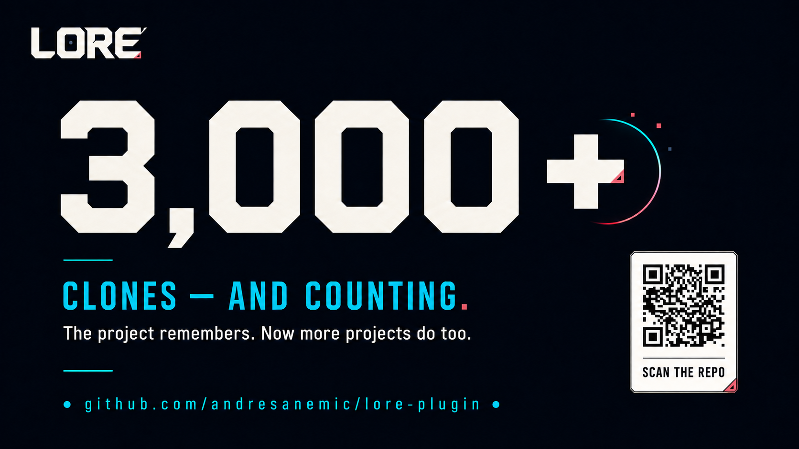
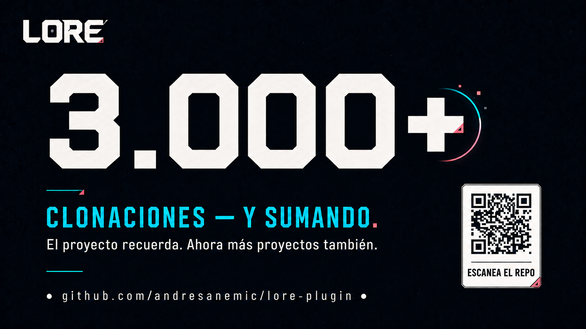
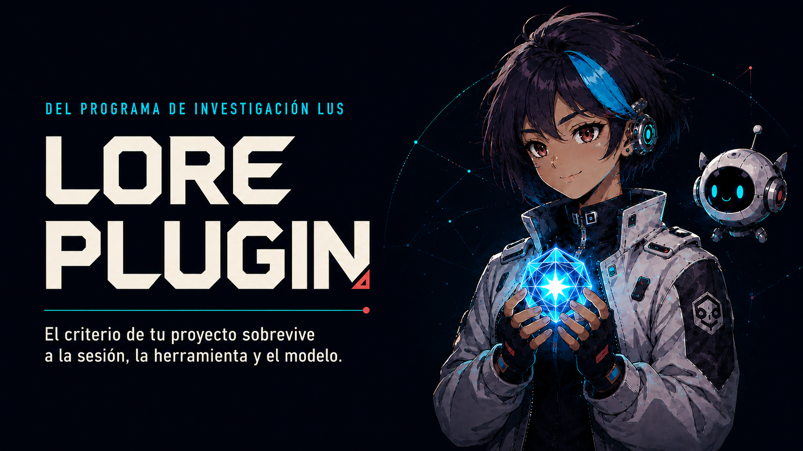

<p align="center">
  
</p>

<h1 align="center">Lore</h1>

<p align="center">
  <a href="#installation"></a>
  <a href="#installation"></a>
  <a href="./docs/SPEC_KIT_en.md"></a>
  <a href="#what-is-lore"></a>
  <a href="#origin"></a>
</p>

<p align="center">
  <b>Stop explaining your project to the AI every morning.</b><br>
  With your approval, Lore turns lessons into project criteria the AI can use next time.
</p>

<p align="center"><a href="./docs/90_SECONDS_en.md">Start with the 90-second guide →</a> · <a href="https://github.com/andresanemic/lore-plugin">Clone the repository</a></p>

---

<details>
<summary><b>Read in English</b></summary>

<a id="english"></a>

## The problem

Every session starts blank. Yesterday’s corrections do not carry into the next one, so you explain the project again and may repeat decisions you had already rejected. Lore gives lessons you approve a place in your project files, ready for future work.

---

<table>
<tr>
<td width="33%" valign="top">

**Start**

[The problem](#the-problem) ·
[What is Lore](#what-is-lore) ·
[Who can use it](#who-can-use-lore-plugin) ·
[Start building](#start-building-your-lore) ·
[Installation](#installation)

</td>
<td width="33%" valign="top">

**Use it**

[Architecture](#architecture) ·
[The nine skills](#the-nine-skills) ·
[Loose notes](#loose-notes) ·
[Documentation](#documentation)

</td>
<td width="33%" valign="top">

**Understand it**

[Shared invariants](#shared-invariants) ·
[Case studies](./docs/CASES_en.md) ·
[Reach](#reach) · [The deck](#the-deck) · [Origin](#origin)

</td>
</tr>
</table>

---

## What is Lore?

Lore is a provider-neutral kit of nine skills and a simple structure for project criteria. You decide what gets written; the kit makes approved criteria available before later work. It does not train a model or learn on its own.

#### What it provides

- A simple convention for organizing a project’s criteria.
- Nine skills that work with that convention.
- A reviewed process for turning experience into reusable criteria.

Each project has one contract (`CLAUDE.md` or `AGENTS.md`, depending on the host), `FASES.md` for current work, and `lore/` for criteria that guide how it is built.

#### Start from existing work

`transmute-lore` can read project folders, documents, exported chat summaries, and notes to help organize criteria already in use. Your files stay as they are; nothing becomes Lore until you read and approve the result.

When criteria need to travel, **CRYSTALLIZE** creates a traceable Markdown snapshot that can move between models and return to a working folder. It omits sensitive filenames and rejects secret markers. It never replaces live Lore.

#### What it does not promise

Lore cannot guarantee correct work or decide when old criteria no longer fit. It gives you a reviewed way to preserve and prune lessons; both still need your judgment and time.

#### The filter

Lore keeps lessons that change future decisions. **If a sentence does not constrain a future decision, it is not Lore.** Other facts belong in documentation or notes.

## Who can use Lore Plugin?

Whether you are new to AI or already build with it, you can start with your own project and your own words.

- **New to AI:** describe what you want to do; the skills guide the next step, and you approve what gets written.
- **Experienced builders:** carry useful project criteria between sessions and models.
- **Teams using spec-kit or another workflow:** Lore keeps project criteria alongside your process tools; it does not replace them. See [`SPEC_KIT_en.md`](./docs/SPEC_KIT_en.md).
- **Readers interested in the research:** [LUS explains the research questions and their evidence boundaries](./docs/LUS_en.md).

## Start building your Lore

For work that spans sessions, the kit can propose a short agreement about its purpose and limits; you decide whether to use it. When a task leaves a lesson worth carrying forward, Lore can turn it into an **Invariant Clue**: a short rule you can reuse.

| Instead of remembering | Lore keeps |
|---|---|
| “The AI wrote a report that was too technical for the reader” | “Before drafting, identify who will read it and explain every unfamiliar term in plain language” |
| “A meeting summary omitted who was responsible for each task” | “Every meeting summary ends with each task, its owner and its deadline” |

### The loop

<p align="center">
  
</p>

Each lesson is proposed, read, and approved before it is written. Lore loads approved criteria before work begins. The claim that accumulated experience changes later decisions is a research hypothesis, not a demonstrated mechanism; [LUS documents that boundary](./docs/LUS_en.md).

---

## Installation

The clearest provider-neutral route is to clone the repository: the source stays visible, updates remain ordinary Git operations, and the same checkout can prepare Claude Code and Codex. It requires Git and Node.js.

### Recommended — clone the repository

```bash
git clone https://github.com/andresanemic/lore-plugin.git
cd lore-plugin
node scripts/lore-plugin.mjs install --target all
codex plugin add lore@personal
```

To target one host, replace `all`. OpenCode receives Lore's skills, hooks and TUI mark.

If you already use a host plugin manager, these shorter routes install the same package without keeping a separate checkout.

### Claude Code

Run these commands inside Claude Code:

```bash
/plugin marketplace add andresanemic/lore-plugin
/plugin install lore@lore-plugin
```

Or run their CLI equivalents from a terminal:

```bash
claude plugin marketplace add andresanemic/lore-plugin
claude plugin install lore@lore-plugin
```

To connect the visible status mark after installing through Claude's plugin manager, run from the repository clone:

```bash
node scripts/lore-plugin.mjs statusline install
```

### Codex CLI

Run these commands in your terminal:

```bash
codex plugin marketplace add andresanemic/lore-plugin
codex plugin add lore@lore-plugin
```

<details>
<summary><b>Other hosts — copy from the same clone</b> (OpenCode, Cursor, Antigravity)</summary>

<br>

### OpenCode

Install Lore's skills, hooks and TUI mark globally:

```bash
node scripts/lore-plugin.mjs install --target opencode
```

Restart OpenCode. Existing `tui.json` entries are preserved; `tui.jsonc` is left untouched. For one project, use `.opencode/skills/` instead.

- For non-interactive delegates, configure routed access with `lore-plugin opencode-permissions --project <dir> --from-routing [--write]`, or prepare a confined profile with `lore-plugin opencode-sandbox <dir>`. The reference explains stdin, `-f` ordering and temporary-directory requirements.

### Cursor

Cursor already discovers skills installed under `~/.codex/skills/` or `~/.agents/skills/`. To keep
a separate Cursor copy, use its global directory and restart Cursor:

```bash
mkdir -p ~/.cursor/skills
cp -R skills/* ~/.cursor/skills/
```

### Google Antigravity

Antigravity loads global skills from `~/.gemini/config/skills/` and workspace skills from
`.agents/skills/`. From a local clone:

```bash
mkdir -p ~/.gemini/config/skills
cp -R skills/* ~/.gemini/config/skills/
```

Restart Antigravity after copying them.

Claude Code does not receive routine hook context: its adapter is deliberately absent because anything handed to the agent can become visible or alter the reply. Its red-only `PreToolUse` guard classifies structured file destinations from the session tree, an existing shared `intercambio/`, its scratchpad, routed sibling trees and session memory, anchored at `SessionStart` rather than a drifting shell `cwd`. **Own** passes. **Foreign** asks the host for approval before the structured file operation: `ask` prompts the person, `allow` can run without prompting, `deny` blocks. Choose `once` for a single operation; the plugin stores no `always`. A host-level deny still wins. Shell and indirect writes stay under the host sandbox policy; this adapter grants none. **Unknown** passes with a notice and is written down. Codex also keeps its automatic local guard through silent `SessionStart` and `PostToolUse`. OpenCode's native `external_directory` and `edit` permissions decide foreign structured writes: `ask` prompts, `allow` may pass silently, `deny` blocks. Choose `once`; the hook cannot select it or save grants. Shell and indirect writes follow host policy. In every host, `use-lore` checks body-load integrity at session opening: a clean check says nothing, a missing connection names only the decision needed. One opening exception, on both hosts since 2.4.8: inside a federated bot whose always-on block does not declare its load, `SessionStart` names the repair (`lore-plugin mycelium federated`) in exactly one line; green stays at zero bytes and everything fails open. `FASES.md` and `PHASES.md` remain state and do not enter the receipt.

</details>

Then open a new CLI session. **If this is your first time, you need no command** — write *«I want to start using Lore Plugin, help me»* and the kit opens a **brainstorming, not a menu**: it receives you first, then looks at your tree, asks one question at a time, and ends with your **first artifact created**, never with a recommendation. If you already know what you want, `use-lore` routes you.

One question at a time is not a courtesy, and a form would be faster. The questions are what keep you and the model two things instead of one — no fusion, and no sparing each other the friction — long enough for an answer neither of you had alone.

## What it looks like in practice

You just shipped a landing page and the feedback is: "I didn't know what to do on the page." The CTA was below the fold and the headline talked about the product, not the outcome. You fixed it. Instead of closing the tab:

```text
› save to lore
```

```text
  Distilled this:

  [cta] CTA not visible — headline without outcome

  Context ······· landing page had the CTA below the fold
  Root cause ···· headline described the product, not the
                  result for the reader
  Clue ·········· place the main CTA above the fold and
                  write the headline around the outcome,
                  not the feature
  Confidence ···· confirmed — fixed on live page

  → projects/client-a/lore/cta.md
  → this clue is generic and confirmed: promote it to the Area
    so the other 3 projects see it?

  Write it?
```

Three months later, another project in the same Area ships a landing page. The criteria is already loaded, so that mistake does not happen again.

> None of it was written without a human saying yes. The same gate governs all nine skills.

---

## Architecture

### The six pieces

Every project organizes its criteria and state into six structural pieces. They are not necessarily six files: thematic modules are one piece, implemented across as many focused files as the work requires.

| Piece | What it holds | Where |
|---|---|---|
| `identidad.md` | What the project is, its purpose and its **quality floor** | `lore/` |
| `principios.md` | Invariant laws, technical and business: prohibitions and imperatives | `lore/` |
| Thematic modules | Technical scars by domain (animation, layout, scroll…) | `lore/` |
| `index.md` | Navigation map: one line per pattern | `lore/` |
| `FASES.md` | State and roadmap: current phase, focus | root |
| `CLAUDE.md` **or** `AGENTS.md` | One collaboration contract, selected by primary host and slimmed to **pointers** | root |

Each has one responsibility. None duplicates another.

> **Lore is criteria (it persists); `FASES.md` is state (it advances).** They never mix, and `FASES.md` never lives inside `lore/`.

They are kept apart because they age at different speeds: who you are and how you work stay true next month; which phase the project is in does not. Mixing them means re-reading a document where half the sentences expired and nothing says which half.

The canonical names are Spanish; in your language they are localized.

#### The always-on block

The contract is the only artifact **both** hosts load without being asked, which is why Lore stamps
a delimited pointer section into it — the kit's always-on channel to the session.

<details>
<summary><b>The exact mechanics</b> (ceiling, variants, how it gets stamped)</summary>

<br>

```markdown
<!-- lore:always-on -->
…what Lore governs here · where it lives · where the state lives · when to invoke instead of writing by hand…
<!-- /lore:always-on -->
```

Four items and no more, under a hard ceiling of **25 lines**, pointing to `lore/` and to `FASES.md`: criteria and state live apart, but a session that receives the criteria without the phase proposes the right thing at the wrong time. Three variants — an **area** to its own `lore/`, a **project** to its own layer and its mother area's, a **bot** to `canon/` and its **routing table**, never to the federated Lores one by one, which is why a bot reaching twenty bodies of criteria still fits. The block never reproduces a clue; the owning skills stamp it idempotently, and a hand-edited divergence is reported, never overwritten.

</details>

### Area → Project inheritance

Lore scales through **Areas**. An Area is a mother folder with its own Lore, and projects inherit it instead of copying it:

```text
web-development/
│
├── lore/                      ← general criteria lives ONCE
│     identity · principles · index · animation · scroll · layout
│
├── PHASES.md                  ← the Area's project registry
├── CLAUDE.md or AGENTS.md     ← the Area's one host-selected contract
│
└── projects/
    ├── client-a/
    │   └── lore/              ← only its own; the index points at the Area
    ├── client-b/
    │   └── lore/
    └── client-c/
        └── lore/
```

Fix a generic clue once in the Area and every project sees it. Each project keeps only what is truly its own — the system stays DRY without losing accumulated experience.

### The third shape: a bot

| | Area | Project | **Bot** |
|---|---|---|---|
| Holds | projects | one piece of work | **a work session** |
| Its Lore governs | the domain's method | that work | **how the agent behaves** |
| Opened to | see the registry | advance that work | **work on any of several projects** |

Areas and projects are places; **a bot is a lens you carry into them.** An Area that collects criteria it never earned starts receiving promotions that belong somewhere else.

---

## The nine skills

**This kit moves with Superpowers' `writing-skills` discipline, not past it.** Every changed skill is checked against it before it ships; the latest record is [`bench/writing-skills-2.4.1/README.md`](./bench/writing-skills-2.4.1/README.md), with the 2.4.0 loose-note and 2.3.3 audit records.

> **The skills are written in English; the Lore they produce is not** — content and filenames included, in your language. Do not open one to explain a mode to someone (we learned this in Case 12, live) — that is what the table and the two docs below are for.

| Skill | What for | When |
|---|---|---|
| `use-lore` | Entry point: explains the model and routes you to the right skill | first, always |
| `brainstorming-lore` | Designs Lore artifacts, or deliverables governed by routed process modules, without taking over generic ideation; preserves recognizable continuity and fertile effort | before a material Lore change or governed design |
| `create-area` | Creates an Area with its shared Lore | opening a new domain |
| `create-project` | Creates a project that inherits from the Area | starting a piece of work |
| `save-to-lore` | Distills a lesson, or mines a loose-notes inbox, and decides whether it rises to the Area | every day |
| `transmute-lore` | Migrates, cleans, translates, upgrades, prunes or exports a safe snapshot of Lore | inheriting, maintaining, updating or sharing Lore |
| `create-bot` | One place to open a session and work across several Areas at once | from zero, or once there is Lore to federate |
| `vespi` | The kernel that keeps a bounded operation alive across sessions: continues, moves laterally, revalidates before continuing | whenever an operation must stay alive; pressure is one case, not the gate |
| `stale-lore` | Verifies which published kit capabilities have gone unexercised and withdraws them declaratively — with a changelog so the withdrawal itself is auditable | reconciling promise against evidence; when the kit's published surface needs to shrink |

**Day one needs two of these:** `use-lore` routes you to whatever comes next, and `save-to-lore` is the one you will actually type — *"save to lore"*, after solving something that cost you. **Getting started, day-to-day use and the full mechanism for every skill and mode** live in one place: [`REFERENCE_en.md`](./docs/REFERENCE_en.md).


---

## Vespi

**Vespi is the kernel under Lore Plugin. This cut carries frozen kernel 0.1.6.** Reviewed, not audited: the only reviews so far are our own superreviews with Claude Code, and there is no independent external security audit.

<p align="center">
  
</p>

Lore Plugin is the ground: your criterion, written once, and the routing that opens the right one for each task. Vespi is what runs on that ground: an operation under an authority you grant, checked apart from whoever carries it out, that leaves a receipt anyone can verify. It does not write your Lore and it does not decide for you: it says what it sees, states its assumptions as assumptions, and the choice is yours.

Version 2.5.2 makes the next action explicit when a session opens. Coordinated ordinary work leaves an operation record, and verification runs a commissioned check before certification. Rejected results remain visible and require fresh review after correction. Deterministic checks and explicitly authorized semantic review have different limits; execution does not guarantee judgment. [Release notes](./docs/RELEASE_2.5.2.md) · [Execution and limits](./docs/VERIFICATION-EXECUTION.md).

Earlier operation features and their limits remain documented in [the 2.4.9 release](./docs/RELEASE_2.4.9.md).

**Vespi Meridian Edition 1.0:** [Website — vespi.xyz](https://vespi.xyz) · [Tutorial in English](https://docs.google.com/document/d/1gwu3gBIJwgevCrGPyMv-J1UfjegggYDu/edit?usp=sharing&ouid=113358117411001923633&rtpof=true&sd=true) · [Deck in English](https://drive.google.com/file/d/1lG5DOOS6z4Kzz6PfZIPP2RXW_LXN_U1g/view?usp=drive_link). Materials supplied by Andrés; website deployment was not verified in this review, so these links do not extend the kernel’s verified scope.

## Loose notes

Create a `notes/`, `notas/`, or `apuntes/` folder in a project, Area, or bot, then ask the AI to review it. `save-to-lore` separates criteria from tasks and noise, proposes where each lesson belongs, waits for your approval, and marks used notes without deleting them. **A note is a source, never criteria.**

## Shared invariants

All nine skills follow the same rules:

- Lore is written **in your language**.
- **Criteria is never invented.** It comes from real experience.
- **A note is a source, never criteria.**
- **Discarded noise is reported**, never silently deleted.
- Every change passes a **threshold** before it is written.
- **Nothing commits automatically.** You review the final diff.

Your criteria stays in files you own. The kit never writes or commits it without your approval.


## Documentation

This README covers motivation and architecture. Everything else lives in its own document:

| Document | What it's for |
|---|---|
| [`90_SECONDS_en.md`](./docs/90_SECONDS_en.md) | **Start here.** The whole mechanism, short enough to read before deciding whether to install anything. |
| [`WHY_LORE_IS_AN_OS_en.md`](./docs/WHY_LORE_IS_AN_OS_en.md) | Why this is called an operating system, and the limits it declares: not a computer OS, no mainnet, no production claim. |
| [`REFERENCE_en.md`](./docs/REFERENCE_en.md) | **The technical document.** Getting started, day-to-day use, core concepts, the exact spec for each skill, mode and artifact, and how to migrate an existing project. |
| [`CASES_en.md`](./docs/CASES_en.md) | The nineteen case studies, each with its declared boundary. |
| [`SPEC_KIT_en.md`](./docs/SPEC_KIT_en.md) | Lore alongside GitHub's spec-kit: who governs what. Optional — Lore never depends on it. |
| [`LUS_en.md`](./docs/LUS_en.md) | The research program behind Lore, its current hypotheses and evidence boundaries. |
| [`GENEALOGY_en.md`](./docs/GENEALOGY_en.md) | Affective genealogy: cultural provenance kept separate from theory and product rules. |
| [`BIBLIOGRAPHY_en.md`](./docs/BIBLIOGRAPHY_en.md) | Conceptual sources: the entry rule, and where each one loses. |
| [`OBSERVER_en.md`](./docs/OBSERVER_en.md) | Observer provenance: the third registry — its method is published, its content does not travel. |
| [`CONTRIBUTING_en.md`](./docs/CONTRIBUTING_en.md) | How to contribute product changes, cases, refutations and research questions. |
| [`CODE_OF_CONDUCT.md`](./docs/CODE_OF_CONDUCT.md) | Participation standards and reporting route. |
| [`LICENSE`](./LICENSE) · [`NOTICE`](./NOTICE) | Apache License 2.0, and it stays open source: the commitment is in `NOTICE`, with authorship. |
| [Read the benchmark →](./bench/effect-2.3.2/) | Method, evidence, limits, and reviewable results. |

---

## Case studies

Lore was not designed ahead of time: every decision came from applying it to real projects and watching what broke — documented as **nineteen case studies**, each with its declared boundary. **Case 12 is the first install run by someone who is not the author.**

> **Status:** cases, not proofs — small n, and **eighteen of the nineteen come from the same researcher**. The measured claim belongs to Case 08; the rest are qualitative evidence.

**[Read the nineteen case studies →](./docs/CASES_en.md)**

---

## Reach

<p align="center">
  
</p>

<p align="center">
  <a href="./data/traffic/clones.json"></a>
  <a href="./data/traffic/clones.json"></a>
  <a href="./data/traffic/clones.json"></a>
  <a href="./data/traffic/clones.json"></a>
</p>

GitHub traffic windows preserved in [`data/traffic/clones.json`](./data/traffic/clones.json). A **recorded minimum, consulted on 2026-10-08; latest API day: 2026-10-07 (UTC)**. Today is not a completed day in the API response.

Lore Plugin is the technical arm of LUS, not a productivity system with philosophy attached. The product measure tests a narrow claim; it does not validate LUS as a whole. [The research boundary is explicit here.](./docs/LUS_en.md)

Morin gives this work its ethical north: in UNESCO's [*Seven Complex Lessons in Education for the Future*](https://unesdoc.unesco.org/ark:/48223/pf0000378091) he writes that “the notion of wager should be generalized to every faith” (our translation). [The sensibility that made such questions thinkable lives here.](./docs/GENEALOGY_en.md)

> **A reach signal, not a demonstration.** Nobody knows what anyone did with their copy — installed, distilled, opened once? It is no case, and answers none of the questions the [case studies](./docs/CASES_en.md) do. And the API's "unique cloners" are unique **per day**, not people: they cannot be summed into a headcount.


---

## The deck

<p align="center">
  
</p>

The full **LUS + Lore Plugin** talk — what Lore Plugin is, the LUS research behind it, and how a project goes from zero to its first useful Lore: **[open the deck →](https://docs.google.com/presentation/d/1p1JoHTVL_A1EW3hG82E6rZpyysznmJbb/edit?usp=sharing)**

---


## Origin

Lore was born from **LUS (Lore User System)**, a research program about relations that accumulate criteria capable of participating in later decisions. Lore is one operational architecture produced by that work, not a demonstration of the program. One idea links them:

> **Experience only creates value when it can participate in a future decision.**

That makes us **gardeners of the Between**: we preserve the experiences that deserve to orient another decision and prune those that no longer constrain anything. Research and software remain separate: a product observation is not automatically a scientific result, and a hypothesis does not become a skill rule without evidence and review.

Read the full [LUS research overview](./docs/LUS_en.md), its [conceptual bibliography](./docs/BIBLIOGRAPHY_en.md), and the separate [affective genealogy](./docs/GENEALOGY_en.md). The public [LUS NotebookLM](https://notebooklm.google.com/notebook/6191db3f-3f9b-4412-b792-86a081b79450) is an accessible introduction, not the source of record.

### Why "Lore"?

In video games, *lore* is the accumulated story and rules that keep a universe coherent — what can and cannot happen next. We borrow the image and shift the weight: specific events fade, and **what remains is the criteria** that keeps the next work coherent. The visual debt is explicit too: the anime palette comes from ***Tales of Berseria*** (Bandai Namco, 2016), the author's favorite game.

## Author

**Andrés Peña Mellado** — principal researcher of LUS.

Building in Web3 — General Editor of the community journalism pilot at **Tellus Cooperative**;
formerly on the editorial teams of **Polkadot Español** and **BeInCrypto**.

He helped establish UTEM's **Design Thinking** course and taught it from 2023 to 2025. **Speaker at
[KCD El Salvador 2023](https://www.credly.com/badges/ad17002a-16be-474b-ada4-d7ba0df3a0fd)**.

<p>
  <a href="https://github.com/andresanemic"></a>
  <a href="https://x.com/andresanemic"></a>
  <a href="https://www.linkedin.com/in/andresanemic/"></a>
  <a href="https://t.me/andresanemic"></a>
  
  <a href="mailto:a.leonardopm@gmail.com"></a>
</p>

</details>

---

<details>
<summary><b>Leer en español</b></summary>

<a id="español"></a>

<p align="center">
  
</p>

<h1 align="center">Lore</h1>

<p align="center">
  <a href="#instalación"></a>
  <a href="#instalación"></a>
  <a href="./docs/SPEC_KIT_es.md"></a>
  <a href="#qué-es-lore"></a>
  <a href="#origen"></a>
</p>

<p align="center">
  <b>Deja de explicarle tu proyecto a la IA todas las mañanas.</b><br>
  Con tu aprobación, Lore convierte lo aprendido en criterios de proyecto que la IA puede usar después.
</p>

<p align="center"><a href="./docs/90_SECONDS_es.md">Empieza con la guía de 90 segundos →</a> · <a href="https://github.com/andresanemic/lore-plugin">Clona el repositorio</a></p>

---

## El problema

Cada sesión arranca en blanco: vuelves a explicar correcciones que el agente ya recibió y puedes terminar otra vez en soluciones que habías descartado. Lore guarda las lecciones que apruebas en archivos de tu proyecto, listas para orientar el próximo trabajo.

---

<table>
<tr>
<td width="33%" valign="top">

**Empezar**

[El problema](#el-problema) ·
[Qué es Lore](#qué-es-lore) ·
[Quién puede usarlo](#quién-puede-usar-lore-plugin) ·
[Comienza a construir](#comienza-a-construir-tu-lore) ·
[Instalación](#instalación)

</td>
<td width="33%" valign="top">

**Usarlo**

[Arquitectura](#arquitectura) ·
[Las nueve skills](#las-nueve-skills) ·
[Notas sueltas](#notas-sueltas) ·
[Documentación](#documentación)

</td>
<td width="33%" valign="top">

**Entenderlo**

[Invariantes](#invariantes-compartidas) ·
[Casos de estudio](./docs/CASES_es.md) ·
[Alcance](#alcance) · [El deck](#el-deck) · [Origen](#origen)

</td>
</tr>
</table>

---

## ¿Qué es Lore?

Lore es un kit neutral al proveedor, con nueve skills y una estructura sencilla para guardar el criterio de un proyecto. Tú decides qué se escribe; el kit carga ese criterio aprobado antes del trabajo siguiente. No entrena modelos ni aprende por su cuenta.

#### Qué aporta

- Una convención sencilla para organizar el criterio de un proyecto.
- Nueve skills que operan esa convención.
- Un proceso revisado para convertir experiencia en criterio reutilizable.

Cada proyecto tiene un contrato (`CLAUDE.md` o `AGENTS.md`, según el host), `FASES.md` para el estado del trabajo y `lore/` para los criterios que guían cómo se construye.

#### Puedes empezar desde lo que ya tienes

`transmute-lore` puede leer carpetas, documentos, resúmenes de chats exportados y notas para ordenar criterios que ya usas. Tus archivos siguen como están: nada se vuelve Lore hasta que lees y apruebas el resultado.

Cuando el criterio necesita viajar, **CRYSTALLIZE** crea una fotografía trazable en Markdown, portable entre modelos y recuperable en una carpeta de trabajo. Omite nombres de archivo sensibles, rechaza marcadores de secretos y nunca reemplaza el Lore vivo.

#### Qué no promete

Lore no garantiza que el trabajo salga bien ni decide cuándo un criterio dejó de servir. Te da una forma revisable de conservar y podar lecciones; ambas cosas siguen necesitando tu juicio y tiempo.

#### El filtro

Lore conserva lecciones que cambian decisiones futuras. **Si una frase no restringe una decisión futura, no es Lore.** Los demás hechos van en documentación o notas.

## ¿Quién puede usar Lore Plugin?

No necesitas saber de SDD ni manejar términos técnicos para empezar. Basta con tu proyecto y tus palabras.

- **Si recién empiezas:** dices qué quieres hacer; las skills te guían y tú apruebas lo que se escribe.
- **Si ya trabajas con IA:** llevas el criterio útil entre sesiones y proyectos, incluso si cambias de modelo.
- **Si tu equipo usa spec-kit u otro flujo:** Lore mantiene vigentes los criterios del proyecto y funciona junto a esas herramientas. No las reemplaza. Ver [`SPEC_KIT_es.md`](./docs/SPEC_KIT_es.md).
- **Si te interesa la investigación:** [LUS explica sus preguntas y los límites de su evidencia](./docs/LUS_es.md).

## Comienza a construir tu Lore

Si el trabajo durará más de una sesión, el kit puede proponerte un acuerdo breve sobre su objetivo y sus límites; tú decides si usarlo. Cuando una tarea deja una lección que conviene recordar, Lore puede convertirla en una **Pista Invariante**: una regla breve para reutilizar.

| En vez de recordar | Lore guarda |
|---|---|
| «La IA escribió un informe demasiado técnico para quien debía leerlo» | «Antes de redactar, identifica quién lo leerá y explica en lenguaje simple cada término poco familiar» |
| «El resumen de una reunión omitió quién era responsable de cada tarea» | «Todo resumen de reunión termina con cada tarea, su responsable y su fecha límite» |

### El ciclo

<p align="center">
  
</p>

Cada lección se propone, la lees y la apruebas antes de escribirla. Lore carga el criterio aprobado antes de empezar el trabajo. La idea de que la experiencia acumulada cambia decisiones futuras es una hipótesis de investigación, no un mecanismo demostrado; [LUS explica ese límite](./docs/LUS_es.md).

---

## Instalación

La ruta neutral al proveedor más clara es clonar el repositorio: el código fuente queda visible, las actualizaciones siguen siendo operaciones normales de Git y el mismo checkout puede preparar Claude Code y Codex. Requiere Git y Node.js.

### Recomendado — clona el repositorio

```bash
git clone https://github.com/andresanemic/lore-plugin.git
cd lore-plugin
node scripts/lore-plugin.mjs install --target all
codex plugin add lore@personal
```

Para un host, reemplaza `all`. OpenCode recibe las skills, hooks y marca TUI de Lore.

Si ya usas el gestor de plugins de un host, estas rutas más cortas instalan el mismo paquete sin conservar un checkout separado.

### Claude Code

Ejecuta estos comandos dentro de Claude Code:

```bash
/plugin marketplace add andresanemic/lore-plugin
/plugin install lore@lore-plugin
```

O ejecuta sus equivalentes desde una terminal:

```bash
claude plugin marketplace add andresanemic/lore-plugin
claude plugin install lore@lore-plugin
```

Para conectar la marca visible después de instalar desde el gestor de Claude, ejecútalo desde el clon del repositorio:

```bash
node scripts/lore-plugin.mjs statusline install
```

### Codex CLI

Ejecuta estos comandos en tu terminal:

```bash
codex plugin marketplace add andresanemic/lore-plugin
codex plugin add lore@lore-plugin
```

<details>
<summary><b>Otros hosts — copia desde el mismo clon</b> (OpenCode, Cursor, Antigravity)</summary>

<br>

### OpenCode

Instala las skills, hooks y marca TUI de Lore en OpenCode:

```bash
node scripts/lore-plugin.mjs install --target opencode
```

Reinicia OpenCode. Conserva otras entradas de `tui.json`; `tui.jsonc` queda intacto. Para un solo proyecto usa `.opencode/skills/`.

- Para delegados sin interacción, configura el acceso enrutado con `lore-plugin opencode-permissions --project <dir> --from-routing [--write]` o prepara un perfil confinado con `lore-plugin opencode-sandbox <dir>`. La referencia explica el cierre de stdin, el orden de `-f` y la carpeta de temporales.

### Cursor

Cursor ya descubre las skills instaladas en `~/.codex/skills/` o `~/.agents/skills/`. Si prefieres
una copia separada para Cursor, usa su directorio global y reinícialo:

```bash
mkdir -p ~/.cursor/skills
cp -R skills/* ~/.cursor/skills/
```

### Google Antigravity

Antigravity carga skills globales desde `~/.gemini/config/skills/` y skills del proyecto desde
`.agents/skills/`. Desde un clon local:

```bash
mkdir -p ~/.gemini/config/skills
cp -R skills/* ~/.gemini/config/skills/
```

Reinicia Antigravity después de copiarlas.

Claude Code no recibe contexto rutinario del hook: el guard no entrega texto al modelo. Su `PreToolUse` solo-en-rojo clasifica destinos estructurados desde el árbol de sesión, un `intercambio/` compartido que ya exista, su scratchpad, los árboles hermanos enrutados y la memoria de sesión; ancla la jurisdicción en `SessionStart`, no en un `cwd` de shell que deriva. **Propio** pasa. **Ajeno** solicita aprobación al host antes de la operación estructurada: `ask` pregunta a la persona, `allow` puede ejecutar sin preguntar, `deny` bloquea. Elige `once` para una sola operación; el plugin no guarda `always`. Un `deny` del host sigue prevaleciendo. Shell y escrituras indirectas quedan bajo la política del host; esto no habilita shell. **Desconocido** pasa con aviso y queda anotado. Codex conserva su guardia local automática mediante `SessionStart` y `PostToolUse` silenciosos. OpenCode deja que los permisos nativos `external_directory` y `edit` decidan las escrituras estructuradas ajenas: `ask` pregunta, `allow` puede pasar en silencio, `deny` bloquea. Elige `once`; el hook no puede elegirlo ni guardar concesiones. Shell y escrituras indirectas siguen bajo la política del host. En todos los hosts, `use-lore` comprueba al abrir la integridad de carga de los cuerpos: un control limpio no dice nada y una conexión faltante nombra solo la decisión necesaria. Una excepción de apertura, en ambos hosts desde 2.4.8: dentro de un bot federado cuyo always-on no declara su carga, `SessionStart` nombra la reparación (`lore-plugin mycelium federated`) en exactamente una línea; el verde queda en cero bytes y todo falla abierto. `FASES.md` y `PHASES.md` siguen siendo estado y no entran al recibo.

</details>

Después abre una sesión nueva en la CLI. **Si es tu primera vez no necesitas comandos** — escribe *«quiero comenzar a usar Lore Plugin, ayúdame»* y el kit abre un **brainstorming, no un menú**: primero te recibe y ve qué vienes a hacer, después mira tu árbol, pregunta de a una cosa por vez y termina con **tu primer artefacto creado**, nunca con una recomendación. También te ofrece el acuerdo, y ahí eliges cómo quieres que te hablen —más sobrio o más cercano; despacio, normal o rápido; si no eliges, cercano y a ritmo normal— y tus límites de uso: qué modelos o qué niveles no quieres que se usen nunca. Se nombran por familia, no por número de versión, para que una actualización del proveedor no te deje atado a un modelo viejo. Si ya sabes qué quieres, `use-lore` te enruta.

Si ya usabas una versión anterior, al actualizar recibes una sola vez un mensaje corto: llegó Vespi, qué puede hacer por ti y la invitación a fijar tus límites.

Preguntar de a una cosa por vez no es cortesía, y un formulario sería más rápido. Las preguntas son lo que te mantiene a ti y al modelo siendo dos cosas y no una —sin fusión y sin ahorrarse la fricción—, el rato suficiente para que aparezca una respuesta que ninguno tenía por separado.

## Así se ve en la práctica

Quieres hacer la web de tu taller de cerámica y nunca has hecho una. Lo dices tal cual:

```text
› quiero hacer la web de mi taller y no sé cómo
```

Antes de escribir una sola línea, Lore Plugin te propone ponerse de acuerdo:

```text
  Antes de empezar, pongámonos de acuerdo. Es corto y lo
  puedes cambiar cuando quieras.

  Para qué es ·················· que la gente vea tus piezas
                                 y te escriba para encargar
  No lo muevo sin tu palabra ··· tus fotos y tus precios
  Aquí tengo margen ············ el diseño y el orden
  Lo que probamos ·············· una galería por colección;
                                 si no te gusta, se cambia
  Para sorprenderte ············ cómo se presenta cada pieza
  Cómo te hablo ················ cercano, a ritmo normal
  Te vuelvo a preguntar ········ antes de publicar

  ¿Así está bien?
```

Dices que sí y queda escrito. Desde ahí trabajas con calma: lo acordado se sostiene sin que tengas que vigilarlo, y si algo nuevo no cabe en el acuerdo, te lo preguntan antes de hacerlo.

Dos semanas después la web tiene tienda, carrito y envíos, y te sorprendes escribiendo:

```text
› esto me está complicando demasiado
```

Esta vez responde Vespi, la parte del kit que cuida que lo acordado siga en pie:

```text
  Según las notas, llevamos tres sesiones con la tienda, y el
  acuerdo decía encargos por mensaje. Supongo que la tienda
  se sumó en el camino.

  ¿La sumamos al acuerdo, o volvemos a lo acordado y la
  dejamos para después?
```

Tú eliges. Y cuando algo sale mal y lo arreglas, lo que aprendiste también se guarda. Acabas de publicar una landing y el feedback es: "No sabía qué hacer en la página". El CTA quedaba abajo y el titular hablaba del producto, no del resultado. Lo corregiste. En vez de cerrar la pestaña:

```text
› guarda en lore
```

```text
  Destilé esto:

  [cta] CTA poco visible — titular sin resultado

  Contexto ······ la landing tenía el CTA debajo del pliegue
  Causa raíz ···· el titular describía el producto, no el
                  resultado para quien lee
  Pista ········· poner el CTA principal arriba del pliegue y
                  escribir el titular alrededor del resultado,
                  no de la funcionalidad
  Confianza ····· confirmada — corregido en la página publicada

  → proyectos/cliente-a/lore/cta.md
  → esta pista es genérica y confirmada: ¿la promuevo al Área
    para que la vean los otros 3 proyectos?

  ¿Escribo?
```

Tres meses después, otro proyecto del Área publica una landing. El criterio ya está cargado y ese error no se repite.

---

## Arquitectura

### Las seis piezas

Cada proyecto organiza su criterio y su estado en seis piezas estructurales. No son necesariamente seis archivos: los módulos temáticos son una sola pieza, repartida en tantos archivos enfocados como el trabajo requiera.

| Pieza | Qué guarda | Dónde |
|---|---|---|
| `identidad.md` | Qué es el proyecto, su propósito y su **piso de calidad** | `lore/` |
| `principios.md` | Leyes invariantes, técnicas y de negocio | `lore/` |
| Módulos temáticos | Cicatrices técnicas por dominio | `lore/` |
| `index.md` | Mapa de navegación: una línea por patrón | `lore/` |
| `FASES.md` | Estado y hoja de ruta | raíz |
| `CLAUDE.md` **o** `AGENTS.md` | Un contrato de colaboración, elegido por host principal y reducido a **punteros** | raíz |

Cada uno tiene una responsabilidad. Ninguno duplica a otro.

> **El Lore es criterio (persiste); `FASES.md` es estado (avanza).** Nunca se mezclan, y `FASES.md` nunca vive dentro de `lore/`.

Se mantienen aparte porque envejecen a velocidades distintas: quién eres y cómo trabajas sigue siendo cierto el mes que viene; en qué fase está el proyecto, no. Mezclarlos significa releer un documento donde la mitad de las frases venció y nada dice cuál mitad.

#### El bloque siempre-activo

El contrato es el único artefacto que **los dos** hosts cargan sin que nadie se lo pida, y por eso
Lore le estampa una sección de punteros delimitada — el canal siempre activo del kit hacia la sesión.

<details>
<summary><b>La mecánica exacta</b> (techo, variantes, cómo se estampa)</summary>

<br>

```markdown
<!-- lore:always-on -->
…qué Lore gobierna acá · dónde vive · dónde vive el estado · cuándo invocar en vez de escribir a mano…
<!-- /lore:always-on -->
```

Cuatro elementos y no más, con un techo duro de **25 líneas**, apuntando a `lore/` y a `FASES.md`: el criterio y el estado viven separados, pero una sesión que recibe el criterio sin la fase propone lo correcto en el momento equivocado. Tres variantes: un **área** a su propio `lore/`, un **proyecto** al suyo y al del área madre, un **bot** a `canon/` y a su **tabla de enrutamiento**, nunca a los Lore federados uno por uno, y por eso un bot que alcanza veinte cuerpos de criterio sigue entrando. El bloque nunca reproduce una pista; las skills dueñas lo estampan de forma idempotente, y una divergencia editada a mano se reporta sin sobrescribirse.

</details>

### Herencia Área → Proyecto

```text
desarrollo-web/
│
├── lore/                      ← el criterio general vive UNA sola vez
│     identidad · principios · index · animacion · scroll · layout
│
├── FASES.md                   ← registro de proyectos del Área
├── CLAUDE.md o AGENTS.md      ← contrato único del Área, elegido por host
│
└── proyectos/
    ├── cliente-a/
    │   └── lore/              ← solo lo propio; el index apunta al Área
    ├── cliente-b/
    │   └── lore/
    └── cliente-c/
        └── lore/
```

Arreglas una Pista genérica una vez, en el Área, y todos los proyectos la ven.

### La tercera forma: un bot

| | Área | Proyecto | **Bot** |
|---|---|---|---|
| Contiene | proyectos | un trabajo | **una sesión de trabajo** |
| Su Lore gobierna | el método del dominio | ese trabajo | **cómo se comporta el agente** |
| Se abre para | ver el registro | avanzar eso | **trabajar en varios proyectos** |

Las Áreas y los proyectos son lugares; **un bot es una lente que llevas a ellos.**

---

## Las nueve skills

**Este kit avanza junto a la disciplina `writing-skills` de Superpowers, no por delante de ella.** Cada skill modificada se revisa antes de publicarse; el registro más reciente vive en [`bench/writing-skills-2.4.1/README.md`](./bench/writing-skills-2.4.1/README.md), con los de notas sueltas 2.4.0 y la auditoría 2.3.3.

> **Las skills están escritas en inglés y el Lore que producen, no** — contenido y nombres de archivo incluidos, en tu idioma. No abras uno para explicarle a alguien qué hace un modo (lo aprendimos en el Caso 12, en vivo) — para eso está la tabla y los dos docs de abajo.

| Skill | Para qué | Cuándo |
|---|---|---|
| `use-lore` | Punto de entrada: explica el modelo y te manda a la skill correcta | primero, siempre; y cuando dices «quiero hacer esto y no sé cómo», te ofrece el acuerdo |
| `brainstorming-lore` | Diseña artefactos Lore, o entregables gobernados por módulos de proceso enrutados, sin apropiarse de la ideación genérica; preserva la continuidad reconocible y el esfuerzo fértil | antes de un cambio Lore material o un diseño gobernado; o cuando dices «ayúdame a pensar el diseño» |
| `create-area` | Crea un Área con su Lore compartido | al abrir un dominio nuevo |
| `create-project` | Crea un proyecto que hereda del Área | al empezar un trabajo |
| `save-to-lore` | Destila una lección, o mina una bandeja de notas sueltas, y decide si sube al Área | todos los días |
| `transmute-lore` | Migra, limpia, traduce, actualiza, poda o exporta una fotografía segura del Lore | al heredar, mantener, actualizar o compartir Lore |
| `create-bot` | Un lugar donde abrir sesión y trabajar sobre varias Áreas a la vez | desde cero, o cuando ya hay Lore que federar |
| `vespi` | Cuida que lo acordado siga en pie. Operación acotada bajo autoridad (experimental): continúa entre sesiones, se mueve lateralmente y revalida antes de seguir | cuando dices «esto me está complicando», «se está perdiendo lo que decidimos» o «sigamos mañana»: el trabajo es una operación viva bajo presión |
| `stale-lore` | Verifica qué capacidades publicadas del kit no se ejercieron y las retira de forma declarativa — con un changelog para que el retiro sea auditable | al reconciliar promesa con evidencia; cuando la superficie publicada del kit necesita reducirse |

**El primer día necesitas dos de estas:** `use-lore` te enruta hacia lo que sigue, y `save-to-lore` es la que vas a escribir de verdad — *"guarda en lore"*, después de resolver algo que te costó. **Cómo empezar, el uso cotidiano y el mecanismo completo de cada skill y modo** viven en un solo lugar: [`REFERENCE_es.md`](./docs/REFERENCE_es.md).


---

## Vespi

**Vespi es el kernel de Lore Plugin. Este corte lleva el kernel 0.1.6 congelado.** Revisado, no auditado: las únicas revisiones hasta ahora son nuestras propias superreviews con Claude Code, y no hay auditoría de seguridad externa independiente.

<p align="center">
  
</p>

Lore Plugin es el terreno: tu criterio escrito una vez y el enrutamiento que abre el correcto para cada tarea. Vespi es lo que corre sobre ese terreno: una operación bajo una autoridad que tú otorgas, verificada aparte de quien la ejecuta, que deja un recibo que cualquiera puede comprobar. No escribe tu Lore ni decide por ti: te dice lo que ve, dice sus suposiciones como suposiciones, y la elección es tuya.

La versión 2.5.2 hace explícita la siguiente acción al abrir una sesión. El trabajo ordinario que requiere coordinación deja un registro de operación y la verificación ejecuta una prueba comisionada antes de certificar. Los rechazos quedan visibles y corregir exige una revisión nueva. Las comprobaciones deterministas y la revisión semántica autorizada tienen límites distintos; ejecutar no garantiza comprender. [Nota de versión](./docs/RELEASE_2.5.2.md) · [Ejecución y límites](./docs/VERIFICATION-EXECUTION.md).

Las funciones anteriores de operaciones y sus límites se conservan en [la nota de 2.4.9](./docs/RELEASE_2.4.9.md).

**Vespi Meridian Edition 1.0:** [Sitio — vespi.xyz](https://vespi.xyz) · [Tutorial en español](https://docs.google.com/document/d/1wj3yfr0Iyi8e3szUawJ4Q-mNb7EmySM-/edit?usp=drive_link&ouid=113358117411001923633&rtpof=true&sd=true) · [Deck en español](https://drive.google.com/file/d/1LkcSXeVLxstZiNhiVpq8zU1_Kn-61qUl/view?usp=drive_link). Materiales proporcionados por Andrés; el despliegue del sitio no se verificó en esta revisión, por lo que estos enlaces no amplían el alcance verificado del kernel.

## Notas sueltas

Agrega una carpeta `notas/`, `notes/` o `apuntes/` dentro del proyecto, Área o bot donde estés trabajando; cualquier editor sirve. Para que la IA la lea, pide:

> «revisa mis notas y checa si algo se puede guardar en mi lore»

`save-to-lore` carga su procedimiento de notas, hace el barrido completo, separa criterio de tareas y ruido, propone el Lore dueño y espera tu aprobación, marca cada nota minada con fecha y destino y nunca la borra. **Una nota es fuente, nunca criterio**: nada cruza sin destilación explícita y un diff aprobado.

El kit también deja notas: lo que se ofrece guardar primero se anota fuera de tu Lore, y lo que ya pesa se te ofrece después a `save-to-lore`, que sigue siendo la única puerta. Vespi deja notas del mismo modo y, si lo que sugiere es técnico —un hook, un cron, un traspaso—, primero te pregunta si sabes qué es y, si no, te lo explica en llano.

---

## Invariantes compartidas

Las nueve skills siguen las mismas reglas:

- El Lore se escribe **en tu idioma**.
- **El criterio no se inventa:** sale de la experiencia.
- **Una nota es fuente, nunca criterio.**
- **El ruido descartado se informa**, nunca se elimina en silencio.
- Todo cambio pasa por un **umbral** antes de escribirse.
- **Nada hace commit automáticamente.** Tú revisas el diff final.

El criterio queda en tus archivos. El kit no lo escribe ni lo confirma sin tu aprobación.


## Documentación

| Documento | Para qué sirve |
|---|---|
| [`90_SECONDS_es.md`](./docs/90_SECONDS_es.md) | **Empieza acá.** El mecanismo completo, corto como para leerlo antes de decidir si instalas algo. |
| [`POR_QUE_LORE_ES_UN_SO_es.md`](./docs/POR_QUE_LORE_ES_UN_SO_es.md) | Por qué esto se llama sistema operativo, y los límites que declara: no es un SO de computador, sin mainnet, sin afirmación de producción. |
| [`REFERENCE_es.md`](./docs/REFERENCE_es.md) | **El documento técnico.** Cómo empezar, uso cotidiano, conceptos, la especificación exacta de cada *skill*, modo y artefacto, y cómo migrar un proyecto existente. |
| [`CASES_es.md`](./docs/CASES_es.md) | Los diecinueve casos de estudio, cada uno con su frontera declarada. |
| [`SPEC_KIT_es.md`](./docs/SPEC_KIT_es.md) | Lore junto a spec-kit de GitHub: quién gobierna qué. Opcional — Lore no depende de él. |
| [`LUS_es.md`](./docs/LUS_es.md) | El programa de investigación detrás de Lore, sus hipótesis vigentes y fronteras de evidencia. |
| [`GENEALOGY_es.md`](./docs/GENEALOGY_es.md) | Genealogía afectiva: procedencia cultural separada de la teoría y las reglas de producto. |
| [`BIBLIOGRAPHY_es.md`](./docs/BIBLIOGRAPHY_es.md) | Fuentes conceptuales: la regla de entrada, y dónde pierde cada una. |
| [`OBSERVER_es.md`](./docs/OBSERVER_es.md) | Procedencia del observador: el tercer registro — se publica su método, su contenido no viaja. |
| [`CONTRIBUTING_es.md`](./docs/CONTRIBUTING_es.md) | Cómo contribuir cambios de producto, casos, refutaciones y preguntas de investigación. |
| [`CODE_OF_CONDUCT.md`](./docs/CODE_OF_CONDUCT.md) | Normas de participación y vía de reporte. |
| [`LICENSE`](./LICENSE) · [`NOTICE`](./NOTICE) | Licencia Apache 2.0, y seguirá siendo de código abierto: el compromiso está en `NOTICE`, con la autoría. |
| [Lee el benchmark →](./bench/effect-2.3.2/) | Método, evidencia, límites y resultados revisables. |

---

## Casos de estudio

Lore no se diseñó de antemano: cada decisión salió de aplicarlo a proyectos reales y mirar qué se rompía — **diecinueve casos de estudio**, cada uno con su frontera declarada. El **Caso 12 es la primera instalación hecha por alguien que no es el autor**.

> **Estatus:** casos, no demostraciones — n pequeño, y **dieciocho de los diecinueve vienen del mismo investigador**. La afirmación medida pertenece al Caso 08; los demás aportan evidencia cualitativa.

**[Leer los diecinueve casos de estudio →](./docs/CASES_es.md)**

---

## Alcance

<p align="center">
  
</p>

<p align="center">
  <a href="./data/traffic/clones.json"></a>
  <a href="./data/traffic/clones.json"></a>
  <a href="./data/traffic/clones.json"></a>
  <a href="./data/traffic/clones.json"></a>
</p>

Ventanas GitHub preservadas en [`data/traffic/clones.json`](./data/traffic/clones.json). Un **mínimo registrado, consultado el 2026-10-08; último día de la API: 2026-10-07 (UTC)**. La respuesta aún no contiene un día completo de hoy.

Lore Plugin es el brazo técnico de LUS, no un sistema de productividad con filosofía agregada. La medición del producto prueba una afirmación acotada; no valida LUS como conjunto. [La frontera de investigación está explícita acá.](./docs/LUS_es.md)

Morin le da a este trabajo su norte ético: en la edición de UNESCO de [*Los siete saberes necesarios para la educación del futuro*](https://unesdoc.unesco.org/ark:/48223/pf0000378091) escribe que «la noción de apuesta se debe generalizar para cualquier fe». [La sensibilidad que volvió pensables esas preguntas vive acá.](./docs/GENEALOGY_es.md)

> **Una señal de alcance, no una demostración.** Nadie sabe qué hizo cada quien con su copia — ¿instalada, destilada, abierta una vez? No es un caso y no responde lo que responden los [casos de estudio](./docs/CASES_es.md). Y los «clonadores únicos» de la API son únicos **por día**, no personas: no se pueden sumar para contar cabezas.


---

## El deck

<p align="center">
  
</p>

La charla completa de **LUS + Lore Plugin** — qué es Lore Plugin, la investigación LUS que hay detrás y cómo un proyecto va de cero a su primer Lore útil: **[abrir el deck →](https://docs.google.com/presentation/d/1eg0OBUwm86yMp3OYFBX_z9pyLrXPCKZV/edit?usp=sharing)**

---


## Origen

Lore nació de **LUS (Lore User System)**, un programa de investigación sobre cómo la experiencia puede orientar decisiones futuras. Lore es un producto de ese trabajo, no una demostración de la investigación. Las observaciones del producto y los resultados científicos se mantienen separados; una hipótesis se vuelve regla de una skill solo después de contrastarla con evidencia.

Lee la [presentación de LUS](./docs/LUS_es.md), su [bibliografía conceptual](./docs/BIBLIOGRAPHY_es.md) y la [genealogía afectiva](./docs/GENEALOGY_es.md). El NotebookLM público de LUS es una introducción, no la fuente de registro.

### ¿Por qué «Lore»?

En los videojuegos, el *lore* es la historia y las reglas acumuladas que mantienen coherente un universo —qué puede y qué no puede pasar después. Tomamos esa imagen y cambiamos el peso: los hechos puntuales se desvanecen, y **lo que permanece es el criterio** que mantiene coherente el próximo trabajo. La deuda visual también es explícita: la paleta anime viene de ***Tales of Berseria*** (Bandai Namco, 2016), el juego favorito del autor.

## Autor

**Andrés Peña Mellado** — investigador principal de LUS.

Construyendo en Web3: editor general del piloto de periodismo comunitario en **Tellus Cooperative**.
Antes, parte del equipo editorial de **Polkadot Español** y editor en **BeInCrypto**.

Docencia e investigación: integró el equipo que estableció las bases bibliográficas y metodológicas
de la asignatura **Design Thinking** de la Escuela de Ingeniería en Informática de la UTEM (2023), y
la dictó desde 2023 hasta 2025. **Speaker en [KCD El Salvador
2023](https://www.credly.com/badges/ad17002a-16be-474b-ada4-d7ba0df3a0fd)**.

<p>
  <a href="https://github.com/andresanemic"></a>
  <a href="https://x.com/andresanemic"></a>
  <a href="https://www.linkedin.com/in/andresanemic/"></a>
  <a href="https://t.me/andresanemic"></a>
  
  <a href="mailto:a.leonardopm@gmail.com"></a>
</p>

</details>
